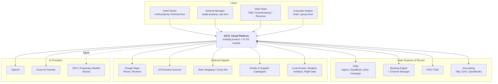
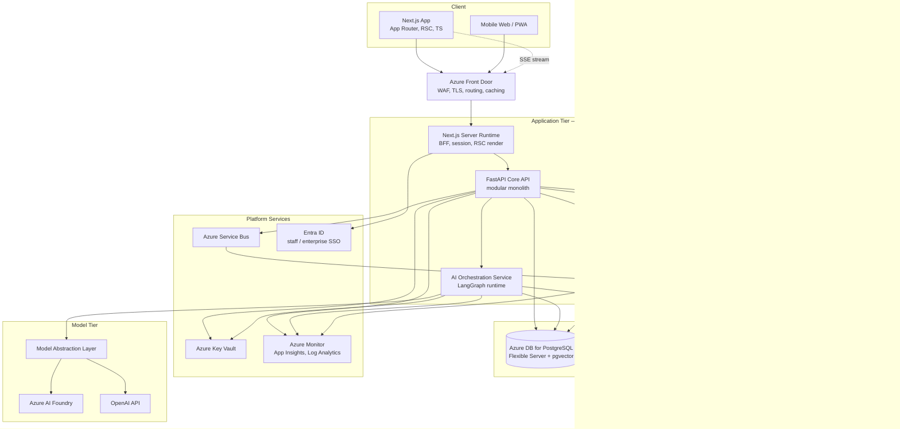
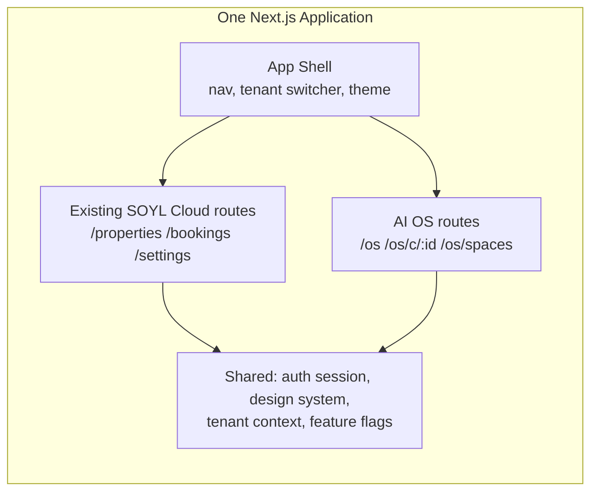
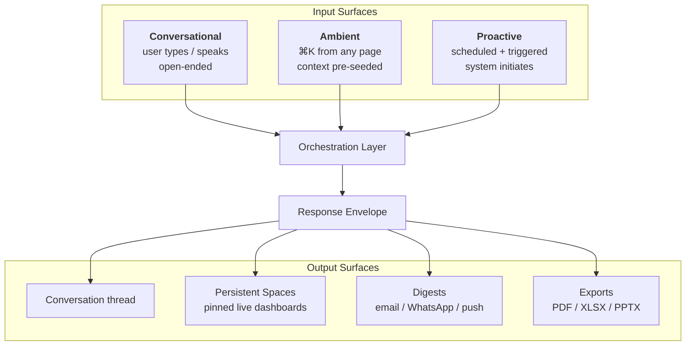
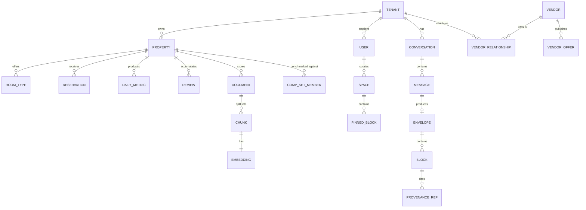
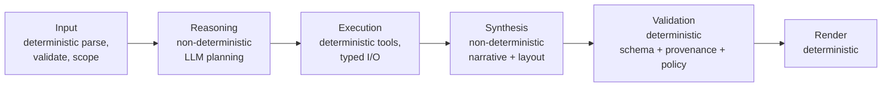

> **Correction (read before §2.4).** This document assumes soyl.cloud is an existing
> authenticated Next.js + FastAPI product. It is not — it is a marketing site. §2.4 and
> the Phase 1 plan in §68 are void. Auth, tenancy and the app shell are new work.
> `Update.md` at the repo root is authoritative for what we are building now.

# Part I — Product and System Foundations

## 1. What we are actually building

### 1.1 The failure mode we are designing against

The default outcome for a project like this is a chat window bolted onto a SaaS product. It ships in six weeks, demos well, and is abandoned within two quarters. It fails for a predictable set of reasons, and naming them is the cheapest form of architecture we will ever do:

**It answers questions the user did not have.** A hotel owner does not wake up wanting to "ask a question about their data." They wake up wanting to know why last weekend underperformed, whether to drop rates for the coming Tuesday, and whether their laundry vendor is overcharging them. Generic assistants force the user to already know what to ask.

**It returns prose where the user needed a number, and numbers where the user needed a decision.** Markdown is a terrible medium for a revenue comparison across six months and four competitors. The user has to reconstruct a mental chart from a text table. That reconstruction cost is why chat-based analytics products lose to dashboards.

**It has no memory of the business.** Every conversation restarts from zero. The system does not know that this property is a 42-room boutique in Goa with a wedding-heavy Q4, that the owner has already rejected the "raise weekday rates" recommendation twice, or that occupancy in March was distorted by a renovation.

**It cannot act.** The user reads a recommendation and then has to go do it somewhere else. The value evaporates in the gap between insight and action.

**It is unfalsifiable.** Nobody can tell whether the AI is right. There is no evaluation harness, no citation, no confidence signal, and so trust never accumulates — and in a business where a bad pricing call costs real revenue, trust is the entire product.

Every major architectural decision in this document is traceable to one of those five failure modes.

### 1.2 The product thesis

> **The LLM is not the product. The interface is not the product. The product is the intelligence layer that connects hotel data, business workflows, external market knowledge, procurement information, analytics and AI reasoning — and then emits software that the user can act inside of.**

Concretely, this means the unit of output is not a message. It is a **Response Envelope**: a structured, typed, versioned JSON document describing an interface, a set of assertions, the evidence behind them, and the actions available. The frontend is a renderer for that envelope. The LLM is one of several components that help produce it.

This reframing has enormous downstream consequences, and they are the reason this document is long:

- If the output is structured, it can be **validated**. We can assert that every numeric claim carries a provenance reference before the response is allowed to reach the user.
- If the output is structured, it can be **cached, diffed, replayed and evaluated**. A regression test can assert that the "RevPAR trend" question still produces a `chart.timeseries` block with the same series identity.
- If the output is structured, it can be **re-rendered** in other surfaces — a mobile app, a WhatsApp summary, a PDF board pack, an email digest — without re-running the model.
- If the output is structured, the frontend can render it **progressively**, so the user sees a KPI card in 800ms instead of a wall of text in 12 seconds.
- If the output is structured, the model is **replaceable**. The contract between the intelligence layer and the interface is a JSON schema, not a prompt style.

### 1.3 What "AI Operating System for Hotels" means operationally

An operating system does four things: it abstracts hardware, it schedules work, it manages resources, and it provides a common interface that applications are written against. The analogy is more than marketing if we hold ourselves to it:

| OS concept | SOYL equivalent | Where it lives in this document |
|---|---|---|
| Hardware abstraction | Integration layer over PMS, booking engines, review platforms, accounting, procurement | Part X |
| System calls | The Tool Layer — a typed, permissioned, auditable catalog of things the AI can do | §29–31 |
| Scheduler | LangGraph orchestration + background job system | §29, §25 |
| Process isolation | Multi-tenant isolation, RLS, per-tenant budgets | §45, Part XI |
| File system | Knowledge base, document store, RAG index | Part VII |
| Window manager / shell | The generative UI renderer | Part III |
| Applications | Capability packs: Revenue, Procurement, Reputation, Operations, Finance | §5.3, Part XIV |

The practical test: **can a new capability be added by writing a tool, an agent, a prompt and a set of UI blocks — without touching the orchestrator, the renderer, the auth layer or the database schema?** If yes, we have an operating system. If no, we have a monolithic app with a chat box. Section 5 defines the extension seams that make the answer "yes."

### 1.4 Non-goals

Explicitly out of scope, and engineers should push back on scope creep in these directions:

- **We are not building a PMS.** We do not own the reservation record of truth. We read from PMSs; we do not replace them. (Ambition may change this in Phase 6+; the architecture does not preclude it, but nothing in Phases 1–5 should assume it.)
- **We are not building a general-purpose assistant.** If a user asks SOYL to write a poem, the correct behaviour is a graceful redirect, not a poem. Scope discipline is a product feature: it is what makes the system trustworthy in its domain.
- **We are not training foundation models in Phase 1–4.** "SOYL proprietary models" in the roadmap means fine-tuned and distilled task models (classification, routing, extraction, ranking), not a from-scratch LLM. The model abstraction layer in Part VI is what makes that transition cheap.
- **We are not building a BI tool that users configure.** The user does not build the dashboard. The system builds it. If we ship a chart builder, we have lost.

---

## 2. System context

### 2.1 C4 Level 1 — System context

### 2.2 The four user archetypes and what they change architecturally

These are not personas for a marketing deck. Each one imposes a concrete architectural requirement.

**The Owner (multi-property, financial lens).** Asks portfolio questions: "which of my four properties is dragging?" Requires that **every query is scoped to a set of properties, not one**, and that aggregation across properties is a first-class concept in the data model and the tool layer. This is why `property_id` is never implicit and why tools take `property_ids: list[UUID]`.

**The General Manager (single property, operational lens).** Asks "what do I do today?" Requires **proactive surfaces** — the system must be able to generate a brief without being asked. This is why the orchestrator is invocable from a scheduler, not only from an HTTP request, and why the Response Envelope is a first-class persisted artifact rather than a transient stream.

**The Department Head (narrow, deep).** Asks "why is housekeeping labour cost per occupied room up 11%?" Requires **drill-down and provenance** — every number must be traceable to rows. This is why every metric in the envelope carries a `provenance` object.

**The Corporate Analyst (chain-level).** Asks benchmark questions and expects to export. Requires **the envelope to be re-renderable to non-HTML targets** (XLSX, PDF, PPTX) and requires **cross-tenant benchmarking with strict anonymisation**. This is the hardest security surface in the product and is treated separately in §63.

### 2.3 C4 Level 2 — Container diagram

**Note on container count.** Four application containers is deliberately the *maximum* for Phase 1–3, and in Phase 1 the AI Orchestration Service runs **in-process inside the Core API** (§20.4). We separate it only when its scaling profile provably diverges — which it will, because AI requests are long-lived and memory-heavy while CRUD requests are short and cheap. The decision to split is pre-planned, not pre-executed.

### 2.4 Integration with the existing SOYL Cloud platform

The AI OS is a **module inside the existing monorepo**, not a satellite product. This is the single most important integration constraint, and it is worth being precise about what "unified" means at each layer.

**Layer-by-layer integration contract:**

| Layer | Integration approach | Rationale |
|---|---|---|
| **Identity** | Single session. AI OS consumes the same session cookie / JWT issued by the existing auth service. No second login, no second identity provider. | A second login is the fastest way to make one product feel like two. |
| **Tenancy** | Shared `tenant_id` / `property_id` primitives. The AI module reads the same tenant context resolved by existing middleware. | Two tenancy models means two isolation bugs. |
| **Database** | Same PostgreSQL instance. AI OS owns schemas `ai`, `rag`, `agent`. Existing platform owns `core`, `ops`. **Cross-schema reads go through a service interface, not raw joins.** | Shared instance keeps ops simple; schema separation keeps ownership clear and makes a future split possible. |
| **Design system** | One shared `@soyl/ui` package. The AI OS does not fork components. | Visual drift is how "one product" becomes "two products" in the user's mind. |
| **API surface** | Same origin, path-prefixed: `/api/v1/os/*`. Same error envelope, same auth middleware, same rate-limit middleware. | Same-origin avoids CORS and cross-site cookie complexity entirely. |
| **Navigation** | The AI OS is a top-level destination in the existing nav, *and* an ambient invocable surface (`⌘K`) available from every existing page. | The second is more important than the first — see §3.2. |
| **Deployment** | Same CI pipeline, same environments. Feature-flagged rollout per tenant. | One pipeline, one rollback procedure. |

**The ambient-invocation requirement.** The AI OS must be reachable from *inside* existing pages with context. If a user is on `/properties/goa-42/revenue` and presses `⌘K`, the resulting AI session is pre-seeded with `{property_id, date_range, current_view}`. This is what makes it feel like an operating system rather than a destination. Architecturally this means:

1. Every existing page **MUST** export a `getAIContext()` descriptor (see §17.6).
2. The conversation-creation API accepts an optional `seed_context` object.
3. The orchestrator treats seed context as high-priority working memory (§32.3).

**Reversal cost of the "one app" decision: High.** We are accepting that a bad AI deploy can affect the core platform. We mitigate with feature flags, separate container scaling, and circuit breakers (§26.5) — not with a separate product.

---

## 3. Interaction model

### 3.1 The three surfaces

The conversational interface is one of three input surfaces, and treating it as the only one is the mistake that produces chatbots.

**Proactive is the differentiator and it is a Phase 3 requirement, not a Phase 6 nice-to-have.** A GM who receives "Occupancy for next Tuesday is 34% against a 61% same-period-last-year; three comp-set properties cut their rates by 12% yesterday; here is a suggested rate action" at 7:00am has received something no chatbot can produce. The architecture supports this because the orchestrator is a library invoked by a runner, and HTTP is only one runner (§29.7).

### 3.2 Spaces — the persistence layer for generated UI

A generated dashboard that disappears when the conversation scrolls away is a demo. The **Space** is the primitive that makes it a product.

A Space is a persisted, named collection of **pinned blocks** whose data refreshes on open and on schedule. When a user says "pin this to my morning view," the block's *generating specification* is saved — not its rendered output. On open, the block's data query re-executes; the AI reasoning is not re-run unless the specification is marked `regenerate: true`.

This distinction is critical and is a recurring theme in this document:

> **Separate the reasoning (expensive, non-deterministic, cacheable for hours) from the data binding (cheap, deterministic, refreshable per second).**

Every UI block therefore carries both a rendered payload *and* a `refresh_spec` describing how to re-fetch its data without an LLM call. §16.4 specifies this.

### 3.3 The conversation is a session, not a transcript

A conversation carries:

- **Working set** — the properties, date ranges and comparison sets currently in scope. Mutated by the user ("now show me Goa only") and by the system. Explicit, inspectable, and editable via UI chips, not buried in prompt text.
- **Assertion log** — the claims the system has made, with provenance. Used for consistency checking (§33.4): if the system said RevPAR was ₹4,200 three turns ago, it must not say ₹4,600 now without explaining the change.
- **Decision log** — recommendations offered, and the user's response (accepted / rejected / deferred). Feeds memory (§32) so the system stops re-recommending rejected actions.
- **Artifact log** — envelopes produced, which are addressable and re-openable.

---

## 4. Domain model and ubiquitous language

Getting these words right prevents a class of bug where two engineers implement "occupancy" differently. **These definitions are normative.** Metric definitions live in code in a single module (`soyl.metrics.definitions`) and are referenced by ID everywhere else — including in prompts.

### 4.1 Core entities

### 4.2 Normative metric definitions

| Term | Definition | Formula | Common mis-definition to avoid |
|---|---|---|---|
| **Available Room Nights (ARN)** | Sellable rooms × nights in period | `rooms_sellable × nights` | Using total rooms including out-of-order rooms. OOO rooms are excluded; out-of-service rooms are excluded. This choice is *configurable per tenant* because chains disagree, and the choice is recorded on the metric result. |
| **Occupancy** | Occupied room nights / ARN | `occupied_rn / arn` | Including complimentary and house-use rooms in the numerator. We exclude by default; flag `include_comp` on the tool. |
| **ADR** | Average Daily Rate — room revenue / occupied room nights | `room_revenue / occupied_rn` | Including F&B or other revenue in the numerator. Room revenue only, net of taxes, gross of commission unless `net_of_commission=true`. |
| **RevPAR** | Revenue per Available Room | `room_revenue / arn` == `adr × occupancy` | Computing as `ADR × Occupancy` from *rounded* inputs. Always compute from raw revenue and ARN. |
| **TRevPAR** | Total Revenue per Available Room | `total_revenue / arn` | — |
| **GOPPAR** | Gross Operating Profit per Available Room | `gop / arn` | Using net profit. GOP is before fixed charges, rent, interest, tax, depreciation. |
| **ALOS** | Average Length of Stay | `room_nights / arrivals` | Counting cancelled stays. |
| **Booking Pace** | Cumulative on-the-books room nights for a future date, by days-out | pickup curve | Comparing pace to a same-calendar-date last year rather than a same-day-of-week, same-days-out basis. |
| **Pickup** | Change in on-the-books between two snapshots | `otb(t2) - otb(t1)` | Requires **daily snapshots**. This is why `fact.otb_snapshot` exists (§48.4) — you cannot reconstruct pace from a current-state PMS pull. |
| **Comp Set Index (MPI/ARI/RGI)** | Property performance vs comp set | `own_metric / compset_metric × 100` | Using a comp set the owner did not approve. Comp set membership is user-confirmed, never purely algorithmic. |
| **Labour Cost per Occupied Room (CPOR)** | Departmental labour / occupied room nights | `dept_labour / occupied_rn` | Allocating shared labour without a documented allocation rule. |

**Engineering rule (`MUST`):** No metric may be computed inline in a tool, an agent, a SQL string in an LLM-generated query, or a frontend component. All metrics are computed by `soyl.metrics` functions that take an explicit `MetricContext` (tenant, properties, period, flags) and return a `MetricResult` carrying value, unit, formula ID, flags applied and provenance. A CI lint rule fails any PR that divides revenue by a room count outside that module.

**Why this is load-bearing for an AI product:** if the LLM can compute metrics, the LLM can compute them *wrongly and confidently*. Making metric computation a deterministic tool call removes an entire category of hallucination. The model chooses *which* metric and *what* period; it never does arithmetic on business figures. This is the single highest-leverage hallucination-reduction decision in the system, and it costs almost nothing to enforce.

### 4.3 Tenancy vocabulary

- **Tenant** — the billing and isolation boundary. Usually a hotel group or an independent owner. All row-level security keys off `tenant_id`.
- **Property** — a physical hotel. Belongs to exactly one tenant.
- **Property Group** — a user-defined or system-defined collection (e.g. "South India", "Leisure segment"). Purely an analytical convenience; carries no permissions.
- **Workspace** — a UI-level scoping selection: the set of properties currently active. Persisted per user.
- **Space** — a saved collection of pinned generated blocks. Belongs to a user, optionally shared to a tenant.

Note the deliberate collision avoidance: *Workspace* (what I'm looking at) and *Space* (what I saved) are distinct, and reviewers should reject PRs that conflate them.

---

## 5. Cross-cutting architectural principles

These are the principles that, when violated, cause the most expensive rework. They are listed in rough order of how much money it costs to get them wrong.

### P1 — Structured output is the contract; prose is a rendering of it

No component downstream of the orchestrator may depend on the *text* of a model response. The boundary between AI and application is a validated Pydantic model, serialised to JSON, versioned with a schema version. If a feature cannot be expressed in the envelope schema, the schema is extended through review — the feature does not smuggle itself through in a markdown string.

**Enforcement:** the orchestrator's return type is `ResponseEnvelope`, not `str`. There is no code path that returns raw model text to the API layer. Free-form prose exists only inside a `text.markdown` block, and that block type is explicitly *not* allowed to contain business figures without an accompanying `metric` block (§33.4).

### P2 — Determinism at the edges, non-determinism in the middle

The LLM decides *what* to do and *how to explain it*. It never decides *what a number is*, *whether a user is authorised*, or *whether a response is safe to send*. Those are code.

### P3 — Every claim carries provenance

Every numeric or factual assertion in an envelope carries a `provenance` reference: a tool call ID, a metric definition ID, a document chunk ID, or an external source URL with a fetch timestamp. The UI surfaces this on hover and on click. Unprovenanced claims are stripped by the validation stage before the response leaves the backend — not flagged, *stripped*, and the removal is logged as an eval signal.

This is expensive to build and it is the reason the product will be trusted. It also gives us a free evaluation metric: **provenance coverage** (fraction of assertions with valid provenance) is a top-line quality number tracked per release.

### P4 — Tenant isolation is enforced at the lowest possible layer

Isolation is enforced in PostgreSQL row-level security, keyed to a session variable set by connection middleware — not by every query remembering a `WHERE tenant_id = ?`. Application-level filtering is defence in depth, not the primary control. Every tool receives a `TenantContext` it cannot forge. See §48.7.

**Reasoning:** with 2–5 engineers and a fast-moving AI codebase, the probability that some query forgets its tenant filter approaches 1. RLS makes that mistake return zero rows instead of another tenant's revenue.

### P5 — The model layer is a replaceable driver

No file outside `soyl.ai.providers` may import `openai`, `azure.ai.*`, `anthropic` or any provider SDK. A CI import-linter rule enforces this. See §36.

### P6 — Modular monolith until the seams hurt, then split along pre-cut seams

We ship a modular monolith with hard internal boundaries (import rules, per-module ports and adapters, no cross-module ORM access). Each module is written as though it will one day be a service. Extraction is a deployment change, not a rewrite. See §20.

### P7 — Everything expensive is cached with an explicit key strategy and an explicit invalidation story

If you add a cache without writing down its key composition, TTL, invalidation trigger and stampede protection in the cache registry (§48.2), the PR is rejected. Undocumented caches are how AI products start showing yesterday's revenue.

### P8 — Cost is a design constraint, not an afterthought

Every AI request carries a **budget**: token ceiling, tool-call ceiling, wall-clock ceiling, and rupee ceiling. Budgets are enforced by the orchestrator and are per-tenant-tier. An architecture that cannot answer "what did that conversation cost?" will produce a business that cannot price itself. See §34.3 and §57.

### P9 — Observability is a product feature

For a probabilistic system, tracing is not an ops nicety — it is how you debug a wrong answer. Every request produces a trace containing the plan, every tool call with inputs and outputs, every model call with prompt version, token counts and latency, and the final envelope. Traces are retained and are the substrate of the evaluation system. See §27 and §39.

### P10 — Additive, versioned contracts

Envelope schemas, API responses and tool signatures evolve additively. Breaking changes require a version bump and a deprecation window. An old frontend must not crash on a new envelope; unknown block types render as a graceful fallback (§19.2).

### 5.1 The extension seams

The claim in §1.3 was that a new capability requires no changes to core. These are the five seams that make it true. Any PR that adds a capability by modifying core instead of registering at a seam should be rejected.

| Seam | Registration mechanism | Example |
|---|---|---|
| **Tool** | Decorator-registered function with Pydantic I/O models and a permission scope | `@tool(scope="revenue:read")` |
| **Agent** | A LangGraph subgraph registered in the agent registry with a capability manifest | `RevenueAgent` declares it handles `revenue.*` intents |
| **Block** | A JSON schema + a React component registered in the renderer registry | `chart.heatmap` |
| **Prompt** | A versioned prompt file in the prompt library, referenced by ID | `synthesis/revenue@v7` |
| **Integration** | A connector implementing the `Connector` protocol with a capability manifest | `CloudbedsConnector` |

### 5.2 Cost of getting these wrong

| Principle violated | Symptom | Cost to fix later |
|---|---|---|
| P1 structured output | Frontend parses markdown with regex; every model change breaks the UI | High — full renderer rewrite |
| P3 provenance | Users stop trusting numbers; churn | High — requires re-plumbing every tool |
| P4 tenant isolation | Cross-tenant data leak | Existential |
| P5 model abstraction | Provider price change or outage takes the product down | Medium |
| P6 module boundaries | Cannot scale AI workload independently; deploys become risky | High |
| P8 cost budgets | Unit economics discovered at Series A diligence | Medium–High |

### 5.3 Capability packs

Product capability is organised into **packs**. A pack is a coherent bundle of tools, agents, prompts, blocks and (optionally) integrations, gated by entitlement. This is the packaging unit for both engineering and pricing.

| Pack | Ships in | Core tools | Signature blocks |
|---|---|---|---|
| **Revenue** | Phase 2–3 | occupancy/ADR/RevPAR series, pace, pickup, forecast, rate recommendation | `chart.timeseries`, `metric.kpi`, `forecast.card`, `chart.heatmap` |
| **Reputation** | Phase 3 | review fetch, sentiment decomposition, theme extraction, response drafting | `sentiment.breakdown`, `list.themes`, `table.reviews` |
| **Procurement** | Phase 4–5 | vendor search, offer comparison, spend analysis, contract extraction | `card.supplier`, `table.comparison`, `plan.actions` |
| **Operations** | Phase 4 | labour productivity, housekeeping throughput, maintenance backlog | `chart.bar`, `table.generic`, `timeline` |
| **Finance** | Phase 4 | P&L decomposition, variance analysis, cost per occupied room | `table.financial`, `chart.waterfall` |
| **Knowledge** | Phase 2 | SOP retrieval, policy Q&A, document search | `doc.citation`, `text.markdown`, `list.checklist` |
| **Market** | Phase 3–4 | comp set discovery, rate shopping, benchmark index, event calendar | `map.properties`, `table.comparison`, `chart.index` |

A tenant's entitlement set determines which tools the planner can see. **The planner's tool list is filtered by entitlement before the model ever sees it** — the model cannot attempt to call a tool the tenant has not bought, which means no "upgrade to access" errors leaking out of tool calls, and no wasted tokens describing unavailable capability.
