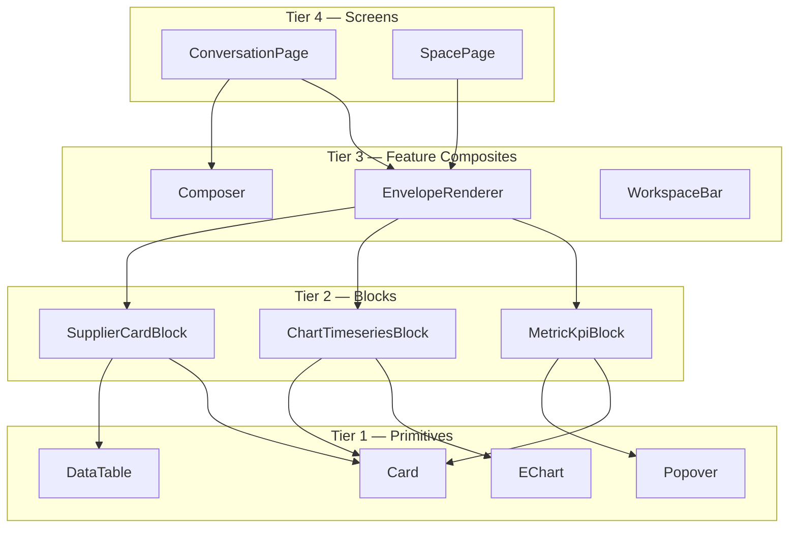

# Part II — Frontend Architecture

## 6. Stack decisions

### 6.1 The confirmed stack, and why each piece is there

| Technology | Role | Why this and not the obvious alternative |
|---|---|---|
| **Next.js 15+ (App Router)** | Application framework | We need three things simultaneously: server-side data fetching for the non-AI parts of SOYL Cloud, a streaming-capable runtime for AI responses, and a single deployable that co-locates BFF logic with UI. App Router's React Server Components let us render heavy dashboard shells on the server while keeping the generative-UI layer client-interactive. Alternative — **Vite + React SPA**: faster dev loop, simpler mental model, but we then need a separate BFF service and we lose streaming SSR, which materially hurts perceived latency on the first paint of a generated dashboard. Alternative — **Remix**: excellent data model, but a smaller ecosystem for the AI streaming patterns we need and a smaller hiring pool in our market. **Reversal cost: High.** |
| **TypeScript (strict)** | Language | Non-negotiable given that the entire product is a renderer for a large discriminated union. Without exhaustive type checking on block types, adding a block type silently breaks a switch statement somewhere. `strict: true`, `noUncheckedIndexedAccess: true`, `exactOptionalPropertyTypes: true`. |
| **Tailwind CSS v4** | Styling | Co-located styling with zero runtime cost, and — critically for us — a token system that can be driven by CSS variables, which is how we implement theming and dark mode without a second stylesheet. Alternative — **CSS Modules**: more explicit, but the velocity cost with a 3-person team is real. Alternative — **styled-components / Emotion**: runtime cost and RSC friction. **Reversal cost: Medium.** |
| **shadcn/ui** | Component substrate | Not a dependency — a code generator over Radix UI primitives. We own the source, which matters because we will be heavily modifying components for AI-native patterns that no component library ships. Radix gives us accessibility (focus management, ARIA, keyboard interaction) that we would otherwise get wrong. Alternative — **MUI / Mantine / Chakra**: faster start, but opinionated visual identity we would fight, and we cannot modify internals. **Reversal cost: Low** (we own the code). |
| **Motion** (formerly Framer Motion) | Animation | Generated UI appears progressively; without choreography it feels like a page glitching. Motion's layout animations and `AnimatePresence` handle the specific hard case of blocks arriving into a list that is reflowing. Alternative — **CSS transitions + View Transitions API**: cheaper, and we use it for route transitions, but it cannot express staggered entry of a dynamically-sized block list well. **Reversal cost: Low.** |
| **Apache ECharts** | Charting | The right call for this product. ECharts handles large series with canvas rendering, has a genuinely complete chart type catalog (heatmaps, sankeys, candlesticks, calendar charts, gauges — all of which we need), and is entirely **configuration-driven**, which is the decisive property: our backend emits a chart spec as JSON and the frontend passes it to ECharts. A component-composition library like Recharts would require the backend to emit *component trees*, which is a far worse contract. Alternative — **Recharts**: lovely React API, poor performance past ~2k points, missing chart types. Alternative — **Visx/D3**: maximum control, far too much bespoke code for our team size. Alternative — **Plotly**: large bundle, licensing friction. **Reversal cost: Medium** (isolated behind our `<Chart>` wrapper). |

### 6.2 Additions to the stack — recommended

These are not in the current preference list and should be adopted.

| Technology | Purpose | Justification |
|---|---|---|
| **TanStack Query v5** | Server state | The generative UI layer is fundamentally a cache of server state with per-block refresh, background refetch, stale-while-revalidate and request deduplication. Writing this by hand is 3,000 lines of bugs. Also gives us `useQueries` for parallel block hydration and query invalidation keyed by tenant/property. **Adopt in Phase 1.** |
| **Zustand** | Client state | Small, unopinionated, no provider hell, works cleanly with RSC boundaries. Used only for genuine client state: workspace scoping, UI preferences, composer state, streaming buffers. **Adopt in Phase 1.** Alternative: Redux Toolkit (too much ceremony for our size), Jotai (excellent, but Zustand's store-per-domain model maps better to our slices). |
| **Zod** | Runtime validation | This is the keystone of the generative UI layer. Envelope schemas are generated from the backend's Pydantic models into Zod schemas, so the frontend validates every block at the boundary and can render a safe fallback instead of crashing on a malformed block. **Adopt in Phase 1. Non-negotiable.** |
| **react-hook-form** | Forms | AI-generated interactive blocks include forms (parameter tweaking, action confirmation, vendor RFQ). Uncontrolled-first design avoids re-rendering a heavy dashboard on every keystroke. **Phase 2.** |
| **TanStack Virtual** | Virtualisation | Long conversations, long tables, long review lists. Required before the first customer with 5,000 reviews. **Phase 2.** |
| **cmdk** | Command palette | The `⌘K` ambient surface (§2.4) is a core interaction. cmdk is what shadcn's Command is built on. **Phase 1.** |
| **TanStack Table v8** | Data grids | Headless table logic — sorting, grouping, column pinning, pagination — for AI-generated tables that must be interactive. **Phase 2.** |
| **MapLibre GL JS** | Maps | For `map.properties` blocks (comp sets, vendor locations, catchment analysis). Chosen over the Google Maps JS SDK for rendering; we still use Google Places/Reviews *data* via our backend. Keeps map rendering vendor-neutral and avoids client-side Google API keys. **Phase 3.** |
| **next-themes** | Theme switching | Handles the SSR flash-of-wrong-theme problem correctly. **Phase 1.** |
| **Vitest + Testing Library + Playwright** | Testing | Vitest for unit/component (Jest is slower and the ESM story is worse), Playwright for E2E including streaming assertions. **Phase 1.** |
| **Storybook** | Component workshop | Essential specifically because of the block catalog: every block type needs a fixture-driven story so designers and engineers can see every block type in all states without generating them from the AI. **Phase 2.** |
| **Sentry** | Frontend error tracking | App Insights covers backend well; Sentry's source-map and session-replay story is better for frontend. Session replay is disproportionately valuable for debugging a UI the AI generated. **Phase 2.** |
| **openapi-typescript + orval** | API client generation | FastAPI emits OpenAPI; we generate typed clients. Zero hand-written API types. **Phase 1.** |

### 6.3 Explicitly rejected

| Technology | Why not |
|---|---|
| **Redux / RTK** | Ceremony cost exceeds benefit at our team size; TanStack Query already owns the hard part (server state). |
| **tRPC** | Attractive, but our backend is Python. tRPC's value is end-to-end TS inference, which we cannot have. OpenAPI codegen gives us 80% of the benefit across the language boundary. |
| **GraphQL** | Would add a schema layer, a resolver layer and a caching layer to solve a problem (over-fetching) that we do not have — our responses are already precisely shaped by the envelope. Revisit only if we build a public partner API in Phase 6. |
| **Micro-frontends** | Catastrophic for a 3-person team. Also directly undermines the "one unified operating system" requirement. |
| **Vercel AI SDK (as the core abstraction)** | We may use its stream-parsing utilities, but our envelope protocol is richer than its message/tool-call model and our orchestration is server-side in Python. Adopting it as the primary abstraction would push us toward a TS-side orchestration we do not want. |

---

## 7. Frontend folder structure

The repository is a **pnpm + Turborepo monorepo** containing both the existing SOYL Cloud app and the AI OS module. The full monorepo tree is in Part XIII; this is the frontend slice.

```
apps/web/
├── app/                                  # Next.js App Router
│   ├── (marketing)/                      # public routes, static
│   ├── (auth)/
│   │   ├── login/
│   │   └── callback/
│   ├── (platform)/                       # authenticated shell
│   │   ├── layout.tsx                    # shell: nav, tenant switcher, ⌘K mount
│   │   ├── properties/                   # EXISTING SOYL Cloud surfaces
│   │   ├── bookings/
│   │   ├── settings/
│   │   └── os/                           # ── AI OPERATING SYSTEM ──
│   │       ├── layout.tsx                # OS shell: rail, thread list, context bar
│   │       ├── page.tsx                  # entry: Home / Today surface
│   │       ├── c/[conversationId]/
│   │       │   ├── page.tsx              # conversation + generated UI canvas
│   │       │   └── loading.tsx
│   │       ├── spaces/
│   │       │   ├── page.tsx
│   │       │   └── [spaceId]/page.tsx
│   │       ├── artifacts/[envelopeId]/page.tsx   # shareable deep link to a response
│   │       └── knowledge/                # document library, ingestion status
│   └── api/                              # BFF route handlers only
│       ├── stream/route.ts               # SSE proxy (adds auth, strips internals)
│       ├── upload/route.ts               # direct-to-blob SAS issuance
│       └── health/route.ts
│
├── features/                             # feature-sliced business logic
│   ├── conversation/
│   │   ├── components/
│   │   │   ├── Composer.tsx
│   │   │   ├── MessageList.tsx
│   │   │   ├── TurnGroup.tsx
│   │   │   └── ThinkingTrace.tsx
│   │   ├── hooks/
│   │   │   ├── useConversation.ts
│   │   │   ├── useEnvelopeStream.ts      # SSE consumption + partial assembly
│   │   │   └── useOptimisticTurn.ts
│   │   ├── store/conversation.store.ts
│   │   └── api/conversation.api.ts
│   ├── envelope/                         # ── THE GENERATIVE UI ENGINE ──
│   │   ├── renderer/
│   │   │   ├── EnvelopeRenderer.tsx      # top-level: envelope → layout
│   │   │   ├── BlockRenderer.tsx         # single block dispatch
│   │   │   ├── BlockRegistry.ts          # type → component map
│   │   │   ├── BlockBoundary.tsx         # per-block error + suspense boundary
│   │   │   └── layouts/
│   │   │       ├── StackLayout.tsx
│   │   │       ├── GridLayout.tsx
│   │   │       └── SplitLayout.tsx
│   │   ├── blocks/                       # one directory per block type
│   │   │   ├── metric-kpi/
│   │   │   │   ├── MetricKpiBlock.tsx
│   │   │   │   ├── MetricKpiBlock.stories.tsx
│   │   │   │   ├── MetricKpiBlock.test.tsx
│   │   │   │   └── schema.ts             # Zod, generated + hand-extended
│   │   │   ├── chart-timeseries/
│   │   │   ├── chart-bar/
│   │   │   ├── chart-heatmap/
│   │   │   ├── table-generic/
│   │   │   ├── table-comparison/
│   │   │   ├── card-supplier/
│   │   │   ├── plan-actions/
│   │   │   ├── list-checklist/
│   │   │   ├── forecast-card/
│   │   │   ├── map-properties/
│   │   │   ├── timeline/
│   │   │   ├── sentiment-breakdown/
│   │   │   ├── doc-citation/
│   │   │   ├── text-markdown/
│   │   │   ├── report-expandable/
│   │   │   └── _fallback/                # unknown block type renderer
│   │   ├── skeletons/                    # per-block-type loading shapes
│   │   ├── actions/                      # block action dispatch + confirmation
│   │   └── hooks/
│   │       ├── useBlockData.ts           # refresh_spec → TanStack Query
│   │       └── useBlockActions.ts
│   ├── workspace/                        # property scoping, date range, comp set
│   ├── spaces/
│   ├── knowledge/
│   ├── command/                          # ⌘K palette, ambient invocation
│   └── provenance/                       # citation popovers, evidence drawer
│
├── components/
│   ├── ui/                               # shadcn primitives (owned source)
│   ├── charts/
│   │   ├── EChart.tsx                    # single ECharts wrapper — see §8.4
│   │   ├── theme.ts                      # ECharts theme bound to CSS vars
│   │   └── specBuilders.ts               # backend spec → ECharts option
│   ├── layout/
│   └── feedback/                         # toasts, empty states, error states
│
├── lib/
│   ├── api/
│   │   ├── client.ts                     # fetch wrapper: auth, tracing, retry
│   │   ├── generated/                    # openapi-typescript output — DO NOT EDIT
│   │   └── sse.ts                        # EventSource / fetch-stream reader
│   ├── envelope/
│   │   ├── schema.ts                     # Zod schemas (generated from Pydantic)
│   │   ├── assemble.ts                   # partial-delta → coherent envelope
│   │   └── version.ts                    # envelope version negotiation
│   ├── auth/
│   ├── flags/                            # feature flag client
│   ├── analytics/                        # typed event emitter → ClickHouse
│   ├── format/                           # currency, dates, units — locale aware
│   └── utils/
│
├── styles/
│   ├── globals.css                       # Tailwind + CSS variable definitions
│   └── themes/                           # light.css, dark.css, brand overrides
│
├── hooks/                                # genuinely generic hooks only
├── types/
├── public/
├── tests/
│   ├── e2e/                              # Playwright
│   └── fixtures/envelopes/               # golden envelope JSON files
└── config/
```

### 7.1 Why feature-sliced rather than type-sliced

A `components/ / hooks/ / utils/` top-level split works until the app has more than about 30 screens, at which point every feature's code is scattered across five directories and nobody can delete anything safely. Feature slicing means a capability is a directory: you can read it, own it, test it and delete it.

The rule that makes this work is a dependency direction rule, enforced by ESLint `import/no-restricted-paths`:

```
app/  →  features/  →  components/ | lib/  →  (nothing)
```

- `features/*` **MUST NOT** import from another `features/*` directly. Cross-feature communication goes through `lib/` or through explicitly exported public APIs (`features/x/index.ts`).
- `components/ui/*` **MUST NOT** import from `features/*`. Primitives know nothing about the domain.
- `lib/api/generated/*` is machine-written; a CI check fails if it is modified by hand.

### 7.2 The `envelope/` directory is the product

Note the asymmetry: `features/envelope/` is larger than every other feature combined. That is correct and intentional. Reviewers should expect most frontend PRs to touch it. If a quarter goes by where `features/envelope/blocks/` did not grow, the product did not grow.

---

## 8. Component architecture

### 8.1 The four component tiers



**Tier 1 — Primitives.** No domain knowledge. No data fetching. Fully controlled. Live in `components/ui` and `components/charts`. Must be usable by the existing SOYL Cloud surfaces, not just the AI OS.

**Tier 2 — Blocks.** The critical tier. A block:

- Accepts exactly one prop: a validated block payload of its own type.
- Is a **pure function of that payload plus optional live data** fetched via its `refresh_spec`.
- Owns its skeleton, its empty state, its error state and its `aria` semantics.
- Has a Storybook story per state and a snapshot test against a golden fixture.
- **MUST NOT** know about conversations, envelopes, routing, or the AI. A `MetricKpiBlock` should be renderable in an email-preview tool with no application context.

**Tier 3 — Feature composites.** Own orchestration, data fetching and state.

**Tier 4 — Screens.** Route-level. RSC where possible. Own layout and metadata.

### 8.2 The block component contract

Every block conforms to this contract. It is enforced by a shared generic type and a conformance test suite that every block must pass.

```typescript
// features/envelope/blocks/types.ts

export interface BlockProps<TPayload> {
  /** Stable ID, unique within envelope. Used for pinning, deep-linking, analytics. */
  id: string;
  /** Validated payload. Validation happens once, in BlockRenderer. */
  payload: TPayload;
  /** Present while the block is still streaming in. */
  streaming?: boolean;
  /** Presentation density, set by the container (conversation vs space vs export). */
  density?: 'comfortable' | 'compact' | 'print';
  /** Emitted when the user interacts. Container decides what to do. */
  onAction?: (action: BlockAction) => void;
  /** Provenance references for anything asserted in this block. */
  provenance?: ProvenanceRef[];
}

export interface BlockDefinition<TPayload> {
  type: string;                                  // 'metric.kpi'
  schema: z.ZodType<TPayload>;                   // runtime validation
  component: React.ComponentType<BlockProps<TPayload>>;
  skeleton: React.ComponentType<{ hint?: unknown }>;
  /** Minimum grid columns this block needs to be legible. Drives layout. */
  minCols: 1 | 2 | 3 | 4;
  /** Can this block be pinned to a Space? */
  pinnable: boolean;
  /** Can this block render in a print/PDF export? */
  exportable: boolean;
  /** Progressive rendering: can it render from a partial payload? */
  streamable: boolean;
}
```

**Why a `BlockDefinition` object rather than just a component:** the renderer needs metadata (`minCols`, `streamable`, `exportable`) *before* the component mounts, in order to compute layout and decide whether to show a skeleton or a partial render. Co-locating metadata with the component keeps registration a one-liner and makes it impossible to register a block without declaring its layout needs.

### 8.3 Block registration

```typescript
// features/envelope/renderer/BlockRegistry.ts
import { metricKpi } from '../blocks/metric-kpi';
import { chartTimeseries } from '../blocks/chart-timeseries';
// ... one import per block

const definitions = [metricKpi, chartTimeseries, /* ... */] as const;

export const BlockRegistry = new Map<string, BlockDefinition<unknown>>(
  definitions.map((d) => [d.type, d as BlockDefinition<unknown>]),
);

export function resolveBlock(type: string): BlockDefinition<unknown> {
  return BlockRegistry.get(type) ?? FallbackDefinition;
}
```

Registration is a static array, not a filesystem scan or a dynamic import glob. This is deliberate: static registration means the bundler can tree-shake, TypeScript can verify exhaustiveness against the backend's block-type union, and a CI test can assert that **every block type the backend can emit has a frontend definition**. That test is one of the most valuable in the suite — it catches "backend shipped a new block type, frontend renders a fallback" before customers do.

```typescript
// tests/blockCoverage.test.ts
import backendBlockTypes from '../../../packages/contracts/block-types.json';

test('every backend block type has a frontend renderer', () => {
  const missing = backendBlockTypes.filter((t) => !BlockRegistry.has(t));
  expect(missing).toEqual([]);
});
```

### 8.4 The single ECharts wrapper

There is exactly one place in the codebase that imports `echarts`. Everything else uses `<EChart option={...} />`.

```typescript
// components/charts/EChart.tsx
'use client';

import * as echarts from 'echarts/core';
import { CanvasRenderer } from 'echarts/renderers';
import { LineChart, BarChart, HeatmapChart, PieChart, ScatterChart } from 'echarts/charts';
import {
  GridComponent, TooltipComponent, LegendComponent,
  DataZoomComponent, MarkLineComponent, VisualMapComponent,
} from 'echarts/components';

echarts.use([
  CanvasRenderer, LineChart, BarChart, HeatmapChart, PieChart, ScatterChart,
  GridComponent, TooltipComponent, LegendComponent,
  DataZoomComponent, MarkLineComponent, VisualMapComponent,
]);

export function EChart({ option, height = 320, onEvent }: EChartProps) {
  const ref = useRef<HTMLDivElement>(null);
  const instance = useRef<echarts.ECharts>();
  const { resolvedTheme } = useTheme();

  useEffect(() => {
    if (!ref.current) return;
    instance.current = echarts.init(ref.current, undefined, {
      renderer: 'canvas',
      useDirtyRect: true,
    });
    const ro = new ResizeObserver(() => instance.current?.resize());
    ro.observe(ref.current);
    return () => { ro.disconnect(); instance.current?.dispose(); };
  }, []);

  // Theme changes must not remount — merge a themed option instead.
  useEffect(() => {
    instance.current?.setOption(applyTheme(option, resolvedTheme), {
      notMerge: false,
      lazyUpdate: true,
    });
  }, [option, resolvedTheme]);

  return <div ref={ref} style={{ height }} role="img" aria-label={option.ariaLabel} />;
}
```

Three things worth noting, each of which is a bug we are pre-empting:

1. **Tree-shaken imports.** Importing all of `echarts` costs ~1MB. Registering only the charts and components we use brings it to roughly 300KB gzipped, and it is a hard rule that adding a new chart type means adding its registration here, visibly, in review.
2. **`useDirtyRect: true`.** Meaningfully faster re-renders on heatmaps and dense series.
3. **Theme changes merge rather than remount.** Naively re-initialising the chart on theme change causes a visible flash and loses zoom/pan state. `applyTheme` reads the resolved CSS custom properties and produces a themed option object.

### 8.5 Server Components vs Client Components

The boundary rule:

| Renders on server (RSC) | Renders on client |
|---|---|
| App shell, navigation, tenant switcher | Composer |
| Conversation list, Space list | Envelope renderer and all blocks |
| Static settings pages | Charts, tables, maps |
| Knowledge library index | `⌘K` palette |
| Initial conversation history (first paint) | Streaming turn |
| Export/print rendering | Anything with `onAction` |

**The important case: initial conversation load.** The first render of an existing conversation is a Server Component that fetches persisted envelopes and renders them. Blocks are client components, so they hydrate — but the *shell and layout* are server-rendered, so the user sees the structure of their dashboard immediately rather than a spinner. Only the newly streaming turn is fully client-driven.

---

## 9. State management

### 9.1 Four kinds of state, four different tools

The most common frontend architecture mistake is putting all state in one place. We deliberately use four mechanisms, and the choice is mechanical:

| Kind | Example | Tool | Persisted? |
|---|---|---|---|
| **Server state** | Conversations, envelopes, block data, documents | TanStack Query | Server + query cache |
| **URL state** | Conversation ID, active space, selected property, date range | Next.js router + `nuqs` | URL (shareable) |
| **Client state** | Composer draft, streaming buffer, panel open/closed, density | Zustand | localStorage (selective) |
| **Ephemeral** | Hover, focus, animation | `useState` | No |

**URL state deserves emphasis.** Property scope and date range belong in the URL, not in a store. If a GM sends a colleague a link to a generated analysis, that link must reproduce the analysis. This is a product requirement disguised as a state management decision.

### 9.2 Zustand store design

Stores are sliced by domain, never global. Each store file exports a hook and typed selectors; components subscribe to selectors, not whole stores, to avoid render storms during streaming.

```typescript
// features/workspace/store/workspace.store.ts
interface WorkspaceState {
  propertyIds: string[];
  dateRange: { from: string; to: string; preset?: DatePreset };
  compareMode: 'none' | 'prior_period' | 'prior_year' | 'comp_set';
  currency: string;

  setProperties: (ids: string[]) => void;
  setDateRange: (r: WorkspaceState['dateRange']) => void;
  setCompareMode: (m: WorkspaceState['compareMode']) => void;
}

export const useWorkspace = create<WorkspaceState>()(
  persist(
    devtools((set) => ({
      propertyIds: [],
      dateRange: { from: iso(-30), to: iso(0), preset: 'last_30d' },
      compareMode: 'prior_year',
      currency: 'INR',
      setProperties: (propertyIds) => set({ propertyIds }),
      setDateRange: (dateRange) => set({ dateRange }),
      setCompareMode: (compareMode) => set({ compareMode }),
    })),
    {
      name: 'soyl.workspace',
      // Never persist across tenants — see §9.5
      partialize: (s) => ({ dateRange: s.dateRange, compareMode: s.compareMode, currency: s.currency }),
    },
  ),
);

// Selectors — components use these, never the raw store
export const useDateRange = () => useWorkspace((s) => s.dateRange);
```

### 9.3 The streaming store — the one genuinely hard piece

Streaming an envelope is not streaming text. Blocks arrive out of order, partially, and are patched in place. The store must handle this without causing the entire conversation to re-render on every SSE frame.

```typescript
// features/conversation/store/stream.store.ts
interface StreamState {
  /** turnId → assembling envelope */
  turns: Record<string, StreamingTurn>;

  begin: (turnId: string, meta: EnvelopeMeta) => void;
  applyDelta: (turnId: string, delta: EnvelopeDelta) => void;
  finalize: (turnId: string, envelope: ResponseEnvelope) => void;
  fail: (turnId: string, error: StreamError) => void;
}

interface StreamingTurn {
  status: 'planning' | 'executing' | 'synthesising' | 'complete' | 'error';
  trace: TraceStep[];            // what the system is doing, shown to the user
  blockOrder: string[];          // layout slots reserved as soon as they are known
  blocks: Record<string, PartialBlock>;
  meta: EnvelopeMeta;
}
```

The performance-critical decisions:

1. **`blockOrder` is populated at plan time, before block content exists.** The planner emits the intended layout early, so we render skeletons in the correct shape immediately. The user sees the *shape* of the answer within ~600ms even though the data arrives over the next 4 seconds. This is the single largest perceived-latency win in the product.
2. **Blocks are keyed by ID in a record, not an array.** Patching block `b3` must not create a new array identity that re-renders `b1` and `b2`.
3. **Each block subscribes to its own slice.** `useStream((s) => s.turns[turnId].blocks[blockId])` with shallow comparison. An SSE frame patching one block re-renders one component.
4. **Text deltas within a block are buffered and flushed on `requestAnimationFrame`.** Token-by-token `setState` at 60+ tokens/second causes dropped frames on mid-range devices. We coalesce.

### 9.4 TanStack Query configuration

```typescript
// lib/api/queryClient.ts
export const queryClient = new QueryClient({
  defaultOptions: {
    queries: {
      staleTime: 60_000,
      gcTime: 15 * 60_000,
      retry: (count, err) =>
        err instanceof ApiError && err.status >= 500 ? count < 2 : false,
      refetchOnWindowFocus: false,   // AI results are expensive; do not refetch on tab focus
    },
  },
});
```

**Query key convention** — every key begins with tenant and property scope so that switching tenants cannot serve stale cross-tenant data:

```typescript
['t', tenantId, 'p', propertyIds.join(','), 'metric', metricId, dateRange.from, dateRange.to]
```

### 9.5 Tenant switching must nuke client state

When the active tenant changes, we `queryClient.clear()` and reset all Zustand stores. This is a security control, not a UX nicety: a stale cache entry rendered after a tenant switch is a cross-tenant data exposure, and it will be treated as a security incident. There is an E2E test that switches tenants and asserts no prior-tenant identifiers appear in the DOM or in the query cache.

---

## 10. API communication and streaming

### 10.1 Transport decision: SSE over WebSockets

**Decision: Server-Sent Events over HTTP/2 for AI response streaming.**

**Rationale.** Our streaming is unidirectional — the client sends one request and receives many events. SSE gives us that with no connection-state management, automatic reconnection semantics, and full compatibility with standard HTTP infrastructure: Azure Front Door, WAF, bearer auth headers, per-request tracing, and standard load balancing all work unmodified. WebSockets would require sticky sessions or a shared pub/sub fan-out layer, both of which are operational complexity we cannot afford at our team size.

**Alternatives considered.**

| Option | Verdict |
|---|---|
| **WebSockets** | Rejected for Phase 1–4. Needed only when we have genuine bidirectional realtime — live collaborative Spaces or voice. Revisit at voice (Phase 5+); at that point add a *separate* WS endpoint rather than migrating everything. |
| **HTTP long-polling** | Rejected. Worse latency, more overhead, no benefit over SSE for our browser targets. |
| **gRPC-Web streaming** | Rejected. Requires a proxy layer, poor browser DX, and buys us nothing over SSE for one-way streams. |
| **RSC streaming (`useActionState` + streamed RSC payload)** | Genuinely tempting and we use it for *initial page* streaming. Rejected for the AI turn because we need the stream to survive navigation, be resumable, and be consumable by non-Next clients (mobile, integrations). |

**One SSE caveat we must handle:** the browser cap of 6 concurrent connections per origin on HTTP/1.1. Azure Front Door terminates HTTP/2 to the browser, which removes the cap. This is a `MUST` on the Front Door configuration and there is an infrastructure test asserting HTTP/2 is negotiated.

### 10.2 The wire protocol

```
POST /api/v1/os/conversations/{id}/turns
Accept: text/event-stream
Content-Type: application/json
Idempotency-Key: 01J8K3...

{
  "input": { "type": "text", "content": "Why was last weekend soft in Goa?" },
  "context": {
    "property_ids": ["01J...a1"],
    "date_range": { "from": "2026-07-17", "to": "2026-07-20" },
    "seed": { "source": "ambient", "route": "/properties/goa-42/revenue" }
  },
  "envelope_version": "2",
  "client_capabilities": {
    "block_types": ["metric.kpi", "chart.timeseries", "table.generic", "..."],
    "max_cols": 4,
    "supports_maps": true
  }
}
```

**`client_capabilities` is a load-bearing field.** The client declares which block types it can render. The synthesis stage is constrained to that set. This is how we ship a new block type to the backend before every client has updated, and how a mobile client with a narrower catalog gets a response it can actually display, rather than a fallback card. See §19.2.

### 10.3 Event types

```
event: turn.started
data: {"turn_id":"01J...","envelope_id":"01J...","version":"2"}

event: trace
data: {"step":"planning","label":"Understanding the question","state":"active"}

event: layout
data: {"layout":"grid","cols":4,"slots":[
        {"block_id":"b1","type":"metric.kpi","span":1},
        {"block_id":"b2","type":"metric.kpi","span":1},
        {"block_id":"b3","type":"chart.timeseries","span":4},
        {"block_id":"b4","type":"text.markdown","span":4}]}

event: trace
data: {"step":"executing","label":"Pulling occupancy and rate data","state":"active",
       "tools":[{"name":"metrics.timeseries","state":"running"}]}

event: block.partial
data: {"block_id":"b1","patch":{"label":"RevPAR","unit":"INR"}}

event: block.complete
data: {"block_id":"b1","payload":{...},"provenance":[{"kind":"metric","ref":"revpar@v2","tool_call_id":"tc_9"}]}

event: block.delta
data: {"block_id":"b4","append":"Occupancy held at 71% but ADR fell "}

event: envelope.complete
data: {"envelope_id":"01J...","block_ids":["b1","b2","b3","b4"],
       "usage":{"input_tokens":8214,"output_tokens":1902,"tool_calls":4,
                "wall_ms":6120,"cost_inr":3.71}}

event: error
data: {"code":"TOOL_TIMEOUT","block_id":"b3","recoverable":true,
       "message":"Rate shopping data unavailable","retry_after_ms":null}
```

**Design notes:**

- `layout` arrives **before** any block content. This is what enables shape-first rendering (§9.3).
- `block.partial` carries a *patch*, not a full payload — cheap on the wire and cheap to apply.
- `block.delta` with `append` handles the streaming-text case for narrative blocks specifically.
- `error` is scoped to a `block_id` where possible. **One failed tool degrades one block; it does not fail the turn.** This is one of the most important resilience properties in the product.
- `usage` on completion feeds the cost dashboard and the per-tenant budget ledger.

### 10.4 Client consumption

`EventSource` cannot set headers (no `Authorization`), so we use `fetch` with a `ReadableStream` reader. This also gives us `AbortController` for cancellation, which `EventSource` handles poorly.

```typescript
// lib/api/sse.ts
export async function consumeTurnStream(
  url: string,
  body: unknown,
  handlers: StreamHandlers,
  signal: AbortSignal,
) {
  const res = await fetch(url, {
    method: 'POST',
    headers: {
      'Content-Type': 'application/json',
      Accept: 'text/event-stream',
      'Idempotency-Key': ulid(),
    },
    body: JSON.stringify(body),
    signal,
  });

  if (!res.ok || !res.body) throw await ApiError.from(res);

  const reader = res.body.pipeThrough(new TextDecoderStream()).getReader();
  let buffer = '';

  while (true) {
    const { value, done } = await reader.read();
    if (done) break;
    buffer += value;

    // SSE frames are separated by a blank line
    let idx: number;
    while ((idx = buffer.indexOf('\n\n')) !== -1) {
      const frame = buffer.slice(0, idx);
      buffer = buffer.slice(idx + 2);
      const { event, data } = parseFrame(frame);
      dispatch(event, data, handlers);   // validates with Zod before handing off
    }
  }
}
```

**Every frame is validated with Zod before it touches the store.** A malformed frame is logged and dropped; it never crashes the UI. This is not paranoia — a model-driven backend will occasionally emit something unexpected, and the correct behaviour is degradation, not a white screen.

### 10.5 Resumability

Long analyses can outlive a flaky mobile connection. Turns are therefore **resumable**:

1. The backend persists every emitted event to Redis under `stream:{turn_id}` with a monotonic `seq`, TTL 1 hour.
2. On disconnect, the client reconnects to `GET /api/v1/os/turns/{turn_id}/stream?from_seq=N`.
3. The backend replays events after `seq=N` from Redis, then attaches to the live stream.

This costs about 150 lines of backend code and eliminates a whole class of "the answer disappeared" support ticket. It also makes the turn a first-class server-side object rather than a side effect of an HTTP connection, which is what enables the proactive/scheduled surfaces in §3.1.

### 10.6 Non-streaming API surface

Everything that is not an AI turn is plain REST with generated types:

```
GET    /api/v1/os/conversations?cursor=&limit=
POST   /api/v1/os/conversations
GET    /api/v1/os/conversations/{id}
DELETE /api/v1/os/conversations/{id}
GET    /api/v1/os/envelopes/{id}
POST   /api/v1/os/blocks/{id}/refresh        # re-run refresh_spec, no LLM
POST   /api/v1/os/blocks/{id}/actions/{key}  # execute a block action
GET    /api/v1/os/spaces
POST   /api/v1/os/spaces/{id}/pins
GET    /api/v1/os/knowledge/documents
POST   /api/v1/os/knowledge/documents        # returns SAS upload URL
```

Note `POST /blocks/{id}/refresh`: refreshing a pinned KPI card costs one SQL query and zero tokens. This endpoint is why Spaces are economically viable.

---

## 11. Design system

### 11.1 Token architecture

Three layers. Components only ever reference layer 3.

```
Layer 1 — Primitives      Raw values. --blue-500: oklch(0.62 0.19 258);
        ↓
Layer 2 — Semantic        Meaning. --color-accent: var(--blue-500);
        ↓
Layer 3 — Component       Usage. --btn-bg-primary: var(--color-accent);
```

Tokens are defined as CSS custom properties in `styles/globals.css` and consumed through Tailwind v4's `@theme` directive, which means the same variable drives a Tailwind utility class and a runtime read (which is how the ECharts theme stays in sync).

```css
@theme {
  --color-bg-canvas:    oklch(1 0 0);
  --color-bg-surface:   oklch(0.985 0.002 264);
  --color-bg-elevated:  oklch(1 0 0);
  --color-fg-primary:   oklch(0.21 0.01 264);
  --color-fg-secondary: oklch(0.48 0.01 264);
  --color-fg-muted:     oklch(0.62 0.01 264);
  --color-accent:       oklch(0.58 0.17 256);
  --color-positive:     oklch(0.62 0.15 152);
  --color-negative:     oklch(0.58 0.19 25);
  --color-warning:      oklch(0.72 0.16 75);
  --color-border-subtle: oklch(0.92 0.004 264);

  /* Data visualisation is its own scale — see §11.3 */
  --viz-1: oklch(0.58 0.17 256);
  --viz-2: oklch(0.66 0.15 178);
  --viz-3: oklch(0.72 0.16 75);
  --viz-4: oklch(0.60 0.18 330);
  --viz-5: oklch(0.55 0.13 145);
  --viz-6: oklch(0.68 0.14 40);
}

[data-theme='dark'] {
  --color-bg-canvas:    oklch(0.17 0.008 264);
  --color-bg-surface:   oklch(0.21 0.009 264);
  --color-bg-elevated:  oklch(0.25 0.010 264);
  --color-fg-primary:   oklch(0.96 0.002 264);
  --color-fg-secondary: oklch(0.74 0.006 264);
  --color-fg-muted:     oklch(0.58 0.008 264);
  --color-accent:       oklch(0.70 0.16 256);
  --color-positive:     oklch(0.72 0.16 152);
  --color-negative:     oklch(0.68 0.19 25);
  --color-border-subtle: oklch(0.29 0.010 264);

  --viz-1: oklch(0.70 0.16 256);
  --viz-2: oklch(0.76 0.14 178);
  /* ... */
}
```

**Why OKLCH and not hex.** OKLCH is perceptually uniform: `oklch(0.6 0.15 H)` has approximately the same perceived lightness at every hue. For a product that is largely data visualisation, this matters enormously — a categorical palette built in HSL or hex will have one series that visually dominates because yellow at the same "lightness" reads far brighter than blue. It also makes generating a dark theme systematic (invert L, slightly reduce C) rather than a hand-tuned second palette. Browser support is universal in our target matrix.

### 11.2 Dark mode architecture

**Decision: `data-theme` attribute on `<html>`, driven by `next-themes`, with CSS variable overrides.**

Not Tailwind's `dark:` variant on every utility — that doubles the class count on every element and makes the ECharts theme a separate, drift-prone concern. With variable overrides:

- One token definition per theme.
- Charts read the same variables at runtime via `getComputedStyle`, so charts and UI can never diverge.
- A third theme (high contrast, or a white-label brand theme for enterprise chains in Phase 6) is one more CSS block, not a codebase-wide change.
- Theme switching does not require a re-render of React — only a CSS recalculation. Charts do need a `setOption` call, handled in `EChart` (§8.4).

**The flash-of-wrong-theme problem** is solved by `next-themes`' blocking inline script in `<head>` that sets `data-theme` from localStorage before first paint. `suppressHydrationWarning` on `<html>` is required.

### 11.3 The data visualisation palette is a separate concern

Categorical, sequential and diverging scales are separate token sets from UI colour, because their constraints are different:

- **Categorical** (`--viz-1..8`) — maximally distinguishable, equal perceived weight, colourblind-safe. Verified against deuteranopia, protanopia and tritanopia simulations in CI using a contrast-checking script.
- **Sequential** (`--viz-seq-*`) — for heatmaps (occupancy by day-of-week × week). Monotonic in lightness.
- **Diverging** (`--viz-div-*`) — for variance charts where zero is meaningful (pickup vs last year). Neutral midpoint.
- **Semantic** — positive/negative for financial deltas. **Never** rely on colour alone: every positive/negative delta carries an arrow glyph and a sign. This is both an accessibility requirement and a correctness one — printed and screenshotted dashboards lose colour fidelity.

### 11.4 Typography and density

| Token | Value | Use |
|---|---|---|
| `--font-sans` | Inter Variable | UI |
| `--font-mono` | JetBrains Mono | Code, IDs, raw values |
| `--font-numeric` | Inter Variable, `font-variant-numeric: tabular-nums` | **All figures in tables and KPI cards** |

Tabular numerals in every metric context is a `MUST`. Proportional digits make a column of currency values ragged and genuinely harder to scan. It is a one-line change that makes the product look like it was built by people who work with numbers.

Three density modes are supported, driven by the `density` prop threaded from container to block:

- `comfortable` — default, conversation context.
- `compact` — Spaces and dashboards where information density wins.
- `print` — export rendering: no hover affordances, no truncation, forced light theme, page-break-aware.

### 11.5 Motion language

Animation in an AI product has one job: **make asynchronous arrival legible**. Decorative animation is rejected in review.

| Interaction | Treatment | Duration |
|---|---|---|
| Block skeleton → content | Cross-fade + 4px upward translate | 180ms, `ease-out` |
| Blocks arriving in sequence | Stagger 40ms per block, capped at 6 | — |
| Layout reflow when a block resizes | Motion `layout` prop, spring | stiffness 260, damping 30 |
| Number changing on refresh | Count-up from previous value | 400ms |
| Trace step advancing | Height auto-animate + opacity | 150ms |
| Route transition | View Transitions API | 200ms |
| Chart data update | ECharts native transition | 300ms |

**`prefers-reduced-motion` is honoured globally**: a root-level media query sets `--motion-scale: 0`, and all Motion transitions read a duration multiplied by it. Count-ups become instant sets. This is checked in the accessibility CI job.

---

## 12. Accessibility

Accessibility for generated UI is harder than for static UI, because we cannot hand-audit every screen — the screens do not exist until runtime. The strategy is therefore **to make accessibility a property of the block, verified once per block type**, rather than a property of the page.

### 12.1 Standard and enforcement

Target: **WCAG 2.2 Level AA**.

| Enforcement point | Mechanism |
|---|---|
| Development | `eslint-plugin-jsx-a11y` at error level |
| Component tests | `jest-axe` / `vitest-axe` assertion in **every block's test file** — this is part of the block conformance suite and a block cannot merge without it |
| Storybook | `@storybook/addon-a11y` on every story |
| E2E | `@axe-core/playwright` on key flows |
| Contrast | CI script asserting every semantic token pair meets 4.5:1 (text) / 3:1 (UI), in both themes |

### 12.2 Generated-UI-specific requirements

**Live regions for streaming.** A screen reader user must know that content is arriving and when it is done. The trace region is `aria-live="polite"`, and — critically — individual block content is **not** live, or the user would be spammed with every token. On `envelope.complete` we announce a single summary: *"Response complete. 4 components: 2 metrics, 1 chart, 1 explanation."*

**Charts are not images to a screen reader.** Every chart block emits, alongside its visual rendering:

- An `aria-label` with a one-sentence description generated by the backend (e.g. *"Line chart of RevPAR from 1 June to 25 July 2026, ranging ₹3,100 to ₹5,400, trending downward from 12 July"*).
- A visually-hidden `<table>` containing the underlying series. This is the actual accessible representation, and it doubles as the print fallback and the copy-paste target.

This is a hard requirement in the block contract. A chart block that ships without a data table fails its conformance test.

**Focus management on new content.** Newly arrived blocks must not steal focus — that would make the interface unusable while streaming. Instead, a skip-link ("Jump to response") appears when a turn completes, and `⌘↓` moves focus to the latest turn.

**Keyboard operability of every generated affordance.** AI-generated action buttons, expandable reports, checkable checklists and sortable tables must all be keyboard operable. Because these are built from Radix primitives at Tier 1, this is largely inherited rather than re-implemented — which is precisely why we chose shadcn/Radix.

**Escape hatches.** Every AI-generated interface must offer "view as text" and "view underlying data." Beyond accessibility, this is a trust feature: users who can see the table under the chart believe the chart.

### 12.3 Language and internationalisation posture

Phase 1–3 ships English only, but the architecture must not preclude Hindi and regional languages, which matter for our market.

- All user-facing strings in `next-intl` message catalogs from day one. No inline English in components. This is cheap now and expensive later.
- Number, currency and date formatting exclusively through `Intl.*` wrappers in `lib/format`. Never string concatenation with `₹`.
- The envelope carries a `locale` field; the synthesis stage generates narrative in the requested language.
- Layout must tolerate 30–40% text expansion. No fixed-width buttons containing text.
- RTL is not a Phase 1–5 requirement, but we use CSS logical properties (`margin-inline-start`, not `margin-left`) so it is not a rewrite.

---

## 13. Responsive behaviour

### 13.1 The problem is not screen size, it is layout authority

In a normal responsive app, a designer decides how a known layout reflows. Here, the *backend* proposes a layout it has never seen rendered. The resolution: **the backend proposes, the client disposes.**

The envelope's layout directive is advisory. Each block declares `minCols` (§8.2), and the client's grid engine computes the final layout from available width and the blocks' minimums.

```typescript
// features/envelope/renderer/layouts/GridLayout.tsx
const BREAKPOINT_COLS = { base: 1, sm: 2, lg: 3, xl: 4 } as const;

function resolveSpan(block: BlockDefinition<unknown>, proposed: number, availableCols: number) {
  return Math.min(Math.max(block.minCols, proposed), availableCols);
}
```

So a KPI card (`minCols: 1`) becomes a 2×2 grid on tablet and a 1×4 row on desktop, while a heatmap (`minCols: 3`) takes full width on tablet and collapses to a horizontally-scrollable region on mobile rather than becoming illegible.

### 13.2 Breakpoints and layout behaviour

| Breakpoint | Width | Grid | Shell behaviour |
|---|---|---|---|
| `base` | < 640px | 1 col | Nav in sheet; composer docked to bottom with safe-area inset; trace collapsed |
| `sm` | ≥ 640px | 2 cols | Nav in sheet |
| `md` | ≥ 768px | 2 cols | Rail visible, icons only |
| `lg` | ≥ 1024px | 3 cols | Rail expanded; thread list visible |
| `xl` | ≥ 1280px | 4 cols | Full three-pane: rail, thread, canvas |
| `2xl` | ≥ 1536px | 4 cols, max content width 1440px | Evidence drawer can open without collapsing canvas |

**Content width is capped even on very wide screens.** A 2560px-wide line chart is not more informative than a 1440px one; it is just harder to read.

### 13.3 Mobile is a different product surface, not a squeezed desktop

Our GM persona reads on a phone at 7am. Mobile-specific behaviours:

- **The composer is the primary surface**, docked with keyboard-aware positioning.
- **Blocks are swipeable cards** rather than a scrolling stack when a turn produces more than three blocks — a horizontal pager with dots, which matches how people read on phones.
- **Charts get touch affordances**: pinch-zoom disabled inside chart canvases (it hijacks page zoom); instead a tap-to-expand fullscreen chart view in landscape.
- **Tables become card lists** below `md`. A 7-column table on a 390px screen is not a table.
- **Trace is collapsed by default** and shows only the current step label.

### 13.4 Container queries

Blocks use container queries (`@container`), not viewport media queries, for their internal layout. A `metric.kpi` block does not care about the viewport; it cares about how much width it was given. This is what allows the same block to render correctly at 1 column in a conversation, 1 column in a 4-up Space grid, and full width in a PDF export — without any of those contexts knowing about the others.

```css
.kpi-block { container-type: inline-size; }
@container (min-width: 220px) { .kpi-block .sparkline { display: block; } }
@container (min-width: 320px) { .kpi-block .comparison { display: flex; } }
```

---

## 14. Frontend performance and scalability

### 14.1 Performance budgets (enforced in CI)

| Metric | Budget | Enforcement |
|---|---|---|
| Initial JS (shell route) | ≤ 180KB gz | `@next/bundle-analyzer` + size-limit in CI |
| Route JS (conversation) | ≤ 260KB gz | size-limit |
| LCP (p75, 4G, mid-tier Android) | ≤ 2.0s | Lighthouse CI |
| INP (p75) | ≤ 200ms | Lighthouse CI + RUM |
| CLS | ≤ 0.05 | Lighthouse CI |
| Time to first trace event | ≤ 500ms | Synthetic monitor |
| Time to first block skeleton | ≤ 800ms | Synthetic monitor |
| Frame rate during streaming | ≥ 55fps | Manual + profiling gate on release |

The last two are the ones that define whether the product feels fast. A user who sees the *shape* of their answer in 800ms tolerates the full answer taking six seconds. A user staring at a spinner does not.

### 14.2 Code splitting strategy

- **Route-level** splitting is automatic via App Router.
- **Block-level** splitting is manual and deliberate: heavy blocks (`map.properties` pulling MapLibre, `chart.*` pulling ECharts, `report.expandable` pulling a rich renderer) are `next/dynamic` with a skeleton fallback. Light blocks (`metric.kpi`, `text.markdown`) are in the main bundle because they appear in nearly every response and lazy-loading them would add a network round trip to the common path.
- The split point is decided by a rule: **if a block type appears in fewer than 25% of envelopes and costs more than 30KB, it is lazy.** This is measured from production analytics, not guessed.

### 14.3 Rendering performance during streaming

The hard case: 8 blocks streaming simultaneously while a 400-point chart animates and a markdown block appends tokens.

| Technique | Applied to |
|---|---|
| Slice-level subscriptions (§9.3) | All block content |
| `requestAnimationFrame` coalescing of text deltas | Narrative blocks |
| `React.memo` with explicit comparators on all blocks | All blocks |
| `useDeferredValue` on markdown content | `text.markdown` |
| Canvas rendering + dirty rect | All charts |
| Virtualisation | Conversations > 30 turns; tables > 100 rows |
| `content-visibility: auto` on off-screen turns | Conversation list |
| Web Worker for client-side table aggregation | `table.generic` with grouping |

### 14.4 Scaling the codebase, not just the runtime

Frontend scalability at 3 engineers is a *codebase* problem more than a runtime one:

- **Block generator script.** `pnpm gen:block chart.waterfall` scaffolds the directory, schema, component, skeleton, story, test and registry entry. This makes adding the 28th block type as cheap as the 4th and prevents structural drift.
- **Contract generation in CI.** Pydantic models → JSON Schema → Zod + TypeScript types, committed and diffed. A backend block schema change shows up as a frontend type error, not a runtime bug.
- **Golden envelope fixtures.** `tests/fixtures/envelopes/` contains real captured envelopes. Storybook and tests render from them. When the backend changes an envelope shape, we re-capture fixtures and the diff is reviewable.
- **Import boundary linting** (§7.1) — the only reliable defence against a feature-sliced structure degrading into mush.
- **A single owner per block type** recorded in `CODEOWNERS`, even with three engineers. Ownership prevents the "everyone's code is no one's code" decay.

**Build-time scaling.** A monorepo that takes eight minutes to typecheck is a monorepo people stop typechecking:

| Concern | Approach | Threshold to act |
|---|---|---|
| Type-check time | TypeScript project references; `packages/*` build independently and are consumed as declarations, not source | `tsc --noEmit` over 60s |
| Test time | Vitest sharding across CI runners; block tests run in parallel by directory | Suite over 4 minutes |
| Build time | Turborepo remote caching, so an unchanged package is never rebuilt | Cold build over 5 minutes |
| Lint time | ESLint cache committed to CI cache; changed-files-only on PRs | Over 45s |
| Bundle growth | `size-limit` per route with a hard ceiling (§14.1); the block-lazy rule (§14.2) | Any budget breach |

**Structural scaling.** The three mechanisms that keep the codebase navigable as the block catalog triples:

1. **Import boundaries are machine-enforced** (§7.1). This is the only defence that survives deadline pressure — a convention that is merely documented degrades within a quarter.
2. **Every block is independently deletable.** A block directory owns its schema, component, skeleton, story and tests. Removing a block type is deleting a directory and one registry line. Code you can delete confidently is code you can change confidently.
3. **The public surface of each feature is a single `index.ts`.** Cross-feature imports reach only that file, so a feature's internals can be restructured without a cross-cutting change.

**What we explicitly do not do:** no micro-frontends, no module federation, no runtime plugin loading for blocks. Each would buy independent deployability we do not need — the frontend is deployed by one team, on one pipeline — at the cost of the static analysis that keeps a 40-block catalog coherent (§8.3).

---

## 15. Building an AI-native interface

This section is design guidance with architectural consequences, and it is the section designers should read most closely.

### 15.1 What "AI-native" actually means

A traditional dashboard answers questions its designer anticipated. An AI-native interface **composes an answer to a question nobody anticipated**. The design consequences:

| Traditional dashboard | AI-native interface |
|---|---|
| Fixed layout, designed once | Composed per response, from a block vocabulary |
| Navigation is the primary interaction | Intent expression is the primary interaction |
| Filters are controls the user operates | Scope is stated in language, shown as editable chips |
| Empty state = "no data" | Empty state = suggested questions grounded in *this* property's actual anomalies |
| Loading = spinner | Loading = progressive structural disclosure |
| Errors = toast | Errors = a degraded but still useful block |
| The user learns the tool | The tool learns the user |

### 15.2 The five interface principles

**1. Show the shape before the substance.** Reserve layout slots the moment the plan is known. A user who sees "two KPI cards, a chart, and an explanation are coming" is oriented before any data exists.

**2. Make the reasoning legible, but collapsible.** The trace (planning → fetching occupancy → comparing to comp set → synthesising) does two jobs: it fills dead time with information rather than a spinner, and it makes the system auditable. But it is secondary content: collapsed by default after the first few uses, expandable on demand. Borrowing the useful part of how coding assistants surface their work — the user should be able to see *what data was touched*, always.

**3. Every number is a door.** Click a KPI → see the query, the rows, the definition, the period. Click a chart point → drill to that day. Hover a claim → provenance popover. This is the highest-leverage trust mechanism in the product, and it is only possible because provenance is structural (P3), not decorative.

**4. The response is a live object, not a transcript entry.** A generated block has a refresh control, a pin control, an export control and an "adjust" control. Adjusting ("show me this by room type instead") should re-run the *data binding*, not the whole reasoning chain, whenever the change is expressible as a parameter change. This is the difference between a 300ms interaction and an 8-second one, and it is why `refresh_spec` exists (§16.4).

**5. Suggest the next question, from the data.** After a response, offer 2–4 follow-ups. These are not generic ("tell me more"); they are generated from what the analysis actually found — *"July 14–16 drove most of the drop — examine those three days?"* This is what turns a Q&A tool into an analytical partner, and it is the single most effective mechanism for teaching users what the product can do.

### 15.3 Deliberate departures from familiar patterns

We are inspired by several products, and it is worth being explicit about what we take and what we reject.

| Pattern | Where it's from | Our position |
|---|---|---|
| Clean, calm, text-forward conversation | Claude | **Adopt the calm.** Reject text-forward — our primary output is visual. |
| Streaming with visible tool use | Coding assistants | **Adopt**, but abstracted: show "Pulling occupancy data," never "calling `metrics_timeseries(...)`." The user must never learn our internals. |
| Inline citations to sources | Perplexity | **Adopt and extend.** Our citations point to *rows and metric definitions*, not just documents. This is strictly stronger. |
| Slash commands / block insertion | Notion | **Adopt for the composer** (`/pin`, `/compare`, `/forecast`), reject as the primary model. Our users are hotel owners, not power users; discoverability must not depend on memorising commands. |
| Keyboard-first, dense, fast | Linear | **Adopt the speed and the `⌘K` primacy.** Reject full keyboard-first as the only path — our persona is not a software engineer. Keyboard is the expert path, not the only path. |
| Multi-panel canvas | Various | **Adopt**, but only at `xl`+. |
| Agent/model selection UI | Several assistant products | **Reject entirely.** The user must never choose an agent or a model. That is our job. See §29. |

### 15.4 The anti-patterns list

Reject in design review:

- **A chart type picker.** If the user has to choose a visualisation, we failed at choosing.
- **A "regenerate" button as the primary error recovery.** Regeneration is non-deterministic hope. Offer a specific correction instead: "I couldn't reach rate-shopping data — show the analysis without comp set?"
- **Raw markdown tables.** A table is a block type with sorting, formatting and export. Never a pipe-delimited string.
- **Progress percentages we cannot compute.** A fake progress bar that jumps to 90% and sits there is worse than a trace of real steps.
- **Model or agent names in the UI.** Ever.
- **"AI can make mistakes" as the only trust mechanism.** That disclaimer is what you ship *instead of* provenance. We ship provenance.
- **Infinite conversational scroll as the only history model.** Spaces and artifacts exist so that valuable output has an address.

### 15.5 The Home surface

The default `/os` route is not an empty chat box. An empty chat box is a blank-page problem, and it is the reason most AI features have terrible D7 retention.

Instead, Home is a **generated daily brief** — itself a Response Envelope produced by a scheduled run (§3.1):

- 3–5 KPI cards for the current workspace scope, with period-over-period deltas.
- 1–3 **anomalies** the system detected without being asked ("Tuesday's pickup is 40% below the trailing 8-week mean for that day-of-week").
- 1–2 **recommended actions** with expected impact and a one-click path to act.
- A suggested-questions rail grounded in those anomalies.
- The composer, below the fold, for anything else.

This inverts the burden: the system asks the first question, not the user. Architecturally it requires that envelope generation be schedulable and persistable, which is why §3.1 and §10.5 exist. It is also the highest-value use of the proactive surface, and it should be a Phase 3 deliverable, not a Phase 6 one.
