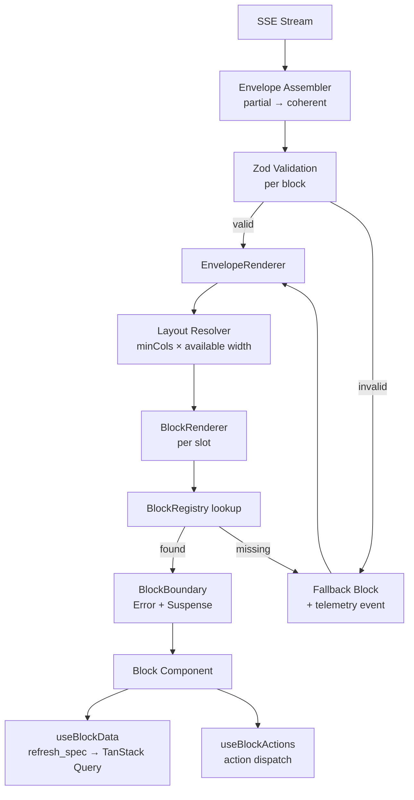
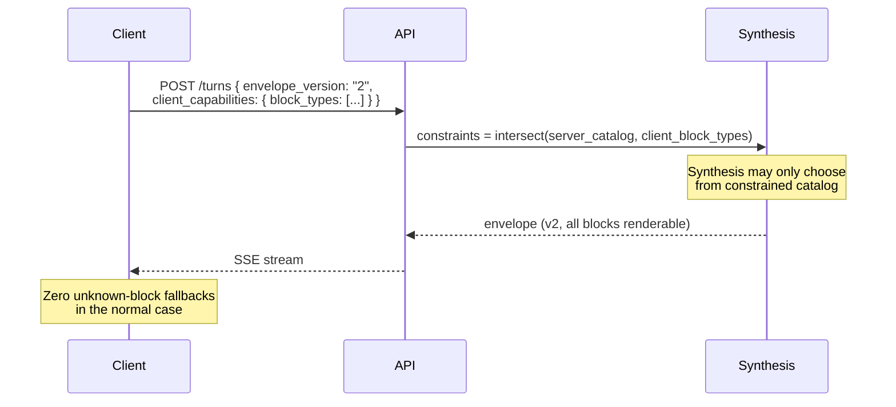

# Part III — The Generative UI Layer

This is the part of the system with no off-the-shelf equivalent. It is our core differentiating asset, and it deserves the most careful specification.

## 16. The Response Envelope

### 16.1 Definition and top-level schema

A **Response Envelope** is the single artifact the intelligence layer produces. It is a versioned, validated JSON document that fully describes a response: its content, its structure, its evidence, its interactivity and its refresh semantics.

```jsonc
{
  "envelope_id": "01JB8Q2H4K5M6N7P8R9S0T1U2V",
  "version": "2",
  "turn_id": "01JB8Q2H4K...",
  "conversation_id": "01JB8Q0000...",
  "tenant_id": "01JAA...",
  "created_at": "2026-07-25T09:14:02.441Z",
  "locale": "en-IN",

  "intent": {
    "primary": "revenue.diagnose_variance",
    "confidence": 0.91,
    "entities": {
      "properties": ["01J...a1"],
      "period": { "from": "2026-07-17", "to": "2026-07-20", "grain": "day" },
      "comparison": { "kind": "prior_year", "from": "2025-07-18", "to": "2025-07-21" },
      "metrics": ["occupancy", "adr", "revpar"]
    },
    "unresolved": []
  },

  "summary": {
    "headline": "RevPAR fell 18% versus the same weekend last year, driven entirely by rate, not occupancy.",
    "tone": "negative",
    "confidence": "high"
  },

  "layout": {
    "kind": "grid",
    "cols": 4,
    "slots": [
      { "block_id": "b1", "span": 1 },
      { "block_id": "b2", "span": 1 },
      { "block_id": "b3", "span": 1 },
      { "block_id": "b4", "span": 1 },
      { "block_id": "b5", "span": 4 },
      { "block_id": "b6", "span": 4 },
      { "block_id": "b7", "span": 2 },
      { "block_id": "b8", "span": 2 }
    ]
  },

  "blocks": [ /* see §16.3 */ ],

  "provenance": {
    "tool_calls": [
      {
        "id": "tc_1",
        "tool": "metrics.timeseries",
        "args_digest": "sha256:9f2a...",
        "row_count": 4,
        "latency_ms": 143,
        "source": "postgres.core.fact_daily_metric",
        "as_of": "2026-07-25T06:00:00Z"
      },
      {
        "id": "tc_3",
        "tool": "market.compset_rates",
        "row_count": 24,
        "latency_ms": 1811,
        "source": "external.rateshop",
        "as_of": "2026-07-25T04:30:00Z",
        "freshness_warning": "Comp-set rates are up to 29 hours old."
      }
    ],
    "documents": [],
    "metric_definitions": ["revpar@v2", "adr@v2", "occupancy@v3"]
  },

  "actions": [
    {
      "key": "create_rate_plan_review",
      "label": "Draft a rate review for next weekend",
      "kind": "workflow",
      "requires_confirmation": true,
      "scope": "revenue:write"
    }
  ],

  "followups": [
    { "label": "Which channels lost the most rate?", "prompt": "Break the ADR decline down by booking channel for 17–20 July." },
    { "label": "Was this weekend-specific?", "prompt": "Compare weekday vs weekend RevPAR for July against last year." },
    { "label": "What are competitors charging next weekend?", "prompt": "Show comp set rates for 24–27 July." }
  ],

  "diagnostics": {
    "degraded": false,
    "warnings": [],
    "usage": {
      "input_tokens": 8214,
      "output_tokens": 1902,
      "reasoning_tokens": 640,
      "tool_calls": 4,
      "wall_ms": 6120,
      "cost_inr": 3.71,
      "model_route": "reasoning.default"
    }
  }
}
```

### 16.2 Why this shape

Every top-level field earns its place:

| Field | Why it exists |
|---|---|
| `version` | Enables additive evolution and client-side negotiation (§19.2). |
| `intent` | Makes the system's understanding **inspectable and correctable**. The UI renders the resolved scope as editable chips; if the system misread "last weekend," the user fixes it in one click instead of retyping. `unresolved` drives clarification UI. |
| `summary.headline` | One-sentence conclusion, always. Used in notifications, digests, list previews, and as the `aria-label` of the turn. Forces the system to have a point of view. |
| `layout` | Separates structure from content so structure can stream first (§9.3). Advisory to the client (§13.1). |
| `blocks` | The content. Ordered independently of layout so a client can ignore layout entirely. |
| `provenance` | Trust infrastructure. Blocks reference these IDs rather than duplicating source metadata. |
| `actions` | Envelope-level actions with explicit permission scopes. Enables the insight→action loop. |
| `followups` | The next-question mechanism (§15.2, principle 5). |
| `diagnostics` | Cost, degradation, warnings. Powers per-tenant budget accounting and the internal debugging UI. |

### 16.3 The Block

```jsonc
{
  "id": "b5",
  "type": "chart.timeseries",
  "title": "RevPAR, 17–20 July vs same weekend 2025",
  "subtitle": "Rate decline accounts for the full gap",
  "payload": { /* type-specific, see §17 */ },
  "provenance_refs": ["tc_1", "revpar@v2"],
  "refresh_spec": {
    "tool": "metrics.timeseries",
    "args": {
      "property_ids": ["01J...a1"],
      "metrics": ["revpar"],
      "from": "2026-07-17",
      "to": "2026-07-20",
      "grain": "day",
      "compare": "prior_year"
    },
    "ttl_seconds": 900,
    "refreshable": true
  },
  "actions": [
    { "key": "drill_day", "label": "Drill into a day", "kind": "query", "param": "date" },
    { "key": "change_grain", "label": "Weekly", "kind": "param", "patch": { "grain": "week" } }
  ],
  "state": "complete",
  "confidence": "high",
  "pinnable": true,
  "exportable": true
}
```

### 16.4 `refresh_spec` — the most important field in the schema

`refresh_spec` is what separates this architecture from a chat product, and it is worth stating why plainly.

A generated chart contains two things: **a decision** (that a timeseries of RevPAR compared to prior year is the right way to answer this question) and **data** (the numbers). The decision cost ~9,000 tokens and 6 seconds of model time. The data cost one indexed SQL query and 140ms.

By persisting `refresh_spec`, we can re-execute the data binding without re-executing the decision. That single property enables:

- **Pinned blocks in Spaces** that refresh on open — a dashboard for the price of a query.
- **Scheduled digests** that reuse yesterday's reasoning with today's numbers.
- **Parameter adjustment** ("show weekly instead of daily") as a 200ms interaction rather than a full turn.
- **Cost control**: the marginal cost of a returning user viewing their pinned dashboard is near zero.
- **Correctness**: a pinned KPI is never stale, because it re-queries rather than replaying a cached number.

`refresh_spec.args` is validated against the tool's declared input schema on the server before execution, and the tool is re-authorised against the *current* user's permissions — a refresh spec is not a capability grant. A user who loses access to a property cannot refresh a block that reads it, and the block degrades to a permission-denied state.

### 16.5 Envelope persistence

Envelopes are persisted in full as JSONB in PostgreSQL (`ai.envelope`), not reconstructed from a message log. Reasons:

1. **Artifacts need addresses.** `/os/artifacts/{envelope_id}` must render exactly what the user saw.
2. **Regression testing.** Golden envelopes are the fixtures for both frontend tests and AI evaluation.
3. **Reproducibility for support.** "Show me what the customer saw" must be answerable exactly.
4. **Re-rendering to other surfaces** (PDF, email, XLSX) reads the envelope, not the model.

Envelopes are large (10–200KB). Storage strategy in §48.5: JSONB in Postgres for the last 90 days with a GIN index on selected paths, then tiered to Blob Storage with a pointer row.

---

## 17. The block catalog

### 17.1 Catalog principles

The catalog is a **closed vocabulary**. The model selects from it; it does not invent block types, and it never emits HTML, JSX or arbitrary code. This is a deliberate rejection of the "let the LLM write React" approach, and the reasoning matters:

| Approach | Verdict |
|---|---|
| **LLM emits React/HTML, client renders it** | **Rejected.** Unsafe (XSS, injection), unbounded (untestable, unstyleable, inconsistent), slow (must generate every token of markup), unbenchmarkable (cannot diff two responses), and impossible to render on non-HTML surfaces. |
| **LLM emits a closed set of typed block specs** | **Adopted.** Safe, fast (a chart spec is ~300 tokens, its React equivalent is ~3,000), consistent, testable, portable to PDF/email/mobile, and version-negotiable. |

The trade-off we accept: **the model cannot express a visualisation we have not built.** We mitigate with a broad catalog and by treating "the model wanted a block type we lack" as a tracked product signal — the synthesis stage logs `desired_block_unavailable` events, which directly drives the block roadmap. That is a feature: our block backlog is generated from real user questions.

### 17.2 Catalog v1 — the full vocabulary

| Type | Purpose | `minCols` | Phase |
|---|---|---|---|
| `text.markdown` | Narrative, explanation. Restricted markdown subset. | 1 | 1 |
| `metric.kpi` | Single figure + delta + sparkline + target | 1 | 1 |
| `metric.group` | Coordinated set of KPIs sharing a period | 2 | 1 |
| `chart.timeseries` | Line/area over time, multi-series, comparison overlay | 2 | 1 |
| `chart.bar` | Categorical comparison, grouped/stacked, horizontal | 2 | 1 |
| `chart.heatmap` | 2D density — day-of-week × week, hour × day | 3 | 2 |
| `chart.waterfall` | Variance decomposition — the canonical "why did P&L move" chart | 3 | 3 |
| `chart.scatter` | Correlation — rate vs occupancy, price elasticity | 2 | 3 |
| `chart.gauge` | Progress against target | 1 | 2 |
| `chart.index` | Indexed comparison vs comp set (MPI/ARI/RGI) | 2 | 3 |
| `table.generic` | Sortable, groupable, exportable data table | 2 | 1 |
| `table.comparison` | Side-by-side entity comparison with winner highlighting | 3 | 2 |
| `table.financial` | P&L / statement layout with subtotals and indentation | 3 | 4 |
| `card.supplier` | Vendor: pricing, terms, rating, contact, distance | 1 | 4 |
| `card.property` | Property summary card for portfolio views | 1 | 2 |
| `plan.actions` | Ordered recommendations: impact, effort, owner, due, confidence | 2 | 2 |
| `list.checklist` | Interactive checklist with persisted state | 1 | 3 |
| `list.themes` | Ranked themes with counts and representative quotes | 2 | 3 |
| `forecast.card` | Prediction with confidence interval and driver attribution | 2 | 3 |
| `sentiment.breakdown` | Sentiment distribution by dimension with drill-through | 2 | 3 |
| `map.properties` | Geographic view: own properties, comp set, vendors | 2 | 3 |
| `timeline` | Chronological events — bookings, incidents, campaigns | 2 | 3 |
| `report.expandable` | Long-form structured report, collapsible sections | 4 | 3 |
| `doc.citation` | Source excerpt with document link and page/section anchor | 1 | 2 |
| `compare.periods` | Structured period-over-period with driver decomposition | 3 | 3 |
| `alert.callout` | Warning, anomaly, or data-quality notice | 2 | 1 |
| `form.parameters` | Adjustable parameters that re-run a `refresh_spec` | 1 | 3 |
| `_fallback` | Unknown type — renders title, summary, and raw data toggle | 1 | 1 |

### 17.3 Representative block schemas

The following are normative. Backend Pydantic models are the source of truth; TypeScript and Zod are generated from them.

**`metric.kpi`**

```typescript
interface MetricKpiPayload {
  label: string;                   // "RevPAR"
  value: number;
  unit: 'INR' | 'USD' | 'EUR' | 'percent' | 'count' | 'nights' | 'ratio';
  precision?: number;
  metric_id: string;               // 'revpar@v2' — links to normative definition
  period: { from: string; to: string; grain?: Grain };

  comparison?: {
    kind: 'prior_period' | 'prior_year' | 'target' | 'budget' | 'compset';
    value: number;
    delta_abs: number;
    delta_pct: number;
    /** Semantic direction — NOT the sign. Cost going down is good. */
    direction: 'favourable' | 'unfavourable' | 'neutral';
  };

  sparkline?: { points: number[]; labels?: string[] };
  target?: { value: number; label: string };
  annotation?: string;             // "Excludes 4 OOO rooms"
}
```

The `direction` field is a small detail that prevents a large class of embarrassing bug. A 12% *decrease* in cost-per-occupied-room is good; a 12% decrease in RevPAR is bad. The renderer must never infer colour from the sign of a delta. The backend, which knows the metric's polarity from its definition, states it explicitly.

**`chart.timeseries`**

```typescript
interface ChartTimeseriesPayload {
  x: { kind: 'time'; values: string[]; grain: 'hour'|'day'|'week'|'month'|'quarter' };
  series: Array<{
    id: string;
    label: string;
    values: (number | null)[];     // null = genuinely no data; never coerce to 0
    unit: string;
    axis?: 'left' | 'right';
    style?: 'solid' | 'dashed' | 'area';
    emphasis?: boolean;
    metric_id?: string;
  }>;
  annotations?: Array<{
    kind: 'point' | 'band' | 'line';
    at: string | [string, string];
    label: string;
    severity?: 'info' | 'warning' | 'critical';
  }>;
  y_axes?: Array<{ id: 'left'|'right'; label: string; unit: string; min?: number; max?: number; zero_based?: boolean }>;
  /** Accessible text description. MUST be present. */
  description: string;
}
```

Three things the schema enforces:

- **`null` is preserved, never zero-filled.** A hotel that was closed for renovation had *no* occupancy, not 0% occupancy. Zero-filling produces charts that lie.
- **`description` is mandatory** — no chart ships without an accessible summary (§12.2).
- **The payload is a data spec, not an ECharts option.** The frontend's `specBuilders.ts` translates to ECharts. If we ever swap charting libraries, the envelope schema is unaffected. This is the same replaceable-driver principle as P5, applied to visualisation.

**`plan.actions`**

```typescript
interface PlanActionsPayload {
  horizon?: 'today' | 'this_week' | 'this_month' | 'this_quarter';
  items: Array<{
    id: string;
    title: string;
    rationale: string;
    /** Quantified where possible — this is what makes it a recommendation, not advice. */
    expected_impact?: { metric_id: string; value: number; unit: string; confidence: 'low'|'medium'|'high' };
    effort: 'low' | 'medium' | 'high';
    priority: 1 | 2 | 3;
    owner_role?: string;
    due?: string;
    depends_on?: string[];
    evidence_refs: string[];        // provenance IDs — MUST be non-empty
    action?: { key: string; label: string; scope: string; payload: Record<string, unknown> };
  }>;
}
```

`evidence_refs` is required and non-empty. **A recommendation with no evidence is not shipped.** The validation stage (§33.4) drops any item failing this check and records it as an eval failure.

**`card.supplier`**

```typescript
interface CardSupplierPayload {
  vendor_id: string;
  name: string;
  category: string;
  logo_url?: string;
  rating?: { value: number; scale: 5 | 10; count: number; source: string };
  location?: { city: string; distance_km?: number; lat?: number; lon?: number };
  pricing?: {
    unit: string;                   // "per kg", "per room per month"
    amount: number;
    currency: string;
    /** Compared against the tenant's current spend where known. */
    vs_current?: { delta_pct: number; direction: 'favourable' | 'unfavourable' };
  };
  terms?: { moq?: string; lead_time_days?: number; payment_terms?: string };
  badges?: Array<'verified' | 'gst_registered' | 'fssai' | 'existing_vendor' | 'new'>;
  contact?: { phone?: string; email?: string; website?: string };
  actions?: BlockAction[];          // "Request quote", "Add to comparison"
}
```

### 17.4 Renderer architecture



```tsx
// features/envelope/renderer/BlockRenderer.tsx
export function BlockRenderer({ block, density, onAction }: BlockRendererProps) {
  const def = resolveBlock(block.type);

  const parsed = useMemo(() => def.schema.safeParse(block.payload), [def, block.payload]);

  if (!parsed.success) {
    // Never throw. Log, degrade, continue.
    trackEvent('block_validation_failed', {
      block_type: block.type,
      envelope_version: block.envelope_version,
      issues: parsed.error.issues.slice(0, 3),
    });
    return <FallbackBlock block={block} reason="schema" />;
  }

  if (block.state === 'pending' || (block.state === 'partial' && !def.streamable)) {
    return <def.skeleton hint={block.title} />;
  }

  const Component = def.component;

  return (
    <BlockBoundary blockId={block.id} blockType={block.type}>
      <Component
        id={block.id}
        payload={parsed.data}
        streaming={block.state === 'partial'}
        density={density}
        provenance={block.provenance_refs}
        onAction={onAction}
      />
    </BlockBoundary>
  );
}
```

The three defensive properties here are the whole point:

1. **Validation failure degrades, never crashes.** One malformed block does not take down the response.
2. **Unknown types degrade.** An older client receiving a newer block type shows a fallback with the block's title and a "view data" toggle — degraded, but honest and still useful.
3. **Every failure is telemetry.** `block_validation_failed` and `block_type_unknown` events flow to ClickHouse and are alerted on. A schema drift between backend and frontend is detected in minutes, not in a support ticket.

### 17.5 Streaming assembly

```typescript
// lib/envelope/assemble.ts
export function applyDelta(turn: StreamingTurn, ev: StreamEvent): StreamingTurn {
  switch (ev.type) {
    case 'layout':
      return {
        ...turn,
        status: 'executing',
        blockOrder: ev.slots.map((s) => s.block_id),
        blocks: Object.fromEntries(
          ev.slots.map((s) => [s.block_id, { id: s.block_id, type: s.type, state: 'pending', span: s.span }]),
        ),
      };

    case 'block.partial':
      return patchBlock(turn, ev.block_id, (b) => ({
        ...b,
        state: 'partial',
        payload: deepMerge(b.payload ?? {}, ev.patch),
      }));

    case 'block.delta':
      return patchBlock(turn, ev.block_id, (b) => ({
        ...b,
        state: 'partial',
        payload: { ...b.payload, content: (b.payload?.content ?? '') + ev.append },
      }));

    case 'block.complete':
      return patchBlock(turn, ev.block_id, () => ({
        id: ev.block_id, type: ev.type, state: 'complete',
        payload: ev.payload, provenance_refs: ev.provenance,
        refresh_spec: ev.refresh_spec, actions: ev.actions,
      }));

    case 'envelope.complete':
      return { ...turn, status: 'complete', meta: { ...turn.meta, usage: ev.usage } };

    case 'error':
      return ev.block_id
        ? patchBlock(turn, ev.block_id, (b) => ({ ...b, state: 'error', error: ev }))
        : { ...turn, status: 'error', error: ev };
  }
}
```

**Block-scoped errors are the resilience keystone.** If rate-shopping data times out, the comp-set chart shows "Comp set data unavailable — retry" while the other seven blocks render normally. The user still gets 85% of their answer. Contrast with the naive design where one tool failure returns a 500 and the user gets nothing.

### 17.6 Ambient context contribution

Every existing SOYL Cloud page contributes context to `⌘K` invocations:

```typescript
// app/(platform)/properties/[id]/revenue/page.tsx
export const aiContext: AIContextDescriptor = {
  route: 'property.revenue',
  describe: (params, search) => ({
    property_ids: [params.id],
    date_range: parseRange(search),
    focus_metrics: ['occupancy', 'adr', 'revpar'],
    hint: 'The user is looking at the revenue dashboard for a single property.',
  }),
};
```

The `⌘K` palette reads the active route's descriptor and includes it as `seed_context` on turn creation. The orchestrator injects it as high-priority working memory. Practically: the user is on the Goa revenue page, presses `⌘K`, types *"why is this down?"* — and "this" resolves correctly with no further disambiguation. That interaction is what makes the AI feel like part of the operating system rather than a widget in the corner.

---

## 18. Interactivity and the action loop

### 18.1 Action taxonomy

| Kind | Semantics | Round trip | Example |
|---|---|---|---|
| `param` | Patch a `refresh_spec` and re-fetch | Data only, ~200ms | "Weekly instead of daily" |
| `query` | Start a new turn with a pre-built prompt | Full turn | "Drill into 18 July" |
| `navigate` | Route within SOYL Cloud | None | "Open the reservation list" |
| `workflow` | Execute a business action with side effects | Confirmation → job | "Send RFQ to these three vendors" |
| `export` | Render the envelope or block to a file | Background job | "Export to Excel" |
| `pin` | Persist to a Space | Immediate | "Pin to morning view" |
| `feedback` | Signal correctness | Immediate | Thumbs up/down + reason |

### 18.2 Workflow actions require a confirmation contract

Anything with side effects renders a confirmation sheet that states, in plain language: what will happen, to whom, what it costs, and whether it is reversible. The backend returns a **preview** before executing.

```
POST /api/v1/os/blocks/{block_id}/actions/{key}
{ "mode": "preview", "payload": {...} }

200 OK
{
  "preview": {
    "summary": "Send a request for quotation to 3 laundry vendors in North Goa.",
    "effects": [
      { "kind": "email", "count": 3, "recipients_redacted": ["s***@abclaundry.in", "..."] },
      { "kind": "record", "description": "Creates 1 RFQ record in Procurement" }
    ],
    "reversible": true,
    "reversal": "RFQs can be withdrawn within 24 hours.",
    "cost": null,
    "requires_scope": "procurement:write"
  },
  "confirmation_token": "cft_01JB..."
}
```

Execution requires the `confirmation_token`, which is single-use, scoped to the action and payload digest, and expires in 5 minutes. **The AI can never cause a side effect without an explicit human confirmation of a rendered preview.** This is an absolute rule through Phase 5 and is a security control, not a UX preference (§60). Autonomous action, if we ever ship it, will require a separate, explicitly-granted, per-action-type autonomy policy with hard limits — designed in §35.4, not enabled.

### 18.3 Feedback capture

Every block and every turn carries feedback affordances, because in a probabilistic product feedback is training data and evaluation signal, not a support channel.

```typescript
interface FeedbackEvent {
  target: { kind: 'turn' | 'block'; id: string };
  signal: 'positive' | 'negative';
  reasons?: Array<'wrong_number' | 'wrong_period' | 'missed_context' | 'not_useful'
                | 'too_slow' | 'wrong_visualisation' | 'hallucination' | 'other'>;
  correction?: string;
  /** Captured automatically for reproduction. */
  envelope_id: string;
  trace_id: string;
}
```

Negative feedback with `wrong_number` or `hallucination` auto-creates an evaluation case in the eval suite with the full trace attached (§39.3). This is how the eval set grows from real failures rather than from imagination, and it is the single highest-value feedback loop in the system.

---

## 19. Failure modes and graceful degradation

### 19.1 The failure taxonomy

| Failure | Detection | User experience | Recovery |
|---|---|---|---|
| Tool timeout | Per-tool deadline | That block shows "unavailable," others render | Retry that block only |
| Tool returns no rows | Row count 0 | Block renders an honest empty state explaining *why* | Suggest widening the period |
| Model returns invalid JSON | Pydantic validation | Invisible — repair pass, then reroute (§33.5) | Automatic, ≤2 attempts |
| Model emits unknown block type | Registry miss on server | Server rewrites to nearest supported type or `_fallback` | Logged as product signal |
| Client cannot render a block type | Registry miss on client | Fallback with title + raw data toggle | Prompt to refresh app |
| Budget exceeded | Orchestrator ledger | Partial envelope + explicit notice | Offer to continue at a cost |
| Provider outage | Circuit breaker | Automatic reroute to fallback provider; user sees nothing | §37.4 |
| All providers down | Circuit breaker | Honest error + cached similar answers if any | Status page link |
| Stream disconnects | Client heartbeat gap | Auto-reconnect with `from_seq` | §10.5 |
| Permission denied on refresh | Server authz check | Block shows lock state | Request access flow |

### 19.2 Version negotiation



Two mechanisms working together:

1. **Capability-constrained synthesis.** The client declares what it can render; the model is constrained to that set. A mobile client without map support simply never receives a map block — it receives a `table.comparison` instead, which is a genuinely better mobile experience anyway.
2. **Graceful fallback as a safety net.** For the case where a client's declared capabilities are wrong or an envelope is replayed into an older client (a shared artifact link, an old cached page), `_fallback` renders.

The rule that keeps this manageable: **envelope schema changes are additive within a major version.** Adding a block type, adding an optional field, adding an action kind — all v2-compatible. Removing a field or changing a field's type requires v3, and v2 must be served for at least 90 days.

### 19.3 The degraded envelope

When the system cannot fully answer, it produces a **partial envelope with `diagnostics.degraded = true`** rather than an error. This is a product decision with architectural teeth: 70% of an answer plus an honest statement of what is missing is far more valuable than a 500, and it is what a competent human analyst would do.

```jsonc
{
  "diagnostics": {
    "degraded": true,
    "warnings": [
      {
        "code": "SOURCE_UNAVAILABLE",
        "message": "Competitor rate data could not be retrieved. The comparison below uses your own historical rates only.",
        "affected_blocks": ["b6"],
        "severity": "medium"
      },
      {
        "code": "DATA_FRESHNESS",
        "message": "PMS data was last synced 14 hours ago; today's figures are incomplete.",
        "affected_blocks": ["b1", "b2"],
        "severity": "low"
      }
    ]
  }
}
```

Warnings render as an `alert.callout` block at the top of the response and as inline badges on affected blocks. `DATA_FRESHNESS` warnings in particular are non-negotiable: showing a partial day's revenue as if it were complete is the fastest way to destroy trust in the product.
