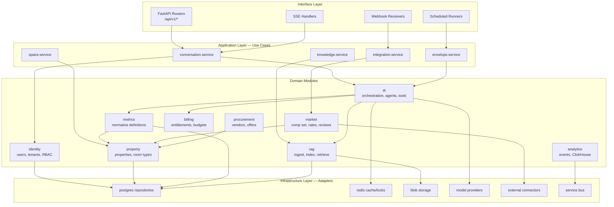
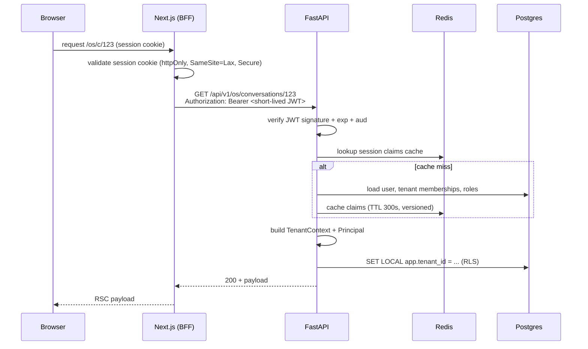
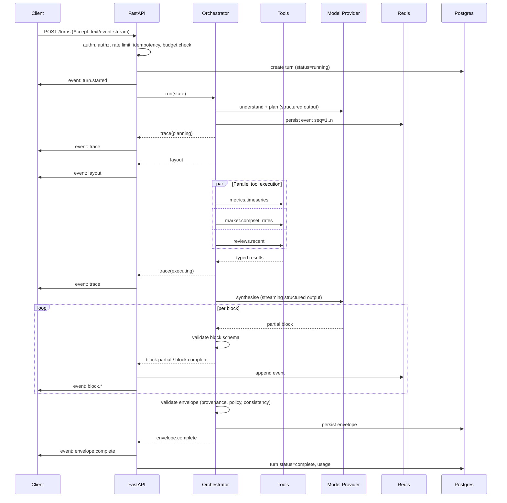
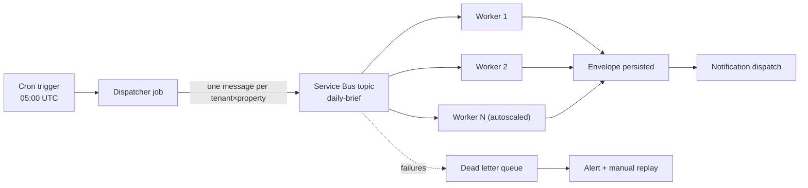
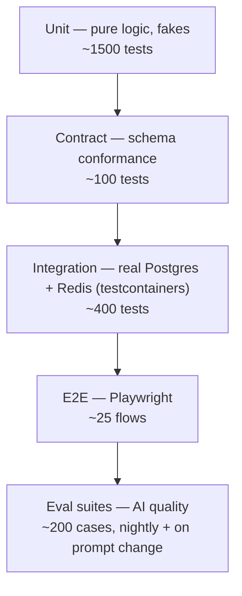

# Part IV — Backend Architecture

## 20. Modular monolith vs microservices

### 20.1 The decision

**Decision: a modular monolith in Python/FastAPI, with hard internal module boundaries, deployed as two containers (API and Worker) in Phase 1, splitting the AI orchestration runtime into a third container in Phase 3.**

**Rationale.** With 2–5 engineers, the dominant cost is not compute — it is coordination, deployment surface and debugging across process boundaries. Microservices trade local complexity for distributed complexity, and distributed complexity is paid for by an on-call rotation we do not have. A monolith gives us: one deployment, one transaction boundary, one local dev environment (`docker compose up`), one debugger, one trace that does not cross a network, and refactoring that a type checker can verify.

What makes this safe rather than naive is that **we pay the modularity cost up front** — hard boundaries, ports and adapters, import linting — so that extraction is a deployment change rather than an archaeology project.

**Alternatives considered.**

| Option | Assessment |
|---|---|
| **Microservices from day one** | Rejected. At our size this means 6 repos, 6 pipelines, 6 dashboards, distributed transactions, and a service mesh, to serve fewer than 100 tenants. The failure mode is well documented: teams spend their first year building platform instead of product. |
| **Serverless-first (Azure Functions for everything)** | Rejected as the primary model. Cold starts are unacceptable for a streaming AI request; long-running LangGraph executions fight the execution model; local development is materially worse. We do use Functions for genuinely event-driven, bursty, isolated work (§25.5). |
| **Single unstructured monolith** | Rejected. Without boundaries, the AI module and the core platform become inseparable within two quarters, and we lose the ability to scale them independently — which we know we will need, because their resource profiles differ by an order of magnitude. |
| **Modular monolith** | **Adopted.** |

**Reversal cost: Low-to-Medium**, by construction. That is the entire point of the design.

### 20.2 The module map



### 20.3 Boundary enforcement

Boundaries that are not enforced mechanically do not exist. Three enforcement mechanisms:

**1. Import linting.** `import-linter` runs in CI with a contract file:

```ini
# .importlinter
[importlinter]
root_package = soyl

[importlinter:contract:layers]
name = Layered architecture
type = layers
layers =
    soyl.interface
    soyl.application
    soyl.domain
    soyl.infrastructure

[importlinter:contract:module-independence]
name = Domain modules are independent
type = independence
modules =
    soyl.domain.identity
    soyl.domain.property
    soyl.domain.market
    soyl.domain.procurement
    soyl.domain.rag

[importlinter:contract:provider-isolation]
name = No provider SDKs outside the provider adapters
type = forbidden
source_modules = soyl.domain, soyl.application, soyl.interface
forbidden_modules = openai, anthropic, azure.ai.inference, google.generativeai
```

The third contract is P5 (§5) made mechanical. It is the cheapest, highest-value lint rule in the codebase.

**2. No cross-module ORM access.** Module A never imports module B's SQLAlchemy models. Cross-module reads go through a port — a Protocol defined by the *consumer*, implemented by the producer.

```python
# soyl/domain/ai/ports.py  — defined by the CONSUMER
from typing import Protocol
from datetime import date
from uuid import UUID

class PropertyDirectory(Protocol):
    async def get_summaries(
        self, tenant_id: UUID, property_ids: list[UUID]
    ) -> list["PropertySummary"]: ...

class MetricEngine(Protocol):
    async def timeseries(
        self, ctx: "MetricContext", metric_ids: list[str],
        frm: date, to: date, grain: str,
    ) -> "MetricSeriesResult": ...
```

The AI module depends on an interface *it* owns. It has no compile-time or runtime knowledge of the property module. Extracting the property module into a service later means writing an HTTP-backed implementation of `PropertyDirectory` — a file, not a refactor.

**3. Per-module public API.** Each module's `__init__.py` exports exactly what is public. Everything else is `_private` by convention and by lint rule.

### 20.4 The pre-planned split

We know which seams will need to become process boundaries, and roughly when:

| Split | Trigger | Phase | Difficulty |
|---|---|---|---|
| **AI Orchestration → own container** | AI request memory/duration profile diverges from CRUD; need independent scaling and separate deploy cadence | 3 | Low — already invoked via a service interface |
| **Ingestion workers → own container** | Document ingestion CPU spikes starve the API | 2 | Trivial — already a worker |
| **Integration connectors → own container** | Third-party rate limits and retries need independent scaling and isolation from user-facing latency | 4 | Low — connectors are adapters behind a port |
| **Analytics ingest → Function** | Event volume exceeds what an in-process background task should handle | 3 | Trivial |
| **Metrics engine → service** | Only if a non-Python consumer appears | 6 | Medium |

Everything else stays in the monolith, probably forever. There is no plan to decompose identity, property, or conversation management, and a proposal to do so should be met with "what problem does this solve that a module boundary does not?"

---

## 21. Backend folder structure

```
services/api/
├── pyproject.toml
├── alembic.ini
├── alembic/
│   ├── env.py
│   └── versions/
├── soyl/
│   ├── __init__.py
│   ├── main.py                          # FastAPI app factory, lifespan, middleware
│   ├── settings.py                      # pydantic-settings, env-driven config
│   ├── container.py                     # DI container wiring
│   │
│   ├── interface/                       # ── LAYER 1: transport ──
│   │   ├── http/
│   │   │   ├── deps.py                  # FastAPI dependencies (auth, tenant, db)
│   │   │   ├── errors.py                # exception → RFC 9457 handlers
│   │   │   ├── middleware/
│   │   │   │   ├── request_context.py   # trace id, tenant id, timing
│   │   │   │   ├── rate_limit.py
│   │   │   │   ├── idempotency.py
│   │   │   │   └── security_headers.py
│   │   │   └── v1/
│   │   │       ├── router.py
│   │   │       ├── conversations.py
│   │   │       ├── turns.py             # the SSE endpoint
│   │   │       ├── envelopes.py
│   │   │       ├── blocks.py            # refresh + actions
│   │   │       ├── spaces.py
│   │   │       ├── knowledge.py
│   │   │       ├── properties.py
│   │   │       └── admin.py
│   │   ├── webhooks/
│   │   │   ├── pms.py
│   │   │   ├── reviews.py
│   │   │   └── billing.py
│   │   └── scheduled/
│   │       ├── daily_brief.py
│   │       ├── anomaly_scan.py
│   │       └── index_maintenance.py
│   │
│   ├── application/                     # ── LAYER 2: use cases ──
│   │   ├── conversation/
│   │   │   ├── start_turn.py
│   │   │   ├── resume_stream.py
│   │   │   └── dto.py
│   │   ├── envelope/
│   │   │   ├── refresh_block.py
│   │   │   ├── execute_action.py
│   │   │   └── export_envelope.py
│   │   ├── knowledge/
│   │   │   ├── ingest_document.py
│   │   │   └── reindex.py
│   │   └── space/
│   │
│   ├── domain/                          # ── LAYER 3: business logic ──
│   │   ├── identity/
│   │   │   ├── models.py
│   │   │   ├── rbac.py                  # role → scope resolution
│   │   │   ├── tenancy.py               # TenantContext
│   │   │   └── service.py
│   │   ├── property/
│   │   ├── metrics/
│   │   │   ├── definitions.py           # ── NORMATIVE METRIC DEFINITIONS ──
│   │   │   ├── engine.py
│   │   │   ├── context.py               # MetricContext, MetricResult
│   │   │   └── sql/                     # parameterised, reviewed SQL
│   │   ├── ai/
│   │   │   ├── ports.py
│   │   │   ├── orchestration/
│   │   │   │   ├── graph.py             # LangGraph assembly
│   │   │   │   ├── state.py             # OrchestrationState
│   │   │   │   ├── nodes/
│   │   │   │   │   ├── understand.py
│   │   │   │   │   ├── plan.py
│   │   │   │   │   ├── route.py
│   │   │   │   │   ├── execute.py
│   │   │   │   │   ├── synthesise.py
│   │   │   │   │   ├── validate.py
│   │   │   │   │   └── repair.py
│   │   │   │   ├── budget.py
│   │   │   │   └── checkpointer.py      # Postgres-backed state persistence
│   │   │   ├── agents/
│   │   │   │   ├── base.py
│   │   │   │   ├── registry.py
│   │   │   │   ├── revenue.py
│   │   │   │   ├── reputation.py
│   │   │   │   ├── procurement.py
│   │   │   │   ├── operations.py
│   │   │   │   ├── knowledge.py
│   │   │   │   └── market.py
│   │   │   ├── tools/
│   │   │   │   ├── base.py              # @tool decorator, registry, scopes
│   │   │   │   ├── metrics_tools.py
│   │   │   │   ├── market_tools.py
│   │   │   │   ├── review_tools.py
│   │   │   │   ├── document_tools.py
│   │   │   │   ├── vendor_tools.py
│   │   │   │   ├── forecast_tools.py
│   │   │   │   └── action_tools.py
│   │   │   ├── envelope/
│   │   │   │   ├── schema.py            # ── ENVELOPE PYDANTIC MODELS ──
│   │   │   │   ├── blocks.py            # block payload models
│   │   │   │   ├── builder.py
│   │   │   │   └── validator.py
│   │   │   ├── memory/
│   │   │   │   ├── working.py
│   │   │   │   ├── episodic.py
│   │   │   │   ├── semantic.py
│   │   │   │   └── summariser.py
│   │   │   ├── guardrails/
│   │   │   │   ├── input_guard.py
│   │   │   │   ├── output_guard.py
│   │   │   │   └── injection.py
│   │   │   └── eval/
│   │   │       ├── datasets.py
│   │   │       ├── graders.py
│   │   │       └── runner.py
│   │   ├── rag/
│   │   │   ├── ingest/
│   │   │   │   ├── extract.py
│   │   │   │   ├── chunk.py
│   │   │   │   └── enrich.py
│   │   │   ├── embed.py
│   │   │   ├── index.py
│   │   │   ├── retrieve.py
│   │   │   ├── rerank.py
│   │   │   └── assemble.py
│   │   ├── market/
│   │   ├── procurement/
│   │   ├── analytics/
│   │   └── billing/
│   │       ├── entitlements.py
│   │       └── budget_ledger.py
│   │
│   ├── infrastructure/                  # ── LAYER 4: adapters ──
│   │   ├── db/
│   │   │   ├── session.py               # async engine, RLS session var
│   │   │   ├── base.py
│   │   │   ├── models/                  # SQLAlchemy models by schema
│   │   │   └── repositories/
│   │   ├── cache/
│   │   │   ├── redis.py
│   │   │   ├── keys.py                  # ── CACHE KEY REGISTRY ──
│   │   │   └── locks.py
│   │   ├── storage/blob.py
│   │   ├── queue/
│   │   │   ├── service_bus.py
│   │   │   └── arq_worker.py
│   │   ├── providers/                   # ── ONLY PLACE PROVIDER SDKs LIVE ──
│   │   │   ├── base.py                  # LLMProvider protocol
│   │   │   ├── openai_provider.py
│   │   │   ├── azure_foundry_provider.py
│   │   │   ├── soyl_provider.py         # future
│   │   │   ├── router.py
│   │   │   └── embeddings.py
│   │   ├── connectors/
│   │   │   ├── base.py                  # Connector protocol
│   │   │   ├── google_places.py
│   │   │   ├── pms/
│   │   │   │   ├── cloudbeds.py
│   │   │   │   └── ezee.py
│   │   │   └── rateshop/
│   │   ├── clickhouse/
│   │   ├── secrets/key_vault.py
│   │   └── observability/
│   │       ├── tracing.py               # OpenTelemetry setup
│   │       ├── logging.py               # structlog
│   │       └── metrics.py
│   │
│   └── prompts/                         # ── PROMPT LIBRARY (versioned) ──
│       ├── registry.py
│       ├── system/
│       │   ├── core@v3.md
│       │   ├── safety@v2.md
│       │   └── formatting@v4.md
│       ├── planning/
│       ├── agents/
│       ├── synthesis/
│       └── eval/
│
└── tests/
    ├── unit/
    ├── integration/
    ├── contract/                        # schema/API contract tests
    ├── eval/                            # AI quality suites
    └── fixtures/
```

### 21.1 Why four layers and not three

The extra layer — `application` between `interface` and `domain` — pays for itself the first time a use case needs to be triggered from somewhere other than HTTP. `start_turn` is called by the HTTP router, by the scheduled daily-brief runner, and by the WhatsApp webhook. If that logic lived in the router, we would either duplicate it or import a router from a scheduler, which is how codebases rot.

---

## 22. API design

### 22.1 Conventions

- **REST with resource nouns**, plural, lowercase, hyphen-free.
- **Versioned by URL path**: `/api/v1/`. Header versioning is more elegant and materially worse to debug, cache and route.
- **ULIDs for all public IDs.** Sortable, URL-safe, no sequence leakage, no coordination.
- **Cursor pagination** everywhere. Offset pagination on a table that receives writes produces duplicates and omissions.
- **RFC 9457 Problem Details** for all errors.
- **`Idempotency-Key` required on all POSTs that create or cause side effects.**

### 22.2 The error envelope

```json
{
  "type": "https://docs.soyl.cloud/errors/budget-exceeded",
  "title": "AI budget exceeded",
  "status": 429,
  "detail": "This conversation has used its token budget for the current period.",
  "instance": "/api/v1/os/conversations/01JB.../turns",
  "trace_id": "4bf92f3577b34da6a3ce929d0e0e4736",
  "code": "BUDGET_EXCEEDED",
  "retryable": false,
  "context": { "budget_kind": "tenant_monthly", "resets_at": "2026-08-01T00:00:00Z" }
}
```

`trace_id` in every error response is non-negotiable. A support conversation that starts with a trace ID resolves in minutes; one that starts with "it didn't work" resolves in days.

### 22.3 Versioning policy

| Change | Version impact |
|---|---|
| New endpoint | None |
| New optional request field | None |
| New response field | None — clients MUST ignore unknown fields |
| New enum value | None — clients MUST handle unknown values gracefully |
| New block type | None (capability negotiation, §19.2) |
| Removing a field | Major version + 90-day dual-serve |
| Changing a field's type or semantics | Major version + 90-day dual-serve |
| Changing default behaviour | Minor, announced, feature-flagged |

Deprecation is signalled via `Deprecation` and `Sunset` headers plus a warning in the response, and — crucially — we instrument usage of deprecated fields so we know whether anyone is actually affected before we remove them.

### 22.4 API gateway posture

"Where does cross-cutting API concern live?" is a question that gets answered badly by default, so it is answered explicitly here.

**Decision: no dedicated API gateway product through Phase 5. Edge concerns terminate at Azure Front Door; application concerns terminate in FastAPI middleware; the Next.js BFF is the only client-facing composition layer. Azure API Management is introduced only when we ship the public partner API (Phase 6).**

Responsibilities are allocated as follows, and every concern has exactly one owner:

| Concern | Terminates at | Why there |
|---|---|---|
| TLS, HTTP/2, global anycast | Front Door | Edge is the only place with global presence |
| WAF, OWASP rule set, bot rules, geo-filtering | Front Door | Must reject before compute is spent |
| DDoS absorption, IP-level throttling | Front Door + Azure DDoS Protection | Volumetric defence belongs at the edge |
| Static asset caching, compression | Front Door CDN | §51.4 |
| Session validation, cookie handling | Next.js BFF | The session cookie is a browser concern; the API never sees it (§23.1) |
| Response composition for a screen | Next.js BFF (RSC) | Avoids chatty clients without a gateway aggregation layer |
| AuthN (JWT verification) | FastAPI middleware | Needs the claims cache and revocation counter (§23.1) |
| AuthZ (scopes, property scoping) | FastAPI dependency + domain | Needs the domain model; a gateway cannot express `property_ids ∩ allowed` |
| Business rate limiting and budgets | FastAPI middleware (§26.4) | Needs tenant, plan tier and cost context |
| Idempotency | FastAPI middleware | Needs the turn store |
| Request tracing and correlation | FastAPI middleware | Needs to enrich spans with tenant and turn |
| Schema validation | Pydantic | The schema is the source of truth |

**Why not Azure API Management now.** APIM adds roughly $50–700/month depending on tier, a second place where routing and policy live, a second deployment artifact, and a policy language (XML) that our team would maintain alongside Python middleware. Every concern it would own is either already handled at the edge or requires domain knowledge APIM does not have. Buying it now would give us a config surface without removing a line of code.

**Why we will want it later.** The moment we expose a *public partner API* — third-party developers, PMS vendors building on us, an integration marketplace — we need things APIM does well and we do not want to build: developer portal, subscription keys, per-subscriber quotas and analytics, product/tier packaging, API versioning as a product surface, and request/response transformation for partners on old contracts. That is Phase 6 (§73), and at that point APIM sits in front of a dedicated `/partner/v1` surface only — **not** in front of the first-party BFF traffic, which would add a hop and latency for no benefit.

**The migration is additive**, which is what makes deferring safe: APIM fronts a new route prefix on a new hostname. Nothing about the existing path changes.

**Alternatives considered.** Kong or Envoy self-hosted: more control, an operational surface we cannot staff. NGINX ingress: only relevant on AKS, which we rejected (§51.2). A hand-rolled gateway service: all of the cost, none of the developer portal.

---

## 23. Authentication and authorisation

### 23.1 Authentication

The AI OS **does not implement authentication**. It consumes the existing SOYL Cloud session. This is the central integration requirement from §2.4.



**Design points:**

- The browser holds an **httpOnly, Secure, SameSite=Lax session cookie**. It never holds a bearer token. This removes token exfiltration via XSS as a class of attack.
- The Next.js server exchanges the session for a **short-lived (5 min) service JWT** when calling FastAPI. Signed with a Key Vault–held key, `aud=soyl-api`, containing `sub`, `tenant_id`, `roles`, `scopes`, `session_id`, `jti`.
- **Claims are cached in Redis with a version counter per user.** Revoking a role bumps the counter, which invalidates cached claims within one request — not within the JWT's lifetime. This is how we get JWT performance with session revocation semantics.
- **Entra ID** is used for staff/internal access and for enterprise chain customers who require SSO (Phase 5). Consumer-tier hotel owners use the existing SOYL Cloud email/password + TOTP flow. Entra External ID is evaluated as a replacement in Phase 5 but is not a Phase 1 dependency.

### 23.2 Authorisation model

Three-layer authorisation. Each layer is independently sufficient to deny.

**Layer 1 — RBAC → scopes.** Roles are coarse and human-meaningful; scopes are fine and machine-checked.

| Role | Scopes |
|---|---|
| `owner` | `*:read`, `*:write`, `billing:*`, `tenant:admin` |
| `general_manager` | `revenue:*`, `operations:*`, `reputation:*`, `procurement:read`, `finance:read` |
| `revenue_manager` | `revenue:*`, `market:read`, `finance:read` |
| `fnb_manager` | `operations:read`, `procurement:*`, `finance:read` |
| `analyst` | `*:read` |
| `viewer` | `revenue:read`, `reputation:read` |

**Layer 2 — Property scoping.** A user is granted access to a set of properties within a tenant, and every request resolves an effective property set.

```python
@dataclass(frozen=True, slots=True)
class Principal:
    user_id: UUID
    tenant_id: UUID
    roles: frozenset[str]
    scopes: frozenset[str]
    property_ids: frozenset[UUID]     # effective, already expanded from groups

    def require(self, scope: str) -> None:
        if scope not in self.scopes and "*:write" not in self.scopes:
            raise Forbidden(scope=scope)

    def scope_properties(self, requested: Iterable[UUID]) -> frozenset[UUID]:
        allowed = frozenset(requested) & self.property_ids
        if not allowed:
            raise Forbidden(reason="no_accessible_properties")
        return allowed
```

**Layer 3 — Row-level security in PostgreSQL.** Defence in depth, and the only layer that cannot be forgotten (§48.7).

### 23.3 Authorisation in the AI layer — the hard part

An AI system that calls tools introduces an authorisation problem that ordinary CRUD apps do not have: **the model chooses what to call.** The model must never be able to escalate.

Four controls:

1. **Tool visibility is filtered before the model sees it.** The planner receives only tools whose `required_scope` is held by the principal *and* whose capability pack is entitled to the tenant. The model cannot attempt what it cannot see.
2. **Every tool re-checks authorisation at execution.** Visibility filtering is not a security boundary — it is an efficiency and UX measure. The boundary is the check inside the tool.
3. **`TenantContext` is passed by the framework, never by the model.** Tool argument schemas exposed to the model **do not contain `tenant_id`**. It is injected by the executor from the request principal. A prompt injection that says "set tenant_id to X" has nothing to bind to. This is worth stating loudly because it eliminates the most obvious AI-specific privilege escalation:

```python
@tool(name="metrics.timeseries", scope="revenue:read")
async def metrics_timeseries(
    ctx: ToolContext,                        # injected — NOT in the model-facing schema
    property_ids: list[UUID],                # model-provided, then intersected with allowed
    metrics: list[str],
    frm: date,
    to: date,
    grain: Grain = "day",
) -> MetricSeriesResult:
    ctx.principal.require("revenue:read")
    scoped = ctx.principal.scope_properties(property_ids)
    return await ctx.metrics.timeseries(
        MetricContext(tenant_id=ctx.principal.tenant_id, property_ids=scoped, ...),
        metrics, frm, to, grain,
    )
```

4. **Write scopes require human confirmation** (§18.2). No tool with a `:write` scope executes without a confirmation token derived from a preview the user saw.

---

## 24. Streaming architecture (server side)

### 24.1 The pipeline



### 24.2 FastAPI implementation

```python
@router.post("/conversations/{conversation_id}/turns")
async def create_turn(
    conversation_id: ULID,
    body: TurnRequest,
    principal: Principal = Depends(get_principal),
    orchestrator: Orchestrator = Depends(get_orchestrator),
    stream_log: StreamLog = Depends(get_stream_log),
    budget: BudgetService = Depends(get_budget),
) -> EventSourceResponse:
    await budget.assert_available(principal.tenant_id, kind="turn")
    turn = await orchestrator.create_turn(principal, conversation_id, body)

    async def event_generator() -> AsyncIterator[ServerSentEvent]:
        seq = 0
        try:
            async for event in orchestrator.run(turn):
                seq += 1
                await stream_log.append(turn.id, seq, event)   # Redis, TTL 1h
                yield ServerSentEvent(
                    event=event.type, data=event.model_dump_json(), id=str(seq)
                )
        except asyncio.CancelledError:
            # Client disconnected. Continue the run in the background so the
            # envelope is still persisted and the user can resume or find it later.
            await orchestrator.detach(turn.id)
            raise
        except Exception as exc:
            logger.exception("turn_failed", turn_id=str(turn.id))
            yield ServerSentEvent(
                event="error",
                data=ErrorEvent.from_exception(exc).model_dump_json(),
            )

    return EventSourceResponse(
        event_generator(),
        headers={"X-Accel-Buffering": "no", "Cache-Control": "no-cache, no-transform"},
    )
```

**Four details that matter:**

1. **`X-Accel-Buffering: no` and `no-transform`.** Any proxy that buffers the response destroys streaming. This has bitten every team that has built this.
2. **Client disconnect does not cancel the run.** The user closing a tab should not waste the tokens already spent, and the envelope should still be there when they come back. We detach and let it finish.
3. **Every event is logged to Redis with a sequence number** before being yielded — resumability (§10.5) depends on the log being ahead of the wire, never behind.
4. **Exceptions become error events, not HTTP 500s.** Once the response has begun streaming, the status code is already sent. Errors must be in-band.

### 24.3 Heartbeats and timeouts

- A `: keepalive` comment frame every 15s prevents intermediary idle timeouts. Azure Front Door's default backend idle timeout is well under a long analysis.
- Hard wall-clock ceiling per turn: **120s** (Phase 1–3), enforced by the orchestrator's budget. Exceeding it produces a degraded envelope with whatever blocks completed, not a timeout error.
- Per-tool deadlines: 5s for database tools, 20s for external HTTP tools, 45s for model calls. Deadlines are enforced with `asyncio.timeout`, and a breached deadline degrades one block.

### 24.4 Concurrency model

FastAPI on Uvicorn with `asyncio` is the right choice here because the workload is overwhelmingly I/O-bound: waiting on Postgres, Redis, HTTP APIs and model providers. Rules:

- **Every I/O call is `async`.** A single synchronous call blocks the event loop and destroys tail latency for every concurrent request. Enforced by `flake8-async` and by review.
- **CPU-bound work goes to a worker.** Document parsing, embedding batches, PDF generation, and any `pandas` work run in the worker pool, never in the API process.
- **Bounded concurrency for tool execution**: `asyncio.Semaphore` per tool class, sized so that a burst of AI requests cannot exhaust the Postgres connection pool. This is a real failure mode — 20 concurrent turns each firing 5 parallel database tools is 100 connections.
- **Connection pools sized deliberately**: `pool_size=10, max_overflow=10` per API replica against a Postgres instance whose `max_connections` is known and divided by expected replica count with headroom. PgBouncer in transaction mode sits in front from Phase 3.

---

## 25. Background jobs

### 25.1 Job taxonomy and tooling

| Job class | Examples | Trigger | Runner |
|---|---|---|---|
| **Ingestion** | Document parse, chunk, embed | Upload event | ARQ worker |
| **Sync** | PMS pull, review fetch, rate shop | Schedule + webhook | ARQ worker |
| **Generation** | Daily brief, anomaly scan, digest | Cron | ARQ worker |
| **Export** | PDF, XLSX, PPTX | User action | ARQ worker |
| **Maintenance** | Index rebuild, partition create, summarisation | Cron | ARQ worker |
| **Fan-out** | Per-tenant scheduled work | Cron → Service Bus | Function consumer |
| **Analytics** | Event batch → ClickHouse | Continuous | Function / worker |

**Decision: ARQ (Redis-backed async job queue) as the primary worker, with Azure Service Bus for cross-service and durable fan-out messaging.**

**Rationale for ARQ over Celery.** Celery is the default answer and it is the wrong one for an async-first Python codebase. Celery's async support remains awkward; ARQ is asyncio-native, so job code is the same code as request code — same repositories, same tool implementations, same tracing. It is dramatically simpler (a few thousand lines vs Celery's ecosystem), and its Redis dependency is one we already have. The trade-off is a smaller ecosystem and fewer batteries (no built-in workflow chaining, weaker routing). At our scale that is a fair trade; if we outgrow it, the migration surface is the job definitions, not the business logic.

**Rationale for adding Service Bus rather than using only Redis.** Redis is not a durable message broker. For anything that must not be lost — billing events, PMS webhook payloads, integration retries with long backoff — Service Bus gives us at-least-once delivery, dead-letter queues, scheduled delivery, duplicate detection and message sessions. We use it for durable, cross-boundary messaging; ARQ for internal task execution.

**Alternative considered — Azure Durable Functions** for orchestration: genuinely good for long-running workflows, rejected as primary because it fragments our codebase across two execution models and complicates local development, which is a real tax on a small team.

### 25.2 Job contract

```python
@job(
    name="ingest_document",
    queue="ingestion",
    max_tries=4,
    timeout=600,
    backoff=exponential(base=2, cap=300, jitter=True),
)
async def ingest_document(ctx: JobContext, tenant_id: UUID, document_id: UUID) -> None:
    async with ctx.tenant(tenant_id):                   # sets RLS session var
        await IngestDocumentUseCase(ctx.container).execute(document_id)
```

Every job **MUST**:

- Be **idempotent**. Retries are guaranteed, not hypothetical. Idempotency is achieved with a natural key and an `INSERT ... ON CONFLICT DO NOTHING`, or an explicit `job_execution` ledger row.
- Take `tenant_id` explicitly and run inside a tenant context so RLS applies. A job that queries without a tenant context is a cross-tenant bug waiting to happen.
- Have a **dead-letter path**. After `max_tries`, the job lands in a DLQ table with its payload and last error, and raises an alert. Silent job death is the worst failure mode in a data product because the data just quietly stops being right.
- Emit progress for anything longer than 10s, so the UI can show ingestion status.

### 25.3 Scheduling

Cron definitions live in code (`soyl/interface/scheduled/`), not in Azure portal configuration, so they are reviewable, testable and environment-aware.

| Job | Schedule | Notes |
|---|---|---|
| `pms_sync` | Every 30 min | Per-connector rate limits respected; staggered by tenant hash to avoid thundering herd |
| `review_fetch` | Hourly | |
| `rate_shop` | 04:00 local | Expensive external calls; comp-set only |
| `daily_brief` | 06:30 tenant-local | Fan-out via Service Bus, one message per property |
| `anomaly_scan` | 05:00 tenant-local | Feeds the brief |
| `conversation_summarise` | Every 15 min | Compacts long conversations (§32.4) |
| `partition_maintenance` | 02:00 UTC weekly | Creates next month's partitions |
| `index_maintenance` | 03:00 UTC weekly | `REINDEX CONCURRENTLY`, `ANALYZE`, vector index tuning |
| `eval_regression` | On deploy + nightly | §39 |

**Tenant-local scheduling is a real requirement**, not a refinement. A 6:30am brief that arrives at 2am is worse than no brief. The scheduler resolves each tenant's timezone and enqueues accordingly.

### 25.4 Fan-out pattern



The dispatcher is small and fast; the work is done by autoscaled consumers. Container Apps scales the worker replica count on Service Bus queue length via KEDA — this is one of the specific reasons Container Apps was chosen over App Service (§51.2).

### 25.5 Where Azure Functions fit

We use Functions narrowly, where their model is genuinely better:

- **Blob-triggered thumbnailing / virus scan callback** on document upload.
- **Event Grid consumers** for infrastructure events.
- **Very low-frequency, isolated timers** that should not keep a worker container warm.

We do **not** use Functions for the main job pipeline. Reasons: shared code with the monolith is awkward across a Function packaging boundary; cold starts hurt; and local development ergonomics are worse. The consistency benefit of "jobs run the same code as requests" outweighs the marginal cost saving.

---

## 26. Errors, resilience and rate limiting

### 26.1 Exception hierarchy

```python
class SoylError(Exception):
    code: str = "INTERNAL"
    status: int = 500
    retryable: bool = False
    def problem(self) -> ProblemDetails: ...

class DomainError(SoylError): ...          # business rule violated
class NotFound(DomainError): status = 404
class Conflict(DomainError): status = 409
class Forbidden(DomainError): status = 403
class ValidationError(DomainError): status = 422

class InfrastructureError(SoylError):
    retryable = True
class ProviderError(InfrastructureError): ...
class ProviderRateLimited(ProviderError): status = 429
class ProviderUnavailable(ProviderError): status = 503
class ToolTimeout(InfrastructureError): status = 504

class BudgetExceeded(SoylError): status = 429; retryable = False
class GuardrailBlocked(SoylError): status = 400; retryable = False
```

The `retryable` flag is consumed by the retry decorator, the circuit breaker and the client. It is a property of the error type, not a decision made at each call site — which means it is decided once, correctly.

### 26.2 Retry policy

| Operation | Attempts | Backoff | Notes |
|---|---|---|---|
| Postgres transient (serialisation failure, connection reset) | 3 | 50ms × 2^n + jitter | Only for idempotent reads/transactions |
| Redis | 2 | 20ms | Cache miss on failure — never fail the request because a cache failed |
| Model provider 429 | 3 | Respect `Retry-After`, else 1s × 2^n | Then reroute (§37.4) |
| Model provider 5xx | 2 | 500ms × 2^n | Then reroute |
| External HTTP (rate shop, reviews) | 3 | 1s × 2^n + jitter | Then degrade the block |
| Webhook delivery to us | n/a | Sender's policy | We must be idempotent |

**Full jitter** on every backoff. Synchronised retries from 30 workers after a provider blip is a self-inflicted outage.

### 26.3 Circuit breakers

Per-dependency breakers (model provider, each connector, ClickHouse). Standard three-state with a rolling window: 50% failure rate over 20 requests opens the breaker for 30 seconds, then half-open with a single probe.

When the breaker for a model provider is open, the router excludes it entirely — no request is spent discovering it is still down. When a connector's breaker is open, tools depending on it fail fast with `SOURCE_UNAVAILABLE`, which the orchestrator turns into a degraded block (§19.3). Fast, honest degradation beats slow, hopeful timeouts.

### 26.4 Rate limiting

Multi-dimensional, Redis-backed sliding window, applied in middleware.

| Dimension | Limit (default tier) | Rationale |
|---|---|---|
| Per user, AI turns | 30 / hour, 200 / day | Abuse and cost control |
| Per tenant, AI turns | tier-dependent | Contractual |
| Per user, all API | 600 / min | Generic protection |
| Per IP, unauthenticated | 60 / min | Credential stuffing |
| Per tenant, document upload | 100 / hour, 2GB / day | Ingestion cost |
| Per tenant, export jobs | 20 / hour | Expensive rendering |
| Per connector, outbound | Connector-specific | Respect partner limits |

Implemented with a Lua script for atomic check-and-increment. Responses carry `RateLimit-Limit`, `RateLimit-Remaining`, `RateLimit-Reset` (draft RFC headers), and 429s carry `Retry-After`.

**Rate limiting is not the same as budgeting.** Rate limits protect the system from request volume; budgets (§34.3) protect the business from cost. A user can be within their rate limit and out of budget, and the two produce different, clearly-worded errors.

### 26.5 Bulkheads

Failure isolation between the AI module and the core platform (the risk we accepted in §2.4):

- Separate connection pools for AI workloads and core CRUD, so a burst of expensive analytical queries cannot starve booking lookups.
- Separate Container Apps revision scaling rules from Phase 3.
- A global kill switch: `flags.ai.enabled=false` disables the AI OS routes and returns a maintenance surface while leaving the rest of SOYL Cloud fully operational. This flag is checked in middleware, is per-tenant capable, and is tested in a game day.

---

## 27. Observability

### 27.1 Why this matters more than usual

In a deterministic CRUD system, a bug reproduces. In a probabilistic system, a user reports "it gave me the wrong number yesterday" and the only way to answer is to replay exactly what happened: which plan, which tools with which arguments, which rows came back, which prompt version, which model, what it emitted, what the validator changed. **Tracing is not ops hygiene here — it is the debugger.**

### 27.2 The three pillars, concretely

**Traces — OpenTelemetry, exported to Application Insights.**

Span hierarchy for one turn:

```
turn (root)
├── auth
├── budget.check
├── orchestration
│   ├── node.understand
│   │   └── llm.call         [model, prompt_version, tokens_in/out, latency, cost]
│   ├── node.plan
│   │   └── llm.call
│   ├── node.route
│   ├── node.execute
│   │   ├── tool.metrics.timeseries
│   │   │   └── db.query     [statement digest, rows, plan hash]
│   │   ├── tool.market.compset_rates
│   │   │   └── http.client  [host, status, retry_count]
│   │   └── tool.reviews.recent
│   │       └── db.query
│   ├── node.synthesise
│   │   └── llm.call         [streaming, ttft, tokens]
│   ├── node.validate
│   │   ├── validate.schema
│   │   ├── validate.provenance
│   │   └── validate.policy
│   └── node.repair          [only when validation failed]
└── persist.envelope
```

Every span carries `tenant_id`, `user_id`, `conversation_id`, `turn_id`, `trace_id`. **`tenant_id` on every span** is what makes "show me every slow turn for this customer" a one-line query.

**Logs — `structlog`, JSON, correlated by `trace_id`.** No string interpolation; every log line is an event with typed fields. PII redaction is applied by a processor in the logging pipeline, not by discipline at call sites (§58.5).

**Metrics — OpenTelemetry metrics → Azure Monitor.**

| Metric | Type | Why |
|---|---|---|
| `turn.duration` | histogram, by intent, tenant tier | Latency SLO |
| `turn.ttfb` | histogram | Perceived latency — the number that matters most |
| `turn.time_to_layout` | histogram | The shape-first metric (§15.2) |
| `turn.outcome` | counter, by `complete/degraded/failed` | Reliability |
| `turn.cost_inr` | histogram, by tenant, model route | Unit economics |
| `llm.tokens` | counter, by model, direction, purpose | Cost attribution |
| `llm.latency` | histogram, by model, provider | Provider comparison |
| `tool.duration` | histogram, by tool | Bottleneck identification |
| `tool.failures` | counter, by tool, reason | Reliability by dependency |
| `envelope.blocks` | histogram, by type | Product analytics — which blocks we actually generate |
| `validation.repairs` | counter, by reason | Model quality signal |
| `provenance.coverage` | gauge | Trust quality (§5, P3) |
| `rag.recall_proxy` | histogram | Retrieval quality |
| `cache.hit_rate` | gauge, by cache name | Cost efficiency |
| `budget.utilisation` | gauge, by tenant | Commercial |

### 27.3 The AI trace viewer

We build an internal tool (Phase 2) at `/admin/traces/{trace_id}` that renders a turn as: the user input, the resolved intent, the plan, every tool call with full arguments and results, every model call with the fully-rendered prompt and raw completion, validation results and repairs, and the final envelope side by side with what the user saw.

This is a week of engineering that saves a month per quarter. It is also what makes the eval loop (§39) practical, because "add this trace to the eval set" becomes a button.

**Access to the trace viewer shows customer data and is therefore an audited, least-privilege, break-glass-style permission**, not something every engineer holds by default (§57.2).

### 27.4 SLOs

| SLO | Target | Window |
|---|---|---|
| API availability (non-AI) | 99.9% | 30d rolling |
| AI turn success (complete or degraded) | 99.0% | 30d |
| AI turn p50 time-to-layout | ≤ 1.2s | 7d |
| AI turn p95 total duration | ≤ 25s | 7d |
| Non-AI API p95 latency | ≤ 400ms | 7d |
| Data freshness (PMS sync) | ≤ 60 min for 95% of properties | 24h |
| Provenance coverage | ≥ 98% of numeric assertions | 7d |

Error budgets are tracked and, when burned, feature work stops in favour of reliability work. With a 3-person team this policy must be written down in advance, because in the moment there will always be a reason to ship the feature.

---

## 28. Testing and dependency injection

### 28.1 Dependency injection

**Decision: a hand-rolled container with FastAPI's `Depends` at the edge and constructor injection everywhere else.**

```python
# soyl/container.py
@dataclass(slots=True)
class Container:
    settings: Settings
    db: AsyncSessionFactory
    redis: Redis
    blob: BlobClient
    llm: LLMRouter
    metrics: MetricEngine
    tools: ToolRegistry
    agents: AgentRegistry
    prompts: PromptRegistry

    @classmethod
    async def build(cls, settings: Settings) -> "Container": ...
```

**Rationale.** A DI framework (`dependency-injector`, `punq`, `wired`) adds magic, indirection and a learning curve for a problem that a dataclass and explicit constructor arguments solve. Explicit wiring is greppable; magic wiring is not. FastAPI's `Depends` is used only at the HTTP boundary to resolve per-request things (principal, session, tenant context) — it does not leak into the domain, because domain code must be callable from jobs and tests without a request.

**Testing benefit:** every use case takes its dependencies as constructor arguments, so a test constructs one with fakes and no monkey-patching. There is no `mock.patch` of a module-level singleton anywhere in this codebase, and PRs that introduce one should be rejected.

### 28.2 The test pyramid, adapted for AI



The unusual layer is **contract tests**, and they carry disproportionate value here:

- Every block Pydantic model round-trips through JSON Schema → Zod and validates a golden fixture.
- Every tool's declared input schema matches its function signature (verified by introspection).
- Every block type the backend can emit exists in the frontend registry (§8.3).
- Every prompt template's declared variables match what the renderer supplies.
- OpenAPI schema does not change unexpectedly (snapshot test; an intentional change updates the snapshot in the same PR, making API changes visible in review).

### 28.3 Testing AI code

The rule: **test the deterministic scaffolding exhaustively; test the model probabilistically and separately.**

| What | How |
|---|---|
| Tool logic | Unit tests with a real database (testcontainers). Tools are ordinary functions. |
| Metric definitions | Golden-dataset tests. A fixture hotel with known figures; assert exact values. **These are the most important tests in the repository.** |
| Orchestration graph | Unit tests with a `FakeLLM` returning scripted structured outputs. Verifies routing, retries, budget enforcement, degradation — all without a model call. |
| Envelope validation | Property-based tests (Hypothesis) generating envelopes; assert the validator never crashes and never passes an unprovenanced numeric claim. |
| Prompts | Eval suites (§39). Not unit tests. |
| Streaming | Integration test asserting event ordering, resumability from `from_seq`, and heartbeats. |
| Tenant isolation | A dedicated suite that, for every repository method, asserts tenant B's context cannot read tenant A's rows. Runs against real Postgres with RLS enabled. **Non-negotiable and non-skippable in CI.** |

```python
# tests/unit/ai/test_orchestration.py
async def test_degrades_when_a_tool_times_out(container_with_fakes):
    container.llm = FakeLLM(script=[
        PlanOutput(intent="revenue.diagnose_variance", steps=[...]),
        SynthesisOutput(blocks=[...]),
    ])
    container.tools.override("market.compset_rates", raises=ToolTimeout())

    envelope = await Orchestrator(container).run(turn_fixture())

    assert envelope.diagnostics.degraded is True
    assert any(w.code == "SOURCE_UNAVAILABLE" for w in envelope.diagnostics.warnings)
    assert len([b for b in envelope.blocks if b.state == "complete"]) >= 3
```

Note what this test does: it verifies our *most important resilience property* with zero model calls, in milliseconds, deterministically. Structuring the orchestrator so this test is possible is worth more than any individual feature.

### 28.4 Test data

- **`FixtureHotel`** — a synthetic 42-room property with two years of generated but realistic daily metrics, reservations, reviews and documents. Seeded deterministically. Every integration test and every eval case runs against it. Building this properly in Phase 1 is a week that pays back continuously.
- **Anonymised production snapshots** for performance testing only, in an isolated environment, with a documented anonymisation pipeline (§58.3). Never in a developer's local environment.
