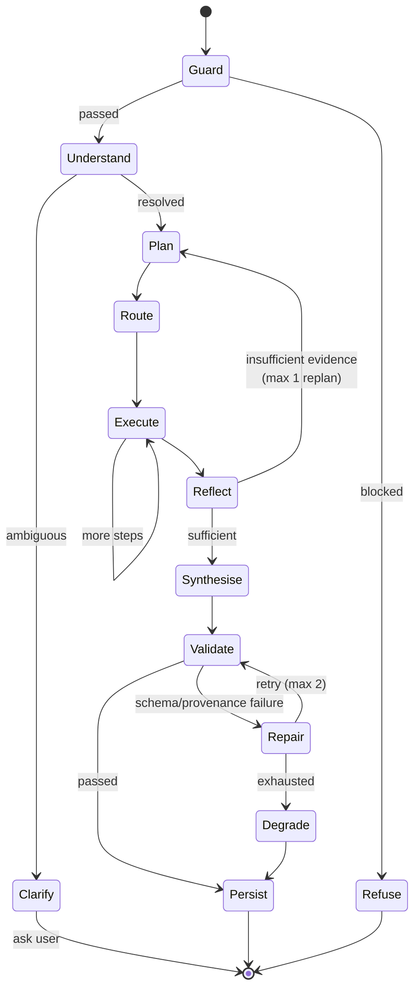
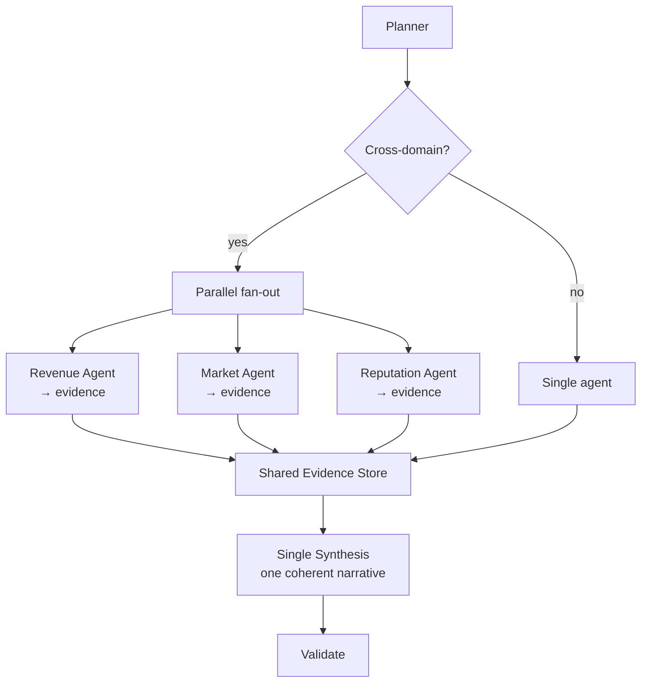
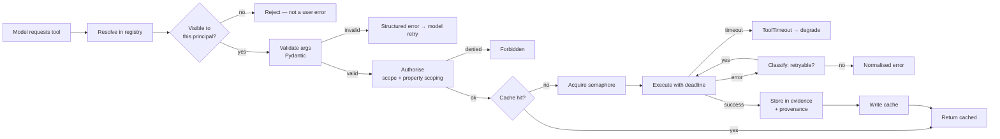

# Part V — AI Orchestration

## 29. The orchestration architecture

### 29.1 Why LangGraph

**Decision: LangGraph as the orchestration runtime.**

**Rationale.** Our orchestration is a **stateful graph with conditional routing, parallel fan-out, checkpointing and human-in-the-loop interrupts** — not a linear chain. LangGraph models exactly that: explicit state, explicit nodes, explicit edges, durable checkpointing, streaming from any node, and interrupt/resume. The alternative of writing this ourselves means reimplementing checkpointing and resumption, which is where the genuinely hard bugs live.

**What we deliberately do not use.** LangChain's higher-level abstractions — `Chain`, agent executors, the retriever/loader ecosystem, memory classes. Those abstractions hide exactly the things we need to control: prompt content, token budgets, retry semantics, tool authorisation. We use LangGraph for graph execution and (largely) call our own provider layer inside nodes. This is an important boundary to hold; there will be pressure to "just use the LangChain thing" and it should be resisted.

**Alternatives considered.**

| Option | Assessment |
|---|---|
| **Hand-rolled async state machine** | Genuinely viable, and about 2,000 lines. Rejected because checkpointing, replay and interrupt semantics are subtle, and LangGraph gives them for free. Revisit only if LangGraph's release cadence becomes a liability. |
| **LlamaIndex workflows** | Strong on RAG, weaker on general agentic control flow. We use LlamaIndex-style ideas in the RAG module but not as the orchestrator. |
| **Semantic Kernel** | The natural Azure-ecosystem choice, and the Python SDK has matured. Rejected because its planner abstractions are less controllable than we need, and the .NET-first design shows. Worth re-evaluating in Phase 5. |
| **OpenAI Assistants / Responses API server-side orchestration** | Rejected outright. Directly violates P5 (model independence). It moves our core IP into a vendor's runtime. |
| **CrewAI / AutoGen** | Rejected. Multi-agent conversation frameworks optimised for autonomy and emergent behaviour. We want the opposite: constrained, auditable, cost-bounded execution. |

**Reversal cost: Medium.** LangGraph is confined to `soyl/domain/ai/orchestration/`. Nodes are ordinary async functions taking and returning our own state type; they are not LangGraph-specific. Replacing the runtime means rewriting `graph.py`, not the nodes.

### 29.2 The graph



### 29.3 Orchestration state

```python
class OrchestrationState(TypedDict, total=False):
    # ── Immutable request context ──
    turn_id: ULID
    conversation_id: ULID
    principal: Principal
    input: UserInput
    seed_context: dict | None
    client_capabilities: ClientCapabilities

    # ── Memory ──
    working_set: WorkingSet          # properties, period, comparison — §32.2
    recent_turns: list[TurnSummary]  # compacted history — §32.4
    semantic_facts: list[Fact]       # long-term learned facts — §32.5

    # ── Reasoning ──
    intent: ResolvedIntent | None
    plan: Plan | None
    route: RouteDecision | None
    replans: int

    # ── Execution ──
    steps: list[PlanStep]
    completed: list[StepResult]
    evidence: EvidenceStore          # tool results, keyed and referenceable
    failures: list[StepFailure]

    # ── Output ──
    draft_envelope: ResponseEnvelope | None
    validation: ValidationReport | None
    repairs: int

    # ── Control ──
    budget: Budget                   # tokens, tool calls, wall clock, rupees
    emit: EventEmitter               # streams events out of any node
    degraded: bool
    warnings: list[Warning]
```

Two design notes. First, **`evidence` is a store, not a blob of text.** Every tool result is stored with a stable ID, its arguments, its row count and its freshness. Synthesis references evidence by ID; the validator checks that every referenced ID exists. This is the mechanism behind P3 (provenance).

Second, **`budget` is state, not configuration.** It is decremented as the graph runs, and every node checks it before doing expensive work. A runaway loop hits a wall it cannot argue with.

### 29.4 Node-by-node

**`guard` — input safety.** Runs before any model call: injection heuristics, PII policy, scope sanity, rate/budget check. Cheap and deterministic where possible; a small classifier model where not. See §39.

**`understand` — intent and entity resolution.** One structured-output model call producing a `ResolvedIntent`. Resolves relative time expressions ("last weekend", "this month vs last") against the tenant's timezone and fiscal calendar, resolves property references against the user's accessible properties, and identifies which metrics are implicated.

This node is deliberately separate from planning because its output is **shown to the user as editable chips** (§16.2). Fusing understanding into planning would hide the system's interpretation, and misinterpretation is the most common source of "wrong answer" complaints.

If a reference cannot be resolved with confidence — two properties named "Beach House," an ambiguous "last quarter" for a tenant with a non-calendar fiscal year — the node emits a `Clarify` outcome. Clarification is a first-class outcome with its own envelope containing a `form.parameters` block, not a chat message asking a question.

**`plan` — decomposition.** Produces an explicit `Plan`: an ordered/parallel DAG of steps, each naming a tool or an agent, its arguments, and what evidence it is expected to produce.

```python
class PlanStep(BaseModel):
    id: str
    kind: Literal["tool", "agent", "compute"]
    target: str                       # "metrics.timeseries" | "agent.market"
    args: dict[str, Any]
    depends_on: list[str] = []
    produces: str                     # evidence key
    optional: bool = False            # failure degrades rather than blocks
    rationale: str                    # for the trace and for evals

class Plan(BaseModel):
    steps: list[PlanStep]
    expected_blocks: list[ExpectedBlock]   # → drives the early `layout` event
    reasoning: str
```

`expected_blocks` is what makes shape-first rendering possible (§9.3). The planner commits to a rough output structure before any data exists, and the client renders skeletons in that shape within ~800ms.

`optional: true` is how the planner expresses "nice to have" evidence — comp-set rates enrich the answer but their absence should not block it. This single flag drives most graceful degradation.

**`route` — agent selection.** Deterministic where possible. Maps intent namespace to agent (`revenue.*` → RevenueAgent). Only ambiguous or cross-domain intents invoke a small routing model. Most turns take the deterministic path, which is faster, cheaper and more predictable.

**`execute` — the work.** Executes the plan DAG with bounded parallelism. Each step:

1. Checks budget.
2. Resolves the tool and re-authorises against the principal.
3. Validates arguments against the tool's Pydantic input model.
4. Executes with a deadline.
5. Stores the typed result in `evidence` with provenance metadata.
6. Emits a trace event.

Failures: if `optional`, record a warning and continue; if required, attempt one retry, then either replan (once) or degrade.

**`reflect` — sufficiency check.** A cheap gate that asks: does the evidence actually answer the question? Implemented primarily as deterministic rules (were all required evidence keys produced? is any series empty? did any step return zero rows for a period the user asked about?) with a small model call only for genuinely ambiguous cases. If insufficient, one replan is permitted; a second is refused and the turn degrades honestly.

**Why cap replanning at one.** Unbounded reflection loops are the most common way agentic systems burn money and time without improving the answer. One replan captures the realistic case (a tool returned nothing and a different approach exists); beyond that, the marginal value drops sharply while cost rises linearly. This cap is a tunable, monitored, and defended parameter.

**`synthesise` — envelope generation.** The most complex node. Takes evidence and produces the envelope, streaming blocks as they are generated. Detail in §33.

**`validate` — the gate.** Deterministic. Schema validation, provenance validation, policy validation, consistency validation. Detail in §33.4.

**`repair` — targeted correction.** When validation fails, we do not regenerate the whole envelope. We send back only the failing block plus the specific error and ask for a corrected block. Cheaper, faster and far more likely to succeed than a full retry. Max two repairs; then degrade.

**`persist` — durability.** Writes envelope, usage, trace reference and evidence digests. Emits `envelope.complete`.

### 29.5 Checkpointing

LangGraph's `PostgresSaver` persists state after each node into `ai.orchestration_checkpoint`. This gives us:

- **Resumption** after a worker crash mid-turn.
- **Human-in-the-loop interrupts** — the graph pauses at a confirmation node and resumes when the user confirms (§18.2). This is the mechanism that makes multi-step workflows possible without holding an HTTP connection.
- **Time-travel debugging** — replay a turn from any node with modified state.

Checkpoints are tenant-scoped, RLS-protected, and retained 7 days.

**Cost note:** checkpointing writes state on every node transition. For a 9-node graph with a large evidence store, that is meaningful write amplification. We mitigate by storing large evidence payloads in Blob with the checkpoint holding a pointer, and by checkpointing only at *interruptible* nodes rather than all of them. This is measured, not assumed — checkpoint write volume is a tracked metric.

### 29.6 Budgets

```python
@dataclass
class Budget:
    max_input_tokens: int = 120_000
    max_output_tokens: int = 16_000
    max_tool_calls: int = 12
    max_wall_seconds: float = 120.0
    max_cost_inr: Decimal = Decimal("15.00")
    max_replans: int = 1
    max_repairs: int = 2

    def consume(self, *, tokens_in=0, tokens_out=0, tool_calls=0, cost=Decimal(0)) -> None:
        ...
        if self.exhausted:
            raise BudgetExceeded(dimension=self.first_exhausted_dimension)
```

Budgets are per-tenant-tier, resolved at turn start, and enforced in every node. A `BudgetExceeded` mid-turn does not throw away work: it short-circuits to synthesis with whatever evidence exists and emits a degraded envelope explaining that the analysis was truncated.

This is the single most important cost-control mechanism in the system, and it is the reason we can answer "what does a customer cost us" precisely.

### 29.7 The orchestrator is a library, not a server

```python
class Orchestrator:
    async def run(self, turn: Turn) -> AsyncIterator[StreamEvent]: ...
    async def run_sync(self, turn: Turn) -> ResponseEnvelope: ...
```

`run` streams (HTTP). `run_sync` returns the final envelope (scheduled briefs, digests, exports, evals, batch jobs). The same graph, the same nodes, the same tools. This is what makes the proactive surface (§3.1) nearly free, and it is why we resisted building the orchestrator into the HTTP layer.

---

## 30. Agents

### 30.1 The invisibility principle

**The user must never know agents exist.** No agent names, no "switching to the Revenue Agent," no agent selector. Agents are an internal decomposition for prompt focus, tool scoping and evaluation granularity — nothing more.

Reasons this is a hard rule:

- Exposing agents makes the user responsible for routing, which is our job and which they will do worse.
- It makes the internal architecture a public contract we cannot change.
- It fragments the experience: a question that spans revenue and reputation should produce one coherent answer, not two agents' outputs stapled together.

Enforcement: the envelope schema has **no field for agent identity**. Agent attribution exists only in traces. A PR adding agent names to any user-facing surface is rejected.

### 30.2 Why decompose at all

If agents are invisible, why have them? Three concrete engineering reasons:

1. **Prompt focus.** A single system prompt covering revenue management, procurement, reputation and operations would be enormous, and quality degrades as prompts sprawl. A focused agent prompt with 8 relevant tools outperforms a general prompt with 60 tools — measurably, and this is one of the first things our eval suite verifies.
2. **Tool scoping.** Fewer tools in context means better selection accuracy, fewer tokens, and lower cost.
3. **Independent evaluation and iteration.** We can evaluate and improve revenue reasoning without regression risk to procurement reasoning, and we can ship a prompt change to one domain without re-validating everything.

### 30.3 The agent catalog

| Agent | Intent namespace | Tools | Specialised knowledge |
|---|---|---|---|
| **Revenue** | `revenue.*`, `pricing.*` | metrics timeseries/compare, pace, pickup, segment mix, forecast, rate recommend | RM concepts: displacement, pace curves, BAR structures, length-of-stay controls, elasticity |
| **Market** | `market.*`, `benchmark.*` | comp set resolve, rate shop, index compute, event calendar, demand signals | Comp set construction, MPI/ARI/RGI interpretation, event impact modelling |
| **Reputation** | `reviews.*`, `sentiment.*` | review fetch, theme extract, sentiment decompose, response draft | Review platform semantics, ranking factors, response etiquette |
| **Operations** | `ops.*`, `staffing.*` | labour metrics, housekeeping throughput, maintenance backlog, energy | Departmental cost structures, productivity standards |
| **Procurement** | `procure.*`, `vendor.*` | vendor search, offer compare, spend analyse, contract extract, RFQ draft | Category management, MOQ/lead-time trade-offs, negotiation levers |
| **Finance** | `finance.*` | P&L decompose, variance analyse, budget compare, cash view | USALI structure, GOP bridges, allocation conventions |
| **Knowledge** | `knowledge.*`, `sop.*` | document search, policy lookup, cite | RAG-first; strict grounding, high refusal threshold |
| **General** | fallback | metrics summary, knowledge search | Scope guardian — redirects out-of-domain requests |

### 30.4 Agent structure

An agent is a LangGraph subgraph, not a class hierarchy:

```python
@register_agent
class RevenueAgent(Agent):
    name = "revenue"
    handles = ("revenue.*", "pricing.*")
    tools = (
        "metrics.timeseries", "metrics.compare", "metrics.segment_mix",
        "pace.curve", "pace.pickup", "forecast.demand",
        "pricing.recommend", "market.compset_rates",
    )
    prompt = "agents/revenue@v5"
    preferred_route = "reasoning.default"
    block_affinities = ("metric.kpi", "chart.timeseries", "compare.periods", "plan.actions")

    def build(self, container: Container) -> CompiledGraph: ...
```

`block_affinities` biases synthesis toward the visualisations that suit this domain — revenue analysis naturally wants timeseries and KPI cards; reputation analysis wants theme lists and sentiment breakdowns. It is a hint, not a constraint.

### 30.5 Multi-agent coordination

Most turns use one agent. Cross-domain questions — *"is my low occupancy a pricing problem or a reputation problem?"* — need several. Coordination is **orchestrator-mediated**, not peer-to-peer.



**Agents never talk to each other.** They contribute evidence to a shared store; a single synthesis step produces one answer. This is a deliberate rejection of conversational multi-agent frameworks, and the reasons are concrete: agent-to-agent conversation is expensive (every exchange is tokens), slow (serialised round trips), non-deterministic in ways that resist debugging, and prone to producing an answer that reads like a committee wrote it. Fan-out with shared evidence gives us parallelism, bounded cost, and a single voice.

---

## 31. The tool layer

### 31.1 Tool definition

Tools are the system's syscalls. The definition is a decorated async function; the decorator handles registration, schema derivation, authorisation, tracing, caching and error normalisation.

```python
@tool(
    name="metrics.timeseries",
    scope="revenue:read",
    pack="revenue",
    description=(
        "Get a time series for one or more hotel metrics over a date range, "
        "optionally compared to a prior period. Use for trends over time. "
        "Do NOT use for a single aggregate figure — use metrics.aggregate."
    ),
    cache=CachePolicy(ttl=900, key_fields=("property_ids", "metrics", "frm", "to", "grain", "compare")),
    deadline_seconds=5.0,
    cost_class="cheap",
)
async def metrics_timeseries(
    ctx: ToolContext,
    property_ids: Annotated[list[UUID], Field(description="Properties to include. Aggregated if multiple.")],
    metrics: Annotated[list[MetricId], Field(description="Metric IDs, e.g. occupancy, adr, revpar.")],
    frm: Annotated[date, Field(description="Inclusive start date.")],
    to: Annotated[date, Field(description="Inclusive end date.")],
    grain: Grain = "day",
    compare: Comparison | None = None,
) -> MetricSeriesResult:
    ...
```

### 31.2 Tool design rules

These rules are the difference between a tool catalog a model uses well and one it uses badly. They were expensive to learn elsewhere and should be treated as settled.

1. **Descriptions are written for the model, not for humans.** They must say when to use the tool *and when not to*, and name the sibling tool to use instead. Most tool-selection errors are disambiguation failures between two similar tools.
2. **Narrow and composable beats broad and configurable.** `pace.pickup` and `pace.curve` outperform one `pace(mode=...)` tool. The model selects better from distinct names than from an enum.
3. **Typed returns, never strings.** Returning formatted text forces the model to parse and re-emit numbers — which is where transcription errors enter. Return structured data; the synthesis step formats it.
4. **Results carry metadata**: row count, freshness (`as_of`), applied filters, and a warning list. Synthesis uses these to caveat honestly.
5. **`tenant_id` is never a model-visible parameter** (§23.3).
6. **Deterministic and idempotent.** Same arguments, same context, same result within the cache window.
7. **Cost class declared** (`cheap` / `moderate` / `expensive`) so the planner and budget can reason about it. An `expensive` tool triggers a budget check before execution.
8. **Empty results are results, not errors.** `rows=0` with an explanation ("no reservations in this period") is a valid, useful outcome. Throwing turns a good empty state into a failure.
9. **Fewer than ~40 tools visible to any single agent.** Beyond that, selection accuracy measurably degrades. If a domain needs more, it needs sub-agents.

### 31.3 The tool catalog (Phase 1–4)

**Metrics** — `metrics.timeseries`, `metrics.aggregate`, `metrics.compare`, `metrics.segment_mix`, `metrics.channel_mix`, `metrics.roomtype_mix`

**Pace and forecast** — `pace.curve`, `pace.pickup`, `pace.on_the_books`, `forecast.demand`, `forecast.revenue`

**Market** — `market.compset_resolve`, `market.compset_rates`, `market.index`, `market.events`, `market.demand_signal`

**Reputation** — `reviews.fetch`, `reviews.themes`, `reviews.sentiment`, `reviews.compare_compset`, `reviews.draft_response`

**Operations** — `ops.labour_productivity`, `ops.housekeeping_throughput`, `ops.maintenance_backlog`, `ops.energy_usage`

**Finance** — `finance.pnl`, `finance.variance`, `finance.budget_compare`, `finance.cost_per_occupied_room`

**Knowledge** — `knowledge.search`, `knowledge.get_document`, `knowledge.list_documents`

**Procurement** — `vendor.search`, `vendor.offers`, `vendor.compare`, `spend.analyse`, `contract.extract`

**Actions (write, confirmation-gated)** — `action.draft_rfq`, `action.create_task`, `action.schedule_review`, `action.export`

**Meta** — `meta.property_info`, `meta.available_metrics`, `meta.data_freshness`

`meta.data_freshness` deserves a note: it lets the model check how current the data is before making a claim, which materially improves honesty. A model that knows the PMS last synced 14 hours ago will caveat today's figures. This is cheap and high-value.

### 31.4 Execution pipeline



**Argument validation errors are returned to the model as structured feedback**, not raised. The model gets one chance to correct (`"metrics must be one of [...]; you passed 'revpar_pct'"`). This recovers a large fraction of otherwise-failed turns for one cheap round trip. A second failure is a hard error.

### 31.5 Tool result caching

Tool caching is where most of our cost savings live. Key composition:

```
tool:{name}:v{version}:{tenant_id}:{sha256(canonical_json(args))}
```

- **`tenant_id` in the key is mandatory** — a cross-tenant cache hit is a data breach. This is asserted in a test.
- **`version`** is bumped when the tool's semantics change, invalidating the whole namespace.
- **Canonical JSON** (sorted keys, normalised dates) so semantically identical calls hit the same key.
- TTL by data volatility: historical metrics 24h (the past does not change), current-day metrics 5 min, comp-set rates 6h, reviews 1h, document search 24h.
- **Stampede protection** via a Redis lock: the first caller computes; others wait on the result with a timeout, then compute independently rather than blocking forever.

---

## 32. Memory

### 32.1 Four memory types

| Type | Scope | Storage | Lifetime | Purpose |
|---|---|---|---|---|
| **Working** | One turn | In-state | Turn | Current scope: properties, period, comparison |
| **Episodic** | One conversation | Postgres + Redis | Conversation | What we discussed and concluded |
| **Semantic** | One tenant | Postgres + pgvector | Indefinite | Learned facts about this business |
| **Procedural** | Global | Prompt library | Release | How to do things well |

### 32.2 Working memory

The working set is **explicit and user-visible**, rendered as editable chips above the composer:

```python
class WorkingSet(BaseModel):
    property_ids: list[UUID]
    period: DateRange
    comparison: Comparison | None
    segment_filter: SegmentFilter | None
    currency: str
    updated_by: Literal["user", "system", "seed"]
```

Making this explicit rather than implicit in conversation history solves the most common frustration in conversational analytics: the system silently losing or wrongly retaining scope. The user can see that "Goa Property, 17–20 July, vs last year" is active, and can change it in one click.

### 32.3 Seed context

Ambient invocation (§17.6) injects seed context that **takes precedence over inferred scope but is overridable by explicit user statement**. Precedence order:

```
explicit user statement in this message
  > seed context from originating page
  > working set carried from previous turn
  > tenant defaults
```

### 32.4 Episodic memory and compaction

Full conversation history is stored but never sent wholesale to the model. Sending 40 turns of history is expensive, degrades attention, and buries the relevant part.

Compaction strategy:

- Last **3 turns** verbatim.
- Turns 4–12 as **structured summaries** (intent, key findings with figures, decisions, rejected recommendations) — generated asynchronously by a cheap model after each turn, so it never sits in the critical path.
- Beyond 12 turns, a **rolling conversation abstract** (≤400 tokens).
- **Assertion log always included in full** — it is small and it is what prevents self-contradiction.

```python
class TurnSummary(BaseModel):
    turn_id: ULID
    intent: str
    scope: WorkingSet
    key_findings: list[str]              # "RevPAR down 18% YoY, rate-driven"
    assertions: list[Assertion]          # metric, value, period — for consistency
    recommendations: list[str]
    user_response: Literal["accepted", "rejected", "ignored"] | None
```

### 32.5 Semantic memory

Long-lived, tenant-scoped facts learned across conversations. This is what makes the system feel like it knows the business.

| Fact kind | Example | Source |
|---|---|---|
| Business context | "Wedding season Nov–Feb drives 40% of annual revenue" | Inferred from data + confirmed by user |
| Preference | "Owner prefers occupancy over rate in shoulder season" | Inferred from rejected recommendations |
| Constraint | "Cannot discount below ₹3,200 — brand agreement" | Stated by user |
| Correction | "Room count is 42, not 44 — 2 converted to storage in 2025" | User correction |
| Rejected recommendation | "Rejected weekday rate increase twice, cited corporate contracts" | Decision log |

```python
class Fact(BaseModel):
    id: ULID
    tenant_id: UUID
    property_id: UUID | None
    kind: FactKind
    statement: str
    confidence: float
    source: Literal["user_stated", "user_confirmed", "inferred", "corrected"]
    evidence_refs: list[str]
    valid_from: date
    valid_to: date | None
    superseded_by: ULID | None
    embedding: list[float]
```

Retrieval is hybrid: always include high-confidence `user_stated` and `corrected` facts; semantically retrieve the rest against the current query.

**Governance is essential here, because a wrong long-term fact poisons every future answer.** Rules:

- Facts from `inferred` sources start at low confidence and require corroboration before promotion.
- Facts are **surfaced to the user** in a "What I know about your business" settings surface, where they can be edited or deleted. This is both a trust feature and a GDPR requirement (§58.3).
- Facts are versioned with `valid_from`/`valid_to`; corrections supersede rather than overwrite, preserving an audit trail.
- A fact contradicting a newer user statement is auto-superseded, and the contradiction is logged.

### 32.6 What we deliberately do not do

- **No cross-tenant memory.** Nothing learned from tenant A ever influences tenant B's responses. Benchmarking uses explicitly aggregated, k-anonymised statistics (§63), never memory.
- **No automatic fine-tuning on customer data** without explicit, separately-obtained contractual consent.
- **No unbounded memory growth.** Facts have review cycles; stale low-confidence inferences expire after 180 days without corroboration.

---

## 33. Synthesis and structured output

### 33.1 The problem

Synthesis must simultaneously: select the right blocks, bind evidence into them correctly, write a coherent narrative, attach provenance, propose actions and follow-ups, and emit it all progressively. Doing this in one unconstrained model call produces slow, inconsistent, hard-to-validate output.

### 33.2 Two-stage synthesis

**Stage A — Composition (cheap, fast, small output).** Given the intent and an *index* of available evidence (keys, shapes, row counts — not full data), choose the block structure.

```jsonc
{
  "headline": "RevPAR fell 18% versus the same weekend last year, driven entirely by rate.",
  "tone": "negative",
  "layout": { "kind": "grid", "cols": 4 },
  "blocks": [
    { "id": "b1", "type": "metric.kpi",        "evidence": ["ev_revpar"],   "span": 1, "emphasis": "primary" },
    { "id": "b2", "type": "metric.kpi",        "evidence": ["ev_adr"],      "span": 1 },
    { "id": "b3", "type": "metric.kpi",        "evidence": ["ev_occ"],      "span": 1 },
    { "id": "b4", "type": "metric.kpi",        "evidence": ["ev_rooms"],    "span": 1 },
    { "id": "b5", "type": "chart.timeseries",  "evidence": ["ev_series"],   "span": 4 },
    { "id": "b6", "type": "table.comparison",  "evidence": ["ev_channel"],  "span": 4 },
    { "id": "b7", "type": "text.markdown",     "evidence": ["ev_*"],        "span": 2 },
    { "id": "b8", "type": "plan.actions",      "evidence": ["ev_*"],        "span": 2 }
  ]
}
```

This is ~400 output tokens and completes in about a second. **The `layout` event is emitted immediately from it** — this is what produces skeletons on screen in under a second.

**Stage B — Materialisation (parallel, per block).** Each block is materialised independently and concurrently:

- **Data-bound blocks** (`metric.kpi`, `chart.*`, `table.*`) are materialised **deterministically in code** from their evidence. No model call at all. The evidence is already typed; mapping a `MetricSeriesResult` to a `ChartTimeseriesPayload` is a pure function.
- **Language blocks** (`text.markdown`, `plan.actions`, `summary`) require a model call, constrained to structured output, with only the evidence they reference in context.

**This split is the highest-leverage optimisation in the entire AI pipeline**, and it deserves emphasis:

| | Naive single-call synthesis | Two-stage with deterministic binding |
|---|---|---|
| Output tokens for a 8-block response | ~4,000 | ~900 |
| Numbers transcribed by the model | ~60 | 0 |
| Numeric hallucination risk | Real | **Structurally eliminated** |
| Latency | Serial, ~12s | Parallel, ~4s |
| Cost | 1× | ~0.3× |

The model never re-types a number. It says "put the RevPAR evidence in a KPI card"; code puts the actual value there. A whole class of "the AI got the number wrong" bug cannot occur.

### 33.3 Structured output enforcement

Three mechanisms, in preference order:

1. **Native structured output** (OpenAI JSON Schema mode / Azure equivalent) where the provider supports it, with our Pydantic model converted to a strict JSON Schema. Guarantees syntactic validity.
2. **Tool-calling-as-schema** where structured output is unsupported: define a single function whose parameters are the schema and force its invocation.
3. **Constrained decoding** for local/proprietary models in future phases.

Always followed by Pydantic validation, because syntactic validity is not semantic validity — a schema-valid envelope can still reference a nonexistent evidence key.

### 33.4 The validation gate

Deterministic, code-only, and the last line of defence. Four checks:

**Schema.** Every block payload validates against its Pydantic model.

**Provenance.** Every numeric assertion resolves to an evidence ID that exists; every metric references a valid definition; every document citation resolves to a retrieved chunk. **Unprovenanced numeric claims in narrative text are stripped**, and the strip is recorded as an eval signal.

```python
def validate_provenance(envelope, evidence: EvidenceStore) -> list[Violation]:
    violations = []
    for block in envelope.blocks:
        for ref in block.provenance_refs:
            if ref not in evidence and not is_metric_definition(ref):
                violations.append(Violation("DANGLING_PROVENANCE", block.id, ref))
        if block.type == "text.markdown":
            for claim in extract_numeric_claims(block.payload.content):
                if not evidence.supports(claim):
                    violations.append(Violation("UNSUPPORTED_CLAIM", block.id, claim))
    return violations
```

**Policy.** No PII of guests in output unless the principal holds `guest_data:read`. No competitor-identifying data beyond what the tenant's licence permits. No claims about legal, tax or regulatory obligations without the standard disclaimer. No financial advice framing.

**Consistency.** Cross-checks against the conversation's assertion log. If turn 3 said occupancy was 71% for a period and turn 7 says 68% for the same period with the same filters, that is flagged; the system must either explain the difference (data refreshed, filter changed) or correct itself. Silent contradiction is the fastest way to lose a user's trust, and it is entirely preventable.

### 33.5 Repair

Failed validation triggers targeted repair: only the offending block, with the specific violation, is regenerated.

```
Block b7 (text.markdown) failed validation:
  UNSUPPORTED_CLAIM: "occupancy in Goa was 82% in June"
  Available evidence: ev_occ (June occupancy = 74.3%, source tc_2)

Regenerate this block only. Use only figures present in the evidence provided.
```

Success rate on first repair is high (measured, and tracked as `validation.repairs` in §27.2). After two failed repairs, the block is dropped and a warning is added — a missing block with an explanation beats a wrong block.

---

## 34. Reliability, retries and cost control in the AI path

### 34.1 Failure classes and responses

| Failure | Detection | Response |
|---|---|---|
| Malformed structured output | Pydantic | Repair prompt, max 2 |
| Tool argument invalid | Pydantic | Structured feedback to model, 1 retry |
| Tool timeout | Deadline | Optional step → degrade; required → replan once |
| Model 429 | Provider | Backoff, then reroute (§37.4) |
| Model 5xx | Provider | Retry once, then reroute |
| Model returns refusal | Content check | Reroute to alternate model; if consistent, honest user-facing message |
| Empty evidence | Row count 0 | Honest empty-state envelope explaining *why*, with suggestions |
| Budget exhausted | Ledger | Short-circuit to synthesis, degraded envelope |
| Checkpoint corrupt | Deserialisation | Restart turn from scratch, log incident |

### 34.2 Idempotency

Turn creation carries an `Idempotency-Key`. A repeated key within 24h returns the original turn and replays its stream from Redis rather than re-executing. This matters because clients retry on flaky mobile networks, and re-executing a ₹4 analysis three times is both wasteful and confusing.

### 34.3 Cost attribution and the budget ledger

Every model call, tool call and turn writes to `billing.usage_ledger`:

```sql
CREATE TABLE billing.usage_ledger (
    id              BIGSERIAL,
    occurred_at     TIMESTAMPTZ NOT NULL DEFAULT now(),
    tenant_id       UUID NOT NULL,
    user_id         UUID,
    turn_id         BYTEA,
    kind            TEXT NOT NULL,     -- 'llm' | 'tool' | 'embed' | 'rerank' | 'external'
    provider        TEXT,
    model           TEXT,
    route           TEXT,
    input_tokens    INTEGER DEFAULT 0,
    output_tokens   INTEGER DEFAULT 0,
    cached_tokens   INTEGER DEFAULT 0,
    units           NUMERIC(14,4) DEFAULT 0,
    cost_inr        NUMERIC(12,4) NOT NULL,
    PRIMARY KEY (id, occurred_at)
) PARTITION BY RANGE (occurred_at);
```

This enables, without any additional engineering:

- Real per-tenant, per-user, per-feature cost.
- Gross margin per plan tier — the number that determines whether the business works.
- Cost-per-intent analysis, which directs optimisation to where it pays.
- Budget enforcement and overage billing.
- Answering "why did our spend triple last Tuesday" in one query.

**Instrumenting this in Phase 1 is non-negotiable.** Retrofitting cost attribution after launch is painful, and operating without it means discovering unit economics from a credit card statement.

### 34.4 Cost optimisation levers, ranked by impact

1. **Deterministic block materialisation** (§33.2) — roughly 60–70% reduction in synthesis output tokens. Already in the design.
2. **Tool result caching** (§31.5) — high hit rates on historical metrics, which are the most-requested and never change.
3. **Prompt caching** — system prompts and tool schemas are stable and large; provider-side prompt caching cuts input cost substantially. Requires stable prompt prefixes, which is a design constraint on prompt assembly (§38.3).
4. **Model routing by complexity** (§37) — a KPI lookup does not need a frontier reasoning model.
5. **Evidence index rather than full evidence in composition** (§33.2) — Stage A sees shapes, not data.
6. **History compaction** (§32.4).
7. **Refresh without regeneration** (§16.4) — the marginal cost of a returning user's dashboard approaches zero.
8. **Batch embedding** for ingestion.

### 34.5 Autonomy: designed, not enabled

Phase 6 contemplates autonomous agents. The architecture supports it; the product does not enable it. When we do, these controls are already specified:

- Autonomy is **per-action-type**, explicitly granted by a tenant admin, with a written scope.
- Hard limits per grant: maximum monetary value, maximum frequency, allowed hours, allowed properties.
- Every autonomous action produces an audit record and a notification **before** it takes effect, with a cancellation window.
- A global tenant-level kill switch, and a platform-level kill switch.
- Autonomous actions are never taken on data older than a freshness threshold.

Writing these constraints down now costs nothing and prevents the Phase 6 conversation from starting with "how do we make this safe" after the feature is half-built.
