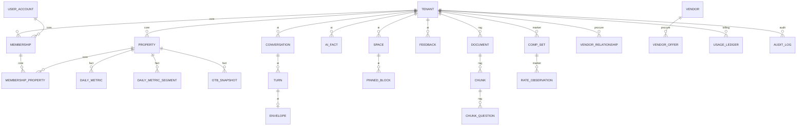
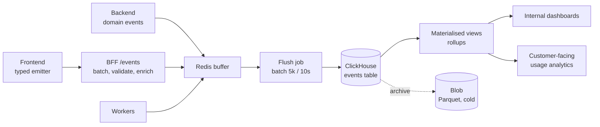

# Part VIII — Data Architecture

## 48. PostgreSQL — the primary store

### 48.1 Why one database does most of the work

**Decision: Azure Database for PostgreSQL Flexible Server, PostgreSQL 16+, with `pgvector`, as the single primary datastore for operational data, AI state, and the vector index.**

**Rationale.** One database means one backup strategy, one connection pooling story, one migration tool, one set of transactional guarantees, and — most importantly — the ability to join a vector search against tenant and property tables in a single query with row-level security applied uniformly. A separate vector database would give us a better ANN implementation and a worse everything-else: two consistency models, two access-control systems, two backup strategies, and a synchronisation problem between chunks and their metadata.

At our corpus size (thousands of documents per tenant, low millions of vectors platform-wide at Phase 5), pgvector with HNSW is entirely adequate. The crossover point where a dedicated vector store wins is roughly 50–100M vectors; we are two orders of magnitude away, and we will see it coming.

**Alternatives considered.**

| Option | Assessment |
|---|---|
| **Pinecone / Weaviate / Qdrant** | Better ANN at scale. Rejected: adds a service, a cost line, a failure mode, and a metadata sync problem, to solve a scale we do not have. Qdrant is the one to revisit if we cross 50M vectors. |
| **Azure AI Search** | Genuinely good hybrid search with built-in semantic ranking, and it is Azure-native. Rejected as *primary* because it duplicates our source of truth and its per-index cost model is unattractive at low volume with many tenants. **Reconsidered in Phase 4** if hybrid search tuning becomes a bottleneck — it is listed as optional in §2.3 for exactly this reason. |
| **MongoDB / Cosmos DB** | Rejected. Our data is highly relational, and we need strong transactional guarantees and RLS. |
| **Separate OLAP-first design** | Rejected as primary; ClickHouse is added alongside for analytics (§51), not as a replacement. |

### 48.2 Schema organisation

Postgres schemas map to modules, which makes ownership explicit and a future extraction mechanical:

| Schema | Owner module | Contents |
|---|---|---|
| `core` | identity, property | tenants, users, properties, room types, memberships |
| `ops` | property, existing platform | reservations, rates, inventory, housekeeping |
| `fact` | metrics | daily metrics, OTB snapshots, financial facts |
| `ai` | ai | conversations, turns, envelopes, checkpoints, facts, feedback |
| `rag` | rag | documents, chunks, embeddings, ingestion jobs |
| `market` | market | comp sets, rate observations, reviews, events |
| `procure` | procurement | vendors, offers, RFQs, spend |
| `billing` | billing | plans, entitlements, usage ledger, budgets |
| `audit` | platform | audit log, access log |

### 48.2.1 Physical schema map

The conceptual domain model is in §4.1. This is the *physical* layout — the tables that exist, which schema owns them, and the foreign-key spine. Cross-schema arrows marked as dashed are logical references only: they are **not** enforced foreign keys, because enforcing them would couple module lifecycles and block a future extraction (§20.4).



Three physical properties are worth stating because they are not visible in the diagram:

- **Every table carries `tenant_id`**, including tables where it is derivable through a join. This is denormalisation for a reason: RLS policies must be evaluable without a join (§48.7), and a join-dependent policy is both slow and fragile.
- **Partitioned tables** (`fact.daily_metric`, `fact.daily_metric_segment`, `fact.otb_snapshot`, `billing.usage_ledger`, `audit.log`, `market.rate_observation`) carry their partition key in the primary key, which is why several primary keys look wider than strictly necessary.
- **ULID primary keys are stored as `BYTEA(16)`** on high-volume AI tables and as `UUID` on core entities. ULIDs sort by creation time, which keeps index inserts append-only and avoids the write amplification that random UUIDv4 primary keys cause on large B-trees.

### 48.3 Core schema

```sql
CREATE TABLE core.tenant (
    id              UUID PRIMARY KEY DEFAULT gen_random_uuid(),
    name            TEXT NOT NULL,
    slug            CITEXT NOT NULL UNIQUE,
    country         CHAR(2) NOT NULL DEFAULT 'IN',
    timezone        TEXT NOT NULL DEFAULT 'Asia/Kolkata',
    base_currency   CHAR(3) NOT NULL DEFAULT 'INR',
    fiscal_year_start_month SMALLINT NOT NULL DEFAULT 4,   -- India: April
    plan_id         UUID REFERENCES billing.plan(id),
    status          TEXT NOT NULL DEFAULT 'active',
    settings        JSONB NOT NULL DEFAULT '{}',
    created_at      TIMESTAMPTZ NOT NULL DEFAULT now(),
    deleted_at      TIMESTAMPTZ
);

CREATE TABLE core.property (
    id              UUID PRIMARY KEY DEFAULT gen_random_uuid(),
    tenant_id       UUID NOT NULL REFERENCES core.tenant(id) ON DELETE CASCADE,
    name            TEXT NOT NULL,
    code            TEXT,
    address         JSONB NOT NULL DEFAULT '{}',
    geo             GEOGRAPHY(POINT, 4326),
    timezone        TEXT NOT NULL,
    currency        CHAR(3) NOT NULL,
    rooms_total     INTEGER NOT NULL CHECK (rooms_total > 0),
    rooms_sellable  INTEGER NOT NULL CHECK (rooms_sellable > 0),
    star_rating     SMALLINT,
    segment         TEXT,                       -- luxury, midscale, budget, boutique
    opened_on       DATE,
    status          TEXT NOT NULL DEFAULT 'active',
    settings        JSONB NOT NULL DEFAULT '{}',
    created_at      TIMESTAMPTZ NOT NULL DEFAULT now(),
    deleted_at      TIMESTAMPTZ,
    UNIQUE (tenant_id, code)
);
CREATE INDEX ON core.property (tenant_id) WHERE deleted_at IS NULL;
CREATE INDEX ON core.property USING GIST (geo);

CREATE TABLE core.user_account (
    id              UUID PRIMARY KEY DEFAULT gen_random_uuid(),
    email           CITEXT NOT NULL UNIQUE,
    display_name    TEXT NOT NULL,
    locale          TEXT NOT NULL DEFAULT 'en-IN',
    status          TEXT NOT NULL DEFAULT 'active',
    entra_object_id UUID,                        -- when SSO is used
    created_at      TIMESTAMPTZ NOT NULL DEFAULT now(),
    deleted_at      TIMESTAMPTZ
);

CREATE TABLE core.membership (
    id              UUID PRIMARY KEY DEFAULT gen_random_uuid(),
    tenant_id       UUID NOT NULL REFERENCES core.tenant(id) ON DELETE CASCADE,
    user_id         UUID NOT NULL REFERENCES core.user_account(id) ON DELETE CASCADE,
    role            TEXT NOT NULL,
    property_scope  TEXT NOT NULL DEFAULT 'all',  -- 'all' | 'explicit'
    created_at      TIMESTAMPTZ NOT NULL DEFAULT now(),
    UNIQUE (tenant_id, user_id)
);

CREATE TABLE core.membership_property (
    membership_id   UUID NOT NULL REFERENCES core.membership(id) ON DELETE CASCADE,
    property_id     UUID NOT NULL REFERENCES core.property(id) ON DELETE CASCADE,
    PRIMARY KEY (membership_id, property_id)
);
```

`fiscal_year_start_month` on the tenant is a small field with large consequences: "last quarter" means different things for an Indian tenant on an April fiscal year and a European one on January. Resolving relative periods without it produces answers that are confidently wrong.

### 48.4 Fact schema — the analytical core

```sql
-- The primary metric fact table. One row per property per business date.
CREATE TABLE fact.daily_metric (
    tenant_id           UUID NOT NULL,
    property_id         UUID NOT NULL,
    business_date       DATE NOT NULL,

    rooms_available     INTEGER NOT NULL,
    rooms_ooo           INTEGER NOT NULL DEFAULT 0,
    rooms_sold          INTEGER NOT NULL DEFAULT 0,
    rooms_comp          INTEGER NOT NULL DEFAULT 0,
    rooms_house         INTEGER NOT NULL DEFAULT 0,

    room_revenue        NUMERIC(14,2) NOT NULL DEFAULT 0,
    fnb_revenue         NUMERIC(14,2) NOT NULL DEFAULT 0,
    other_revenue       NUMERIC(14,2) NOT NULL DEFAULT 0,

    arrivals            INTEGER NOT NULL DEFAULT 0,
    departures          INTEGER NOT NULL DEFAULT 0,
    cancellations       INTEGER NOT NULL DEFAULT 0,
    no_shows            INTEGER NOT NULL DEFAULT 0,

    currency            CHAR(3) NOT NULL,
    source              TEXT NOT NULL,           -- 'pms:cloudbeds' | 'manual' | 'derived'
    source_synced_at    TIMESTAMPTZ NOT NULL,
    is_final            BOOLEAN NOT NULL DEFAULT FALSE,
    updated_at          TIMESTAMPTZ NOT NULL DEFAULT now(),

    PRIMARY KEY (tenant_id, property_id, business_date)
) PARTITION BY RANGE (business_date);

-- Segment-level detail
CREATE TABLE fact.daily_metric_segment (
    tenant_id       UUID NOT NULL,
    property_id     UUID NOT NULL,
    business_date   DATE NOT NULL,
    dimension       TEXT NOT NULL,          -- 'channel' | 'market_segment' | 'room_type' | 'rate_plan'
    member          TEXT NOT NULL,
    rooms_sold      INTEGER NOT NULL DEFAULT 0,
    room_revenue    NUMERIC(14,2) NOT NULL DEFAULT 0,
    PRIMARY KEY (tenant_id, property_id, business_date, dimension, member)
) PARTITION BY RANGE (business_date);

-- On-the-books snapshots — the ONLY way to compute pace and pickup.
CREATE TABLE fact.otb_snapshot (
    tenant_id       UUID NOT NULL,
    property_id     UUID NOT NULL,
    snapshot_date   DATE NOT NULL,          -- when the snapshot was taken
    stay_date       DATE NOT NULL,          -- the future date being measured
    rooms_otb       INTEGER NOT NULL,
    revenue_otb     NUMERIC(14,2) NOT NULL,
    PRIMARY KEY (tenant_id, property_id, snapshot_date, stay_date)
) PARTITION BY RANGE (snapshot_date);
```

**`fact.otb_snapshot` is the single most important design decision in the data model, and it is the one most often missed.** A PMS tells you what is on the books *right now*. It cannot tell you what was on the books three weeks ago for next Saturday. Pace and pickup — the core of revenue management — require that history, and it can only be captured by snapshotting daily. **If we do not start snapshotting on day one, that history is permanently lost.** This must be in Phase 1 even though the features that consume it ship in Phase 3.

`is_final` distinguishes a settled business date from a partially-synced current day. Every metric result carries this through to the envelope, and the UI marks provisional figures. Presenting a partial day as final is a trust-destroying bug.

### 48.5 AI schema

```sql
CREATE TABLE ai.conversation (
    id              BYTEA PRIMARY KEY,            -- ULID
    tenant_id       UUID NOT NULL,
    user_id         UUID NOT NULL,
    title           TEXT,
    working_set     JSONB NOT NULL DEFAULT '{}',
    abstract        TEXT,                          -- rolling compaction (§32.4)
    turn_count      INTEGER NOT NULL DEFAULT 0,
    last_turn_at    TIMESTAMPTZ,
    created_at      TIMESTAMPTZ NOT NULL DEFAULT now(),
    archived_at     TIMESTAMPTZ,
    deleted_at      TIMESTAMPTZ
);
CREATE INDEX ON ai.conversation (tenant_id, user_id, last_turn_at DESC)
    WHERE deleted_at IS NULL;

CREATE TABLE ai.turn (
    id                  BYTEA PRIMARY KEY,
    conversation_id     BYTEA NOT NULL REFERENCES ai.conversation(id) ON DELETE CASCADE,
    tenant_id           UUID NOT NULL,
    user_id             UUID NOT NULL,
    input               JSONB NOT NULL,
    intent              TEXT,
    status              TEXT NOT NULL,             -- running|complete|degraded|failed
    envelope_id         BYTEA,
    trace_id            TEXT,
    summary             JSONB,                     -- TurnSummary for compaction
    usage               JSONB NOT NULL DEFAULT '{}',
    started_at          TIMESTAMPTZ NOT NULL DEFAULT now(),
    completed_at        TIMESTAMPTZ,
    idempotency_key     TEXT,
    UNIQUE (conversation_id, idempotency_key)
);

CREATE TABLE ai.envelope (
    id              BYTEA PRIMARY KEY,
    tenant_id       UUID NOT NULL,
    turn_id         BYTEA NOT NULL,
    version         TEXT NOT NULL,
    body            JSONB NOT NULL,                -- the full envelope
    body_blob_uri   TEXT,                          -- set when tiered out (§48.9)
    size_bytes      INTEGER NOT NULL,
    created_at      TIMESTAMPTZ NOT NULL DEFAULT now()
);
CREATE INDEX ON ai.envelope USING GIN ((body -> 'blocks') jsonb_path_ops);

CREATE TABLE ai.fact (
    id              BYTEA PRIMARY KEY,
    tenant_id       UUID NOT NULL,
    property_id     UUID,
    kind            TEXT NOT NULL,
    statement       TEXT NOT NULL,
    confidence      REAL NOT NULL CHECK (confidence BETWEEN 0 AND 1),
    source          TEXT NOT NULL,
    evidence_refs   JSONB NOT NULL DEFAULT '[]',
    valid_from      DATE NOT NULL DEFAULT CURRENT_DATE,
    valid_to        DATE,
    superseded_by   BYTEA REFERENCES ai.fact(id),
    embedding       VECTOR(1536),
    created_at      TIMESTAMPTZ NOT NULL DEFAULT now()
);
CREATE INDEX ON ai.fact USING hnsw (embedding vector_cosine_ops)
    WHERE valid_to IS NULL AND superseded_by IS NULL;

CREATE TABLE ai.feedback (
    id              BIGSERIAL PRIMARY KEY,
    tenant_id       UUID NOT NULL,
    user_id         UUID NOT NULL,
    target_kind     TEXT NOT NULL,                 -- 'turn' | 'block'
    target_id       TEXT NOT NULL,
    envelope_id     BYTEA,
    trace_id        TEXT,
    signal          SMALLINT NOT NULL,             -- +1 / -1
    reasons         TEXT[],
    correction      TEXT,
    created_at      TIMESTAMPTZ NOT NULL DEFAULT now()
);

CREATE TABLE ai.space (
    id              BYTEA PRIMARY KEY,
    tenant_id       UUID NOT NULL,
    owner_user_id   UUID NOT NULL,
    name            TEXT NOT NULL,
    shared          BOOLEAN NOT NULL DEFAULT FALSE,
    layout          JSONB NOT NULL DEFAULT '{}',
    created_at      TIMESTAMPTZ NOT NULL DEFAULT now()
);

CREATE TABLE ai.pinned_block (
    id              BYTEA PRIMARY KEY,
    space_id        BYTEA NOT NULL REFERENCES ai.space(id) ON DELETE CASCADE,
    tenant_id       UUID NOT NULL,
    block_type      TEXT NOT NULL,
    title           TEXT,
    payload_seed    JSONB NOT NULL,                -- last known rendering
    refresh_spec    JSONB NOT NULL,                -- §16.4 — the important part
    position        INTEGER NOT NULL,
    last_refreshed  TIMESTAMPTZ,
    created_at      TIMESTAMPTZ NOT NULL DEFAULT now()
);
```

### 48.6 RAG schema

```sql
CREATE TABLE rag.document (
    id              BYTEA PRIMARY KEY,
    tenant_id       UUID NOT NULL,
    property_ids    UUID[] NOT NULL DEFAULT '{}',
    title           TEXT NOT NULL,
    doc_type        TEXT NOT NULL,
    language        TEXT NOT NULL DEFAULT 'en',
    blob_uri        TEXT NOT NULL,
    checksum        BYTEA NOT NULL,
    page_count      INTEGER,
    effective_from  DATE,
    expires_on      DATE,
    supersedes      BYTEA REFERENCES rag.document(id),
    sensitivity     TEXT NOT NULL DEFAULT 'normal',
    status          TEXT NOT NULL DEFAULT 'pending',   -- pending|indexed|failed|quarantined
    metadata        JSONB NOT NULL DEFAULT '{}',
    created_at      TIMESTAMPTZ NOT NULL DEFAULT now(),
    deleted_at      TIMESTAMPTZ,
    UNIQUE (tenant_id, checksum)
);

CREATE TABLE rag.chunk (
    id                  BYTEA PRIMARY KEY,
    document_id         BYTEA NOT NULL REFERENCES rag.document(id) ON DELETE CASCADE,
    tenant_id           UUID NOT NULL,
    property_ids        UUID[] NOT NULL DEFAULT '{}',
    ordinal             INTEGER NOT NULL,
    heading_path        TEXT[] NOT NULL DEFAULT '{}',
    content             TEXT NOT NULL,
    context_header      TEXT NOT NULL,
    summary             TEXT,
    keywords            TEXT[] NOT NULL DEFAULT '{}',
    doc_type            TEXT NOT NULL,
    effective_from      DATE,
    expires_on          DATE,
    sensitivity         TEXT NOT NULL DEFAULT 'normal',
    token_count         INTEGER NOT NULL,
    embedding           VECTOR(1536),
    embedding_model     TEXT NOT NULL,
    content_tsv         TSVECTOR GENERATED ALWAYS AS (
                            to_tsvector('english',
                                coalesce(context_header,'') || ' ' || coalesce(content,''))
                        ) STORED,
    created_at          TIMESTAMPTZ NOT NULL DEFAULT now(),
    UNIQUE (document_id, ordinal)
);

CREATE INDEX chunk_embedding_hnsw ON rag.chunk
    USING hnsw (embedding vector_cosine_ops)
    WITH (m = 16, ef_construction = 64);

CREATE INDEX chunk_tsv ON rag.chunk USING GIN (content_tsv);
CREATE INDEX chunk_tenant ON rag.chunk (tenant_id, doc_type);
CREATE INDEX chunk_props ON rag.chunk USING GIN (property_ids);

-- Hypothetical questions, embedded separately (§43.2)
CREATE TABLE rag.chunk_question (
    id          BIGSERIAL PRIMARY KEY,
    chunk_id    BYTEA NOT NULL REFERENCES rag.chunk(id) ON DELETE CASCADE,
    tenant_id   UUID NOT NULL,
    question    TEXT NOT NULL,
    embedding   VECTOR(1536)
);
CREATE INDEX ON rag.chunk_question USING hnsw (embedding vector_cosine_ops);
```

### 48.7 Multi-tenancy

**Decision: shared database, shared schema, `tenant_id` on every row, enforced by PostgreSQL row-level security. Schema-per-tenant and database-per-tenant are available as Phase 5+ options for enterprise contracts.**

| Model | Isolation | Ops cost | Cross-tenant analytics | Verdict |
|---|---|---|---|---|
| Shared schema + RLS | Strong (DB-enforced) | Low | Easy | **Adopted** |
| Schema per tenant | Stronger | Medium — migrations × N | Painful | Phase 5 enterprise option |
| Database per tenant | Strongest | High | Very painful | Phase 6, contractual only |
| Application-only filtering | Weak | Low | Easy | **Rejected — one forgotten WHERE is a breach** |

RLS implementation:

```sql
ALTER TABLE fact.daily_metric ENABLE ROW LEVEL SECURITY;
ALTER TABLE fact.daily_metric FORCE ROW LEVEL SECURITY;

CREATE POLICY tenant_isolation ON fact.daily_metric
    USING (tenant_id = current_setting('app.tenant_id', TRUE)::UUID);
```

The application connects as a role **without** `BYPASSRLS`, and every request sets the session variable inside its transaction:

```python
@asynccontextmanager
async def tenant_session(factory, tenant_id: UUID):
    async with factory() as session:
        await session.execute(
            text("SELECT set_config('app.tenant_id', :tid, TRUE)"),
            {"tid": str(tenant_id)},
        )
        yield session
```

The `TRUE` third argument makes the setting **transaction-local**, which is essential with connection pooling — a pooled connection must not leak a tenant setting into the next request.

**Verification.** A dedicated test suite (§28.3) proves isolation for every repository method. Additionally, a CI check asserts that every table containing a `tenant_id` column has RLS enabled — the failure mode we are guarding against is a new table shipping without a policy, and that is exactly the kind of thing a tired engineer misses on a Friday.

**Migrations run as a role with `BYPASSRLS`**, which is a separate credential, used only by the migration job, never by the application.

### 48.8 Indexing strategy

| Table | Index | Type | Purpose |
|---|---|---|---|
| `core.property` | `(tenant_id) WHERE deleted_at IS NULL` | btree partial | Tenant listing |
| `core.property` | `geo` | GiST | Proximity, comp set |
| `fact.daily_metric` | PK `(tenant_id, property_id, business_date)` | btree | The dominant access pattern |
| `fact.daily_metric` | `(tenant_id, business_date)` | btree | Cross-property rollups |
| `fact.otb_snapshot` | PK `(tenant_id, property_id, snapshot_date, stay_date)` | btree | Pace |
| `fact.otb_snapshot` | `(tenant_id, property_id, stay_date, snapshot_date)` | btree | Pickup curve for a stay date |
| `ai.conversation` | `(tenant_id, user_id, last_turn_at DESC)` | btree | Thread list |
| `ai.envelope` | `(body->'blocks')` | GIN jsonb_path_ops | Block-type analytics |
| `rag.chunk` | `embedding` | HNSW | Vector search |
| `rag.chunk` | `content_tsv` | GIN | Lexical search |
| `rag.chunk` | `property_ids` | GIN | Array filtering |
| `audit.log` | `(tenant_id, occurred_at DESC)` | btree | Audit queries |

**HNSW parameters.** `m=16, ef_construction=64` for build; `hnsw.ef_search` tuned per query (40 for interactive retrieval, 100 for eval runs where recall matters more than latency). HNSW over IVFFlat because it does not require a training step, handles incremental inserts gracefully — which matters when documents arrive continuously — and gives better recall at our scale. The cost is a larger index and slower build; both are acceptable.

**Index discipline:** every index must be justified by a query in review, and unused indexes are dropped quarterly based on `pg_stat_user_indexes`. Unused indexes are not free — they slow every write.

### 48.9 Partitioning

Partitioned by range on the time column, monthly:

- `fact.daily_metric`, `fact.daily_metric_segment` — monthly on `business_date`
- `fact.otb_snapshot` — monthly on `snapshot_date` (this grows fastest: properties × snapshot days × horizon days)
- `billing.usage_ledger` — monthly on `occurred_at`
- `audit.log` — monthly on `occurred_at`
- `market.rate_observation` — monthly

Benefits: partition pruning on the overwhelmingly common date-ranged query; `DETACH`+archive instead of `DELETE` for retention; `VACUUM` and index maintenance operate per partition.

A weekly maintenance job creates the next three months of partitions. Partition creation failure pages someone — the failure mode is silent write errors at month boundaries, which is a genuinely bad way to find out.

**We do not partition by `tenant_id`.** Postgres partitioning does not scale to thousands of partitions well, tenant sizes are wildly uneven, and RLS already provides isolation.

### 48.10 Query optimisation practice

- **All queries parameterised.** No string interpolation, ever. Enforced by lint and by review.
- **`EXPLAIN (ANALYZE, BUFFERS)` required in the PR description** for any new query touching a fact table.
- **`pg_stat_statements` enabled**, with a weekly review of the top 20 by total time.
- **Statement timeout** of 5s for API queries, 300s for jobs. A runaway analytical query must not hold a connection hostage.
- **No `SELECT *`** in application code.
- **Slow query log** at 500ms, flowing into App Insights with the trace ID attached, so a slow query is linked to the turn that caused it.
- **PgBouncer in transaction mode** from Phase 3, when replica count makes direct pooling insufficient. Note that transaction-mode pooling forbids session-level state — our transaction-local `set_config` is already compatible, which was deliberate.

### 48.11 Migrations

**Alembic**, with these rules:

1. **Every migration is reversible**, or explicitly documents why it is not.
2. **Expand/contract for every breaking change.** Add the new column → backfill in batches → dual-write → switch reads → stop writing the old → drop it. Four deploys, zero downtime.
3. **No long locks.** `CREATE INDEX CONCURRENTLY`. `ALTER TABLE ... SET NOT NULL` only after a validated `CHECK` constraint. A migration that takes an `ACCESS EXCLUSIVE` lock on `fact.daily_metric` is an outage.
4. **Migrations run as a pre-deploy job**, not on application startup. Application startup migrations race across replicas.
5. **Every migration tested against a production-sized dataset** in staging before production. A migration that is instant on 1,000 rows can be an hour on 50M.
6. **Data migrations are jobs, not migrations.** Alembic changes schema; backfills are idempotent, resumable, monitored background jobs.

### 48.12 Backup and disaster recovery

| Aspect | Configuration |
|---|---|
| Automated backups | Azure Flexible Server, 35-day retention, geo-redundant |
| PITR | Any point within retention |
| Cross-region | Geo-redundant backup to the paired region |
| Read replica | One in-region (Phase 4, deliverable 4.9) for analytics offload and fast failover |
| **RPO** | ≤ 5 minutes |
| **RTO** | ≤ 1 hour (Phase 1–4); ≤ 1 hour region-wide from Phase 5 with a warm standby (§54.3, deliverable 5.13) |
| Restore testing | **Quarterly, to a scratch environment, with a documented, timed runbook** |
| Logical backups | Weekly `pg_dump` to Blob with immutability policy, guarding against logical corruption that PITR would faithfully reproduce |

The quarterly restore test is the item most likely to be skipped and most likely to matter. A backup that has never been restored is a hypothesis, not a backup. It is a calendar item with a named owner.

---

## 49. Redis

### 49.1 Every use case

**Decision: Azure Cache for Redis. One instance per environment, logically separated by key prefix; separate instances for cache and queue from Phase 3.**

| # | Use case | Key pattern | TTL | Eviction | Notes |
|---|---|---|---|---|---|
| 1 | Session claims cache | `sess:{user_id}:v{ver}` | 300s | volatile-lru | Version bump on role change = instant revocation (§23.1) |
| 2 | Tool result cache | `tool:{name}:v{n}:{tenant}:{argshash}` | 5m–24h | volatile-lru | Biggest cost saver (§31.5) |
| 3 | Envelope cache | `env:{tenant}:{intent}:{scopehash}` | 15m | volatile-lru | Identical question, same scope, short window |
| 4 | Stream event log | `stream:{turn_id}` (LIST) | 1h | volatile-ttl | Resumability (§10.5) |
| 5 | Rate limiting | `rl:{dim}:{id}:{window}` | window | volatile-ttl | Lua atomic check-and-increment |
| 6 | Budget ledger (hot) | `budget:{tenant}:{period}` | period | noeviction | Authoritative copy in Postgres; Redis is the fast path |
| 7 | Job queue (ARQ) | `arq:*` | — | **noeviction** | Must be a separate logical DB or instance |
| 8 | Distributed locks | `lock:{resource}` | 30s | volatile-ttl | Redlock-style; cache stampede, job dedup |
| 9 | Circuit breaker state | `cb:{dependency}` | 60s | volatile-ttl | Shared across replicas (§36.4) |
| 10 | Idempotency keys | `idem:{key}` | 24h | volatile-ttl | Turn dedup (§34.2) |
| 11 | Embedding cache | `emb:{model}:{texthash}` | 7d | volatile-lru | Re-embedding identical queries is pure waste |
| 12 | Retrieval cache | `rag:{tenant}:{queryhash}:{filterhash}` | 1h | volatile-lru | |
| 13 | Feature flags | `flag:{key}` | 60s | volatile-ttl | With in-process L1 cache |
| 14 | Presence / typing | `presence:{conversation}` | 30s | volatile-ttl | Phase 5 collaboration |
| 15 | Hot config | `cfg:model_routes` | 60s | volatile-ttl | Hot-reload without deploy (§35.3) |
| 16 | Analytics buffer | `evt:buffer` (LIST) | — | noeviction | Batched to ClickHouse |

### 49.2 The critical operational rule

**Cache data and queue/durable data must not share an eviction policy.** A Redis instance under memory pressure with `allkeys-lru` will happily evict the job queue, and jobs will vanish silently. Phase 1–2: separate logical databases with careful policy. **Phase 3: separate instances.** This is a cheap decision that prevents a genuinely awful, hard-to-diagnose incident.

### 49.3 The cache registry

Every cache is declared in one place, and P7 (§5) makes an undeclared cache a review failure:

```python
# soyl/infrastructure/cache/keys.py
CACHES: dict[str, CacheSpec] = {
    "tool_result": CacheSpec(
        prefix="tool",
        key_fields=("name", "version", "tenant_id", "args_hash"),
        ttl=timedelta(minutes=15),
        invalidate_on=("tool_version_change", "tenant_data_resync"),
        stampede_protection=True,
        max_value_bytes=256_000,
        owner="ai",
    ),
    ...
}
```

This makes it possible to answer "which caches hold data for tenant X?" — which is a GDPR erasure requirement (§58.3), not merely good hygiene.

### 49.4 Invalidation

Invalidation is event-driven, not TTL-hope:

| Event | Invalidates |
|---|---|
| PMS sync completes for a property | `tool:metrics.*:{tenant}:*` for that property, `env:{tenant}:*` |
| Document indexed | `rag:{tenant}:*` |
| Role/membership change | `sess:{user}` (via version bump) |
| Tool version deployed | Entire `tool:{name}:v{old}` namespace |
| Tenant data resync | All tenant-scoped caches |

Namespace invalidation uses a version counter rather than `SCAN`+`DEL`, because `SCAN` over a large keyspace during an incident is how a cache becomes an outage:

```
tool:metrics.timeseries:v{TOOL_VER}:{tenant}:{ver:tenant:5}:{argshash}
```

Bumping `ver:tenant` orphans the old keys, which then expire naturally. O(1) invalidation.

---

## 50. ClickHouse and the analytics platform

### 50.1 Why ClickHouse

**Decision: ClickHouse for product analytics, event storage and heavy aggregate analytics. Phase 3 introduction.**

**Rationale.** We have two workloads that Postgres serves badly:

1. **High-volume event ingestion** — every UI interaction, every block render, every tool call, every model call. At a few hundred tenants this is easily tens of millions of rows per month, with an append-only write pattern and analytical read pattern. Putting this in Postgres bloats the primary database, competes for I/O with transactional work, and makes backups slow.
2. **Wide analytical scans** — "RevPAR distribution across all properties in the Goa market by month for three years" touches millions of rows and a handful of columns. A columnar engine is 10–100× faster and compresses roughly 10× better.

ClickHouse handles both, is operationally simple for a single-node or small-cluster deployment, and has excellent Python support.

**Alternatives considered.**

| Option | Assessment |
|---|---|
| **Postgres only, with TimescaleDB** | Genuinely viable through Phase 3 and simpler. Timescale's hypertables and continuous aggregates cover much of this. Rejected as the destination because column-store compression and scan speed diverge sharply as data grows, and because Timescale on Azure Flexible Server has extension-availability constraints. **We do start on Postgres and migrate at the documented trigger.** |
| **Azure Synapse / Fabric** | Rejected. Overweight, expensive, and optimised for a warehouse workload we do not have. |
| **Azure Data Explorer (Kusto)** | The Azure-native analogue and a legitimate option. ClickHouse preferred for cost predictability, portability, SQL familiarity, and a better local development story. Revisit if Azure-native operational simplicity becomes decisive. |
| **DuckDB** | Excellent for embedded analysis and used in eval tooling, but not a multi-user server. |

**Trigger for introduction:** event volume above ~50M rows/month, or analytical queries consistently above 2s on Postgres, or analytics I/O measurably affecting transactional latency. Introducing it earlier is premature; later is painful.

### 50.2 Event architecture

**One event schema, versioned, typed at the producer, validated at the boundary.** The most common analytics failure is fifty ad-hoc event shapes that nobody can join.

```python
class Event(BaseModel):
    event_id: ULID
    event_name: str                       # 'turn.completed', 'block.rendered'
    event_version: int = 1
    occurred_at: datetime
    tenant_id: UUID
    user_id: UUID | None
    session_id: str | None
    property_ids: list[UUID] = []
    trace_id: str | None
    source: Literal["web", "api", "worker", "scheduler"]
    properties: dict[str, Any]            # event-specific, schema per event_name
```



Events are buffered in Redis and flushed in batches. ClickHouse strongly prefers large batched inserts; row-at-a-time inserts create excessive parts and trigger merge pressure. **Batching is not an optimisation here — it is a requirement.**

### 50.3 ClickHouse schema

```sql
CREATE TABLE events (
    event_id        UUID,
    event_name      LowCardinality(String),
    event_version   UInt8,
    occurred_at     DateTime64(3, 'UTC'),
    tenant_id       UUID,
    user_id         Nullable(UUID),
    session_id      Nullable(String),
    trace_id        Nullable(String),
    source          LowCardinality(String),
    property_ids    Array(UUID),
    properties      String,                  -- JSON
    ingested_at     DateTime DEFAULT now()
)
ENGINE = MergeTree
PARTITION BY toYYYYMM(occurred_at)
ORDER BY (tenant_id, event_name, occurred_at)
TTL occurred_at + INTERVAL 24 MONTH
SETTINGS index_granularity = 8192;
```

`ORDER BY (tenant_id, event_name, occurred_at)` is the decisive choice: nearly every query filters by tenant first, then by event type, then by time. Getting the sort key wrong is the difference between a 50ms query and a 5s one, and it is expensive to change later.

Rollups as materialised views:

```sql
CREATE MATERIALIZED VIEW mv_turn_daily
ENGINE = SummingMergeTree
PARTITION BY toYYYYMM(day) ORDER BY (tenant_id, day, intent, outcome)
AS SELECT
    tenant_id,
    toDate(occurred_at) AS day,
    JSONExtractString(properties, 'intent')  AS intent,
    JSONExtractString(properties, 'outcome') AS outcome,
    count() AS turns,
    sum(JSONExtractFloat(properties, 'cost_inr'))  AS cost_inr,
    sum(JSONExtractUInt(properties, 'input_tokens'))  AS input_tokens,
    sum(JSONExtractUInt(properties, 'output_tokens')) AS output_tokens,
    quantileState(0.5)(JSONExtractFloat(properties, 'wall_ms'))  AS p50_state,
    quantileState(0.95)(JSONExtractFloat(properties, 'wall_ms')) AS p95_state
FROM events
WHERE event_name = 'turn.completed'
GROUP BY tenant_id, day, intent, outcome;
```

### 50.4 The analytics event catalog

| Event | Key properties | Answers |
|---|---|---|
| `turn.started` | intent, source, seeded | Usage volume, entry surface |
| `turn.completed` | intent, outcome, wall_ms, cost_inr, tokens, blocks, degraded | Quality, cost, latency |
| `block.rendered` | block_type, span, from_cache | **Which blocks we actually generate** — drives the block roadmap |
| `block.interacted` | block_type, action_kind | Which visualisations earn engagement |
| `block.pinned` | block_type, space_id | What users find durably valuable |
| `followup.clicked` | position, intent | Whether suggestions work |
| `feedback.given` | signal, reasons, block_type | Quality by surface |
| `tool.executed` | tool, duration, rows, cached, failed | Bottlenecks and reliability |
| `llm.called` | route, model, tokens, latency, prompt_version | Model economics |
| `retrieval.performed` | k, reranked, top_score, doc_types | Retrieval quality |
| `document.ingested` | doc_type, pages, duration, engine | Ingestion pipeline health |
| `export.generated` | format, blocks | What people take out of the product |
| `space.opened` | pin_count, refresh_ms | Whether Spaces retain |

`block.rendered` and `block.pinned` together answer the single most important product question we have: **which generated interfaces do users actually value?** That answer, not intuition, should determine which block types we build next.

### 50.5 Dashboards and BI

| Audience | Tool | Content |
|---|---|---|
| Engineering | Grafana on ClickHouse + Azure Monitor | Latency, error rates, tool performance, queue depth |
| Product | Metabase on ClickHouse | Funnels, retention, block usage, intent distribution |
| Business | Metabase | MRR, per-tenant cost, gross margin, usage vs plan |
| Customers | **Our own product** | Usage analytics rendered as envelope blocks |

The last row is a deliberate dogfooding decision: customer-facing usage analytics is built as capability packs and block types in our own system, not as a separate reporting feature. If our generative UI cannot render our own usage analytics well, it will not render theirs well either.

**We do not buy a customer-facing BI embed** (Power BI Embedded, Metabase embedding). It would directly contradict the product thesis — we are replacing the dashboard-configuration paradigm, not embedding it.
