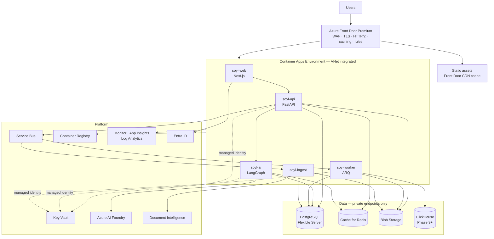
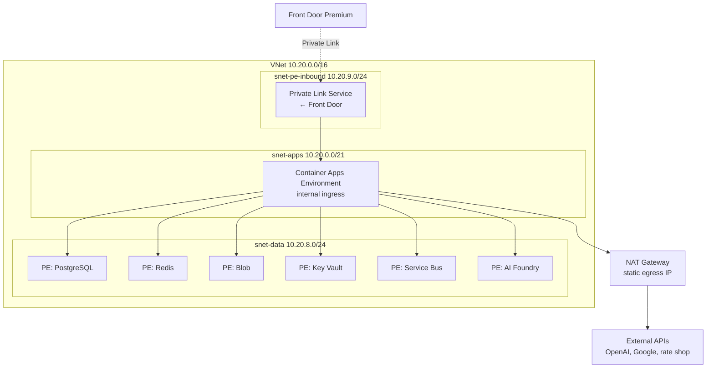
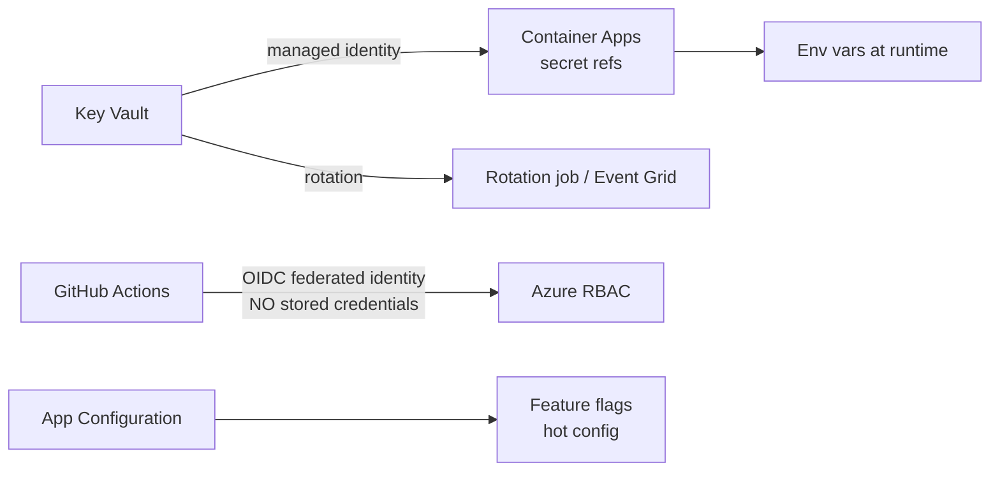
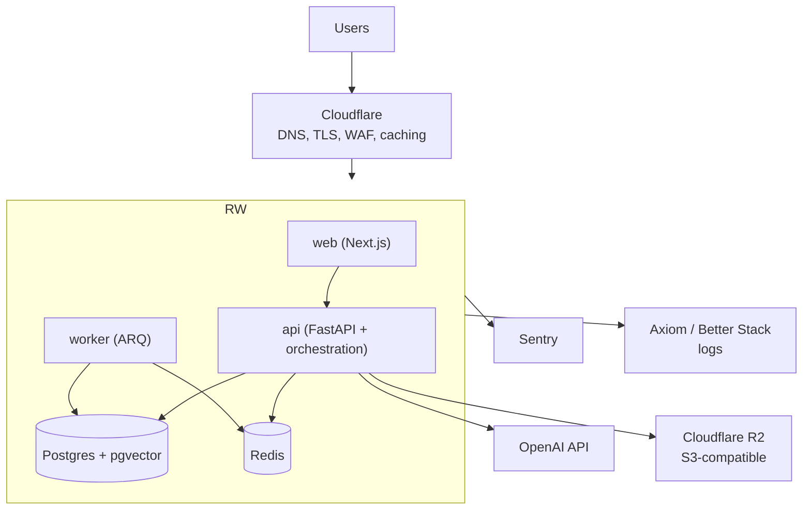
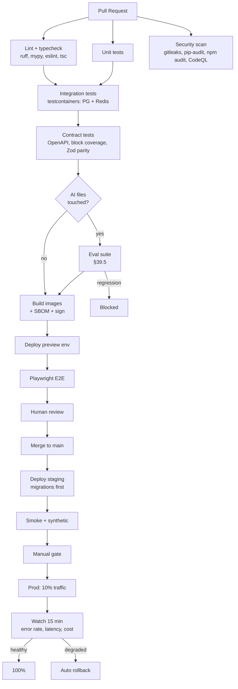
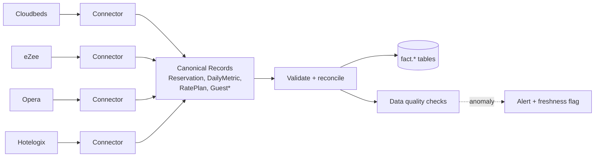
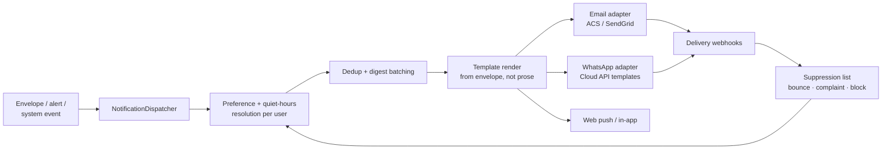

# Part IX — Cloud Infrastructure

## 51. Azure-first architecture

### 51.1 Guiding constraint

Azure is the target ecosystem; AWS is excluded. The objective is to stay simple while remaining scalable. Practically, this means: **prefer managed PaaS over anything we operate, and reject Kubernetes until there is a specific problem only Kubernetes solves.**

### 51.2 Compute: Azure Container Apps

**Decision: Azure Container Apps for all application workloads. Not App Service. Not AKS.**

**Rationale versus App Service.** App Service is simpler for a single web app, and if we were shipping one Next.js app it would be the right call. But we run multiple containerised workloads with different scaling profiles (API, workers, orchestration), and we need three specific things App Service does not do well:

1. **Scale-to-zero for non-production environments** — dev and preview environments cost nothing when idle. Over a year, with per-PR preview environments, this is real money.
2. **KEDA-based event-driven autoscaling** — worker replicas scale on Service Bus queue depth. On App Service we would scale on CPU, which is the wrong signal for a queue consumer and results in either latency or waste.
3. **First-class multi-container revisions with traffic splitting** — blue/green and canary rollouts without a load balancer to configure.

**Rationale versus AKS.** AKS gives maximum control and costs a full-time platform engineer we do not have. Container Apps is Kubernetes underneath (it runs on AKS), managed for us, with KEDA, Dapr and Envoy already wired. We get the scaling model without the operational surface. **We adopt AKS only if we hit a specific limit** — sustained need for GPU node pools, custom CNI, service mesh policy, or per-pod IAM granularity beyond what Container Apps offers. That is a Phase 6 conversation at the earliest, and it should require written justification.

**Rationale versus Azure Functions.** Covered in §25.5 — cold starts and long-running streams make Functions the wrong primary host. Used narrowly.

| Container App | Purpose | Scaling rule | Min/Max (prod) |
|---|---|---|---|
| `soyl-web` | Next.js server runtime | HTTP concurrency (100/replica) | 2 / 10 |
| `soyl-api` | FastAPI core + orchestration (Phase 1–2) | HTTP concurrency (50/replica) | 2 / 20 |
| `soyl-ai` | Orchestration runtime (Phase 3+) | HTTP concurrency (20/replica) | 2 / 15 |
| `soyl-worker` | ARQ consumers | KEDA on Service Bus depth | 1 / 12 |
| `soyl-ingest` | Document ingestion (Phase 2+) | KEDA on queue depth | 0 / 6 |

`min_replicas: 2` for user-facing apps is non-negotiable in production — a single replica means every deployment and every node maintenance event is an outage. `soyl-ingest` scales to zero because bursty document ingestion does not need a warm container.

**Resource sizing.** AI orchestration replicas need more memory than CPU — evidence stores and envelopes are large in-memory objects. Starting point: `api` 1 vCPU / 2GB, `ai` 1 vCPU / 4GB, `worker` 2 vCPU / 4GB. Revised from observed usage after Phase 1, not guessed at forever.

### 51.3 Full deployment topology



### 51.4 Service-by-service justification

| Service | Tier (prod) | Why | Alternative rejected |
|---|---|---|---|
| **Front Door Premium** | Premium | WAF with managed rules, private-link origin, HTTP/2 (required for SSE, §10.1), global anycast, caching. Premium specifically for Private Link to origins and managed WAF rule sets. | Application Gateway — regional only, more config; Azure CDN standalone — no WAF |
| **Container Apps** | Consumption + Dedicated (D4) | §51.2 | App Service, AKS |
| **PostgreSQL Flexible Server** | GP D4ds v5, ZR HA | Managed, pgvector supported, zone-redundant HA, PITR, read replicas | Single Server (retired), Cosmos for PG (over-provisioned for us) |
| **Cache for Redis** | Standard C1 → Premium P1 (Ph 3) | Premium for VNet injection, persistence, zone redundancy | Self-hosted — no |
| **Blob Storage** | Hot + Cool + Archive, GZRS | Documents, exports, backups, cold envelopes. Lifecycle policies. | Files — wrong access pattern |
| **Service Bus** | Standard → Premium (Ph 4) | Durable messaging, DLQ, scheduled delivery, dedup, sessions | Storage Queues — no topics/DLQ; Event Hubs — wrong semantics |
| **Key Vault** | Standard, RBAC + purge protection | Secrets, keys, certs; managed identity access | App settings alone — no rotation, no audit |
| **AI Foundry** | Provisioned + PAYG mix | Primary model provider; India region for residency | — |
| **Document Intelligence** | S0 | Layout-aware OCR (§42.1) | Generic OCR — loses tables |
| **Monitor / App Insights** | Pay-as-you-go, sampled | Traces, logs, metrics, alerts | Datadog — cost; we add Sentry for FE only |
| **Container Registry** | Premium | Geo-replication, content trust, vulnerability scanning | Docker Hub — no |
| **Entra ID** | P1 (staff), External ID (Ph 5) | Staff SSO, enterprise customer SSO | — |
| **App Configuration** | Standard | Feature flags, hot config (model routes) | Custom table — reinventing |

### 51.4.1 CDN and static asset strategy

Front Door's CDN handles static delivery; there is no separate Azure CDN profile. The rules:

| Asset class | Path | Cache-Control | Invalidation |
|---|---|---|---|
| Hashed build output (JS, CSS, fonts) | `/_next/static/*` | `public, max-age=31536000, immutable` | Never — the hash changes |
| Optimised images | `/_next/image*` | `public, max-age=86400, stale-while-revalidate=604800` | By content hash |
| Public marketing pages | `/` , `/pricing` | `public, s-maxage=3600, stale-while-revalidate=86400` | Purge on deploy |
| Authenticated app shell | `/(platform)/*` | `private, no-store` | n/a |
| **All API and SSE responses** | `/api/*` | `no-store, no-transform` | n/a |
| User-uploaded documents | Blob, via SAS | `private, max-age=300` | SAS expiry |
| Generated exports | Blob, via SAS | `private, no-store` | SAS expiry |

Three non-negotiables, each of which is a bug we have pre-empted:

1. **`no-transform` on every streaming response.** A CDN that "optimises" a `text/event-stream` by buffering it silently breaks the entire AI experience (§24.2).
2. **Nothing authenticated is ever cached at the edge.** A shared cache serving one tenant's dashboard shell to another is the same class of failure as a cross-tenant query. Front Door rules explicitly bypass cache for any request carrying a session cookie or `Authorization` header, and there is an infrastructure test asserting it.
3. **Content-hashed filenames for everything long-lived**, so we never need a purge in the deploy path. Purges are eventually consistent and are the wrong tool for a rollback.

Documents and exports are served from Blob via short-lived SAS URLs on a **separate hostname** (`files.soyl.cloud`), so a malicious uploaded SVG or HTML file cannot execute in the application origin (§59.1).

### 51.5 Networking



Principles:

- **No public IPs on data services.** Every PaaS dependency is reached via a private endpoint with public network access disabled. This is the single highest-value network control.
- **Container Apps ingress is internal**; the only public entry is Front Door, connected via Private Link.
- **NAT Gateway for egress** gives a stable outbound IP, which partners (PMS vendors, rate-shopping providers) will ask us to allowlist.
- **Private DNS zones** for each private endpoint.
- **NSGs** with default-deny and explicit allows.
- **A dedicated `snet-jump`** with a Bastion host for break-glass database access, off by default, requiring PIM elevation to enable (§57.2).

**Cost note:** private endpoints cost roughly $8/month each plus data processing. Six of them is under $60/month, which is entirely worth it. Front Door Premium is the significant line item (~$330/month base) and is the one place we spend meaningfully for security posture. In Phase 1 with a Railway MVP (§53) this is deferred.

### 51.6 Environments

| Environment | Purpose | Infra | Data | Cost target |
|---|---|---|---|---|
| **local** | Development | docker-compose | Seeded fixtures | $0 |
| **preview** | Per-PR | Container Apps, scale-to-zero, shared DB with per-PR schema | Synthetic | ~$40/mo total |
| **dev** | Integration | Reduced-size Azure mirror | Synthetic + anonymised | ~$250/mo |
| **staging** | Pre-production | **Production-shaped**, smaller SKUs | Anonymised production snapshot | ~$600/mo |
| **prod** | Live | Full | Real | Scales with usage |

**Staging must be production-shaped**, not production-sized. Same services, same networking, same identity model, same deployment mechanism, smaller SKUs. A staging environment that differs structurally from production tests nothing that matters. The most common serious incident in a small team is "it worked in staging" caused by staging having public database access while production does not.

**Preview environments per PR** are worth the effort specifically for this product: reviewing a change to generated UI requires *seeing* it. A designer should be able to open a URL from a PR and interact with the new block type.

### 51.7 Secrets management



Rules:

1. **No secret in source control, ever.** `gitleaks` in pre-commit and in CI; push protection enabled on the repository.
2. **No secret in a container image.** Injected at runtime from Key Vault via Container Apps secret references.
3. **Managed identity everywhere possible.** Postgres, Blob, Service Bus, Key Vault and AI Foundry all support Entra authentication — connection strings with passwords are eliminated, not just protected.
4. **GitHub Actions uses OIDC federated credentials.** No service principal secret stored in GitHub. This closes the most commonly exploited CI attack path.
5. **Rotation:** automatic where supported (storage keys, Redis keys, certificates), quarterly and documented where not (third-party API keys). Rotation is a calendar item with an owner.
6. **A secret in an error message or log is a P2 incident**, and the logging pipeline has a redaction processor for known secret patterns as a backstop.

---

## 52. Railway for the earliest MVP

### 52.1 The honest comparison

Railway is genuinely better than Azure for the first weeks of a project, and pretending otherwise costs real time.

| Dimension | Railway | Azure (Container Apps) |
|---|---|---|
| Time to first deploy | ~30 minutes | 2–5 days (VNet, PE, IaC, identity) |
| Managed Postgres + Redis | One click, connected | Provision, network, configure |
| Preview environments | Built in | Must be built |
| Cost at zero traffic | ~$20–40/mo | ~$400/mo with the security posture above |
| Private networking | Basic | Full VNet + private endpoints |
| Compliance posture | Limited | SOC 2 / ISO inheritable |
| Data residency (India) | Not available | Central India region |
| Enterprise procurement | A blocker | Expected |
| Scaling ceiling | Adequate to meaningful load | Effectively none |
| IaC maturity | Limited | Bicep/Terraform, full |

### 52.2 The recommendation

**Use Railway for Phase 1 through early Phase 2 — roughly the first 3–5 months — then migrate to Azure before the first paying enterprise customer or the first real customer data.**

The reasoning is a straightforward calculation. Setting up production-grade Azure infrastructure is 2–3 weeks of a senior engineer's time. With a 3-person team, that is roughly 15% of the entire team's first quarter, spent on infrastructure for a product that has not yet been validated. Railway removes that cost entirely at a stage when iteration speed is the only thing that matters.

**The migration is cheap if — and only if — we hold these constraints from day one:**

1. Everything is a container. No Railway-specific build magic.
2. All configuration is environment variables. No platform-specific config APIs.
3. Postgres is plain Postgres with pgvector. No proprietary extensions.
4. Redis is plain Redis.
5. Object storage is accessed through **our own storage port**, with a local/S3-compatible adapter for Railway and a Blob adapter for Azure. This is the one genuine abstraction we write early, and it is worth it.
6. No Railway-specific networking assumptions.
7. Secrets are read from the environment; the source of those values differs by platform.

With those held, the migration is: build the Azure infrastructure with Bicep, `pg_dump`/`pg_restore` the database, copy blobs, cut DNS. A weekend, with a rollback path.

### 52.3 The migration trigger

Migrate when **any** of these becomes true:

- A prospect requires data residency, SOC 2 evidence, a security questionnaire, or a DPA with specific infrastructure commitments.
- We hold real customer financial data at meaningful volume.
- We need private networking to satisfy a customer's security review.
- Monthly Railway cost approaches Azure's baseline (roughly $400–500/month) — at which point Azure is strictly better value.
- We need India data residency for a customer contract.

**Do not migrate because it feels more serious.** Migrate on a trigger.

### 52.4 Phase 1 Railway topology



Note we use OpenAI directly and R2 for storage in this phase — both accessed exclusively through our provider and storage ports, so the Azure switch is a configuration change plus one adapter each.

---

## 53. CI/CD

### 53.1 Pipeline



### 53.2 GitHub Actions structure

```
.github/workflows/
├── ci.yml                  # PR: lint, test, build, preview
├── eval.yml                # AI evals — path-filtered + nightly
├── deploy-staging.yml      # on merge to main
├── deploy-prod.yml         # manual dispatch or tag, with approval
├── migrate.yml             # reusable: run Alembic as a job
├── security.yml            # CodeQL, dependency review, container scan
├── preview-cleanup.yml     # tear down preview envs on PR close
└── nightly.yml             # full eval, restore drill, cost report
```

Practices:

- **Path filters** so a frontend-only PR does not run the 20-minute eval suite.
- **Concurrency groups** cancel superseded runs on the same branch.
- **Reusable workflows** for anything used more than twice.
- **OIDC to Azure**; no stored credentials.
- **Build once, promote the same digest** through staging to production. Never rebuild for production — a rebuild is a different artifact and invalidates everything staging proved.
- **PR budget:** CI feedback under 10 minutes for the common path. A slow pipeline gets bypassed, and a bypassed pipeline is worse than no pipeline.

### 53.3 Deployment and rollback

**Blue/green via Container Apps revisions with traffic splitting.** Deploy a new revision at 0% traffic, smoke test it directly by revision URL, shift 10%, watch, shift 100%, retire the old revision after 30 minutes.

**Rollback is a traffic shift** — under a minute, and it is tested monthly as a drill, not assumed.

**Database migrations are the constraint on rollback**, and this is the discipline that makes fast rollback real:

- Migrations run as a pre-deploy job, before the new revision receives traffic.
- **Migrations must be backward compatible with the previous application version** for one release. This is the expand/contract rule (§48.11), and it is what makes an application rollback safe without a database rollback — which is the operation you never want to perform under pressure.
- If a migration cannot be made backward compatible, the deployment is split across two releases. There is no exception to this.

### 53.4 Infrastructure as Code

**Decision: Bicep for Azure resources, with Terraform reserved for anything multi-cloud or third-party (Cloudflare, Sentry, ClickHouse Cloud).**

Bicep because it is Azure-native, has same-day support for new resource properties, needs no state file to manage or corrupt, and has genuinely good tooling. Terraform's advantages — multi-cloud, a large provider ecosystem — are advantages we do not need for Azure resources, and state management is a real operational burden for a small team.

```
infra/
├── bicep/
│   ├── main.bicep
│   ├── modules/
│   │   ├── network.bicep
│   │   ├── container-apps.bicep
│   │   ├── postgres.bicep
│   │   ├── redis.bicep
│   │   ├── storage.bicep
│   │   ├── keyvault.bicep
│   │   ├── servicebus.bicep
│   │   ├── frontdoor.bicep
│   │   ├── monitoring.bicep
│   │   └── ai-foundry.bicep
│   └── env/
│       ├── dev.bicepparam
│       ├── staging.bicepparam
│       └── prod.bicepparam
├── terraform/                 # Cloudflare, Sentry, ClickHouse Cloud
└── scripts/
    ├── bootstrap.sh
    ├── restore-drill.sh
    └── cost-report.sh
```

All infrastructure changes go through PR with `what-if` output posted as a comment. No portal changes in staging or production — a portal change is invisible to review and will be silently reverted by the next deployment.

### 53.5 Incident response

| Severity | Definition | Response | Comms |
|---|---|---|---|
| **P1** | Platform down, data loss, security breach | Immediate, all hands | Status page + direct customer contact within 30 min |
| **P2** | Major feature broken, AI unavailable, severe degradation | Within 30 min | Status page |
| **P3** | Partial degradation, elevated errors | Next business day | In-app if user-visible |
| **P4** | Minor, cosmetic | Backlog | None |

With a 3-person team there is no formal rotation, and pretending otherwise is worse than admitting it. What we have instead:

- **Alerting tuned to be actionable.** A pager that fires on noise gets ignored, and then it fires on something real and still gets ignored. Every alert must have a runbook and a plausible action.
- **Runbooks in `docs/runbooks/`** for every alert, written when the alert is created — not after the first incident.
- **A written blameless postmortem for every P1 and P2**, with a tracked action item. Every incident produces at least one of: a new eval case, a new test, a new alert, or a new runbook.
- **Monthly game days** rotating through: provider outage, database failover, rollback drill, cache loss, region loss. These are two hours and they are the difference between a controlled incident and a bad night.

---

## 54. Scaling, cost and disaster recovery

### 54.1 Scaling strategy by dimension

| Dimension | Bottleneck | Strategy |
|---|---|---|
| Concurrent users | API replicas | Horizontal, HTTP concurrency scaling |
| Concurrent AI turns | Model provider TPM quota, memory | Provisioned throughput on Foundry + queueing + routing to fallbacks |
| Database reads | Primary CPU/IO | Read replica for analytics; caching; ClickHouse offload |
| Database writes | Primary IO | Batch writes, partition, then scale up (vertical is fine for a long time) |
| Document ingestion | CPU, Document Intelligence quota | Queue depth scaling, ingest containers to zero when idle |
| Vector search | Index size and memory | HNSW tuning; partition by tenant when necessary; dedicated store past ~50M vectors |
| Event volume | Postgres | Migrate to ClickHouse at the documented trigger |
| Cost | Model tokens | §34.4 levers |

**The realistic first bottleneck is not compute — it is model provider quota.** Azure AI Foundry TPM limits per deployment will constrain concurrent turns long before any container saturates. Mitigations: provisioned throughput units for the primary route, multiple deployments across regions, aggressive caching, and honest queueing with a user-visible wait state rather than an error.

### 54.2 Cost model and optimisation

Illustrative monthly steady-state at ~100 active tenants (order-of-magnitude, to be replaced with measured figures after Phase 2):

| Line | Estimate |
|---|---|
| Container Apps | $350 |
| PostgreSQL (GP D4ds, HA) | $450 |
| Redis (Premium P1) | $250 |
| Front Door Premium | $350 |
| Blob + egress | $80 |
| Service Bus | $30 |
| Monitor / App Insights | $200 |
| Container Registry | $50 |
| **Infrastructure subtotal** | **~$1,760** |
| **Model inference** | **$1,500–6,000 — the dominant variable** |
| Document Intelligence | $150 |
| Embeddings | $60 |
| Reranking | $80 |
| ClickHouse (Phase 3+) | $250 |
| **Total** | **~$3,800–8,500** |

The important observation: **model inference dominates and is the only line that scales with usage.** Infrastructure is roughly fixed. This means unit economics are almost entirely an AI-efficiency problem, which is why §34.3 (cost attribution) and §34.4 (optimisation levers) are treated as architecture rather than as an optimisation phase.

Cost controls:

- Per-tenant budgets with alerting at 70% and 90% (§29.6).
- A daily cost report to Slack, broken down by tenant and route.
- Anomaly alerting on 2× day-over-day movement.
- Reserved capacity for Postgres and Container Apps once usage is predictable (roughly 30–40% saving).
- Blob lifecycle: Hot 30d → Cool 90d → Archive.
- App Insights sampling at 20% for successful requests, **100% for errors and for all AI turns** — AI traces are too valuable to sample.

### 54.3 Disaster recovery

| Scenario | Detection | Response | RTO | RPO |
|---|---|---|---|---|
| Container App unhealthy | Health probe | Automatic restart/reschedule | < 1 min | 0 |
| Bad deployment | Canary metrics | Traffic shift to prior revision | < 2 min | 0 |
| Database zone failure | Azure | Automatic HA failover | < 2 min | ~0 |
| Database corruption | Alerts, user reports | PITR to a new server, cut over | < 2 hr | ≤ 5 min |
| Region failure | Azure Monitor | Restore from geo-backup in the paired region, redeploy from IaC, DNS cut | < 8 hr (Ph 1–3)<br/>< 1 hr (Ph 5+) | ≤ 1 hr |
| Redis loss | Health check | Rebuild from Postgres; degraded performance, no data loss | < 15 min | Cache only |
| Model provider outage | Circuit breaker | Automatic reroute | < 30 s | 0 |
| All model providers | Circuit breakers | Non-AI product remains fully functional; AI surfaces show honest status | — | 0 |
| Accidental data deletion | Audit log, user report | PITR to a scratch server, extract, repair | < 4 hr | ≤ 5 min |

**Region failure is deliberately accepted as an 8-hour RTO in Phase 1–3.** Active-active multi-region roughly doubles infrastructure cost and adds substantial complexity — cross-region data replication, conflict resolution, split-brain handling — to protect against an event that occurs perhaps once in several years. With a 3-person team, that engineering is better spent elsewhere. This is a written, deliberate risk acceptance, revisited when we have enterprise SLA commitments, at which point it becomes a priced feature rather than a cost.

**What we do maintain from day one:** geo-redundant backups, infrastructure fully expressible from IaC, a documented and *rehearsed* regional recovery runbook, and DNS with a low TTL. The gap between "we could recover" and "we have recovered, in a drill, and it took 6 hours 40 minutes" is the entire value of DR planning.

---

# Part X — Integrations

## 55. Integration architecture

### 55.1 The connector abstraction

Every external system is a **Connector** implementing a common protocol with a declared capability manifest. This is the fifth extension seam from §5.1.

```python
class Connector(Protocol):
    id: str                                # 'pms.cloudbeds'
    kind: ConnectorKind                    # pms | booking_engine | reviews | accounting | maps
    capabilities: frozenset[Capability]
    auth: AuthKind                         # oauth2 | api_key | basic | custom

    async def test(self, cfg: ConnectorConfig) -> HealthResult: ...
    async def sync(self, ctx: SyncContext) -> SyncResult: ...
    async def fetch(self, ctx: SyncContext, resource: str, **kw) -> Any: ...
    def normalise(self, raw: Any, resource: str) -> list[CanonicalRecord]: ...
    async def handle_webhook(self, payload: bytes, headers: Mapping) -> list[CanonicalEvent]: ...
```

**Capabilities are declared, not assumed.** One PMS exposes segment-level revenue; another does not. Rather than degrading silently, a connector declares `{RESERVATIONS, DAILY_METRICS, RATES}` but not `{SEGMENT_REVENUE}`, and the system knows — before a user asks — that channel-mix analysis is unavailable for this property. It can then say so precisely instead of returning an empty chart.

### 55.2 The canonical model



Everything downstream — metrics, tools, agents, envelopes — depends only on the canonical model. Adding a PMS is writing a connector, never touching the metrics engine.

`Guest*` is starred deliberately: guest PII is minimised at the boundary. We ingest what analytics requires (stay pattern, channel, segment, country) and hash or drop direct identifiers unless a specific feature requires them and the tenant has consented (§58.3).

### 55.3 Sync patterns

| Pattern | When | Used by |
|---|---|---|
| **Webhook** | Provider supports it | Modern cloud PMSs, payment gateways |
| **Incremental poll** | Cursor/watermark available | Most PMSs, review platforms |
| **Full snapshot** | Small datasets, no incremental support | Rate plans, room types |
| **Daily snapshot** | State-in-time capture | **OTB snapshots (§48.4) — non-negotiable** |
| **On-demand** | Expensive, low-value-if-stale | Rate shopping, Places lookups |

Reliability rules for every sync:

1. **Idempotent by natural key.** `(tenant, property, external_id, resource)` with upsert.
2. **Watermarked and resumable.** Store the last successful cursor; resume from it after a failure.
3. **Reconciled periodically.** A weekly full comparison against the source catches silent drift, which incremental sync always eventually produces.
4. **Rate-limit aware**, with per-connector token buckets and honoured `Retry-After`.
5. **Quarantine, not crash.** A malformed record goes to a quarantine table with its raw payload; the sync continues. One bad reservation must not stop a property's data.
6. **Freshness recorded per property per resource**, surfaced through `meta.data_freshness` (§31.3) and into envelope warnings.

### 55.4 The integration catalog

| Integration | Phase | Direction | Auth | Notes |
|---|---|---|---|---|
| **Google Places** | 2 | Read | API key | Property/vendor metadata, geocoding, competitor discovery |
| **Google Reviews** (Business Profile API) | 2 | Read/Write | OAuth2 | Reviews and — later — responses. Requires location ownership verification, which is a real onboarding step to design for. |
| **Cloudbeds** | 3 | Read | OAuth2 | Good API, webhooks. Best first PMS. |
| **eZee / Hotelogix** | 3–4 | Read | API key | Large India presence. Weaker APIs; expect polling and quirks. |
| **Oracle OPERA Cloud** | 5 | Read | OAuth2 | Enterprise requirement. Significant integration effort and certification. |
| **Channel managers** (SiteMinder, STAAH) | 4 | Read | API key | Channel mix, rate distribution |
| **Booking engines** | 4 | Read | Varies | Direct booking funnel |
| **Rate shopping** (OTA Insight/Lighthouse, RateGain) | 3 | Read | API key | Comp set rates. Licensed data — never scraped. |
| **Accounting** (Tally, Zoho Books, QuickBooks) | 4 | Read | Varies | P&L, actual cost |
| **Vendor / supplier APIs** (§55.4.1) | 5 | Read/Write | Varies | Catalogue, pricing, stock, RFQ submission |
| **B2B marketplaces** (IndiaMART, Udaan) | 5 | Read | API key | Vendor discovery and indicative pricing |
| **WhatsApp Business** | 5 | Write | Cloud API | Digests, alerts. High value in our market. |
| **Email** (Azure Communication Services / SendGrid) | 2 | Write | API key | Digests, exports, notifications (§55.6) |
| **Payment gateways** (Razorpay, Stripe) | 4 | Read/Write | API key | Our billing, plus transaction data (§55.7) |
| **Weather / events** | 3 | Read | API key | Demand signal features |

#### 55.4.1 Vendor and supplier APIs

Procurement data arrives through three tiers of integration quality, and the architecture must not assume the best one:

| Tier | Source | Mechanism | Freshness | Confidence |
|---|---|---|---|---|
| **A — API** | Large suppliers and distributors with published APIs | `VendorConnector` polling catalogue and price endpoints | Hourly–daily | High |
| **B — Feed** | Suppliers who publish a CSV/XLSX price list to a URL or mailbox | Scheduled fetch → tabular normalisation | Weekly–monthly | Medium |
| **C — Document** | Everyone else — a PDF price list emailed to the hotel | Ingestion pipeline (§42) with structured extraction | On receipt | Medium-low, extraction-confidence scored |

The `VendorConnector` protocol extends the base `Connector` (§55.1) with procurement-specific capabilities:

```python
class VendorConnector(Connector, Protocol):
    capabilities: frozenset[Capability]   # CATALOGUE, PRICING, STOCK, RFQ, ORDER, INVOICE

    async def catalogue(self, ctx: SyncContext, since: datetime | None) -> list[VendorOffer]: ...
    async def price_for(self, ctx: SyncContext, sku: str, qty: int) -> PriceQuote | None: ...
    async def submit_rfq(self, ctx: SyncContext, rfq: RFQ) -> RFQReceipt: ...
```

Three rules that keep this honest:

1. **Every offer carries `source_tier` and `as_of`.** A `card.supplier` block rendered from a Tier-C extraction of a three-month-old PDF says so, and the comparison table marks it. Comparing a live API price against a stale extracted one without saying so would be a serious correctness failure in a procurement recommendation.
2. **`submit_rfq` is a write action and is confirmation-gated** (§18.2) with no exception. We do not send a purchase intent to a supplier on a model's judgement.
3. **Tier A connectors are per-vendor and therefore unbounded in number.** They are built only on demonstrated demand — a vendor integration is written when enough tenants use that vendor to justify it, measured from the procurement analytics, not from a partnership conversation.

### 55.5 Connector security

- Credentials are stored **encrypted per tenant** with envelope encryption: a per-tenant data key wrapped by a Key Vault master key. A database dump alone does not yield usable credentials.
- **OAuth tokens are refreshed proactively** before expiry, with failure alerting to the tenant admin and a clear reconnection flow.
- **Least-privilege scopes** requested — read-only wherever the feature allows.
- **All connector egress from the NAT Gateway static IP** for partner allowlisting.
- **Webhook signature verification is mandatory**, with replay protection via a timestamp window and a nonce cache. An unverified webhook endpoint is an unauthenticated write path into our database.
- **Per-connector circuit breakers** so a failing partner degrades one capability rather than the platform.

### 55.6 Outbound messaging — email, WhatsApp, push

Digests and alerts are a core surface (§3.1), not a notification afterthought, so delivery gets a real design.

**Decision: one channel-agnostic `NotificationDispatcher`; channels are adapters. Azure Communication Services Email as the primary email transport, with SendGrid retained as a configured fallback.**

ACS is chosen for email because it keeps identity, billing and data residency inside Azure and supports India-region data storage. SendGrid stays configured because email deliverability failures are the kind of problem you solve by having a second path already wired.



The parts that matter:

- **Templates render from the envelope, not from generated prose.** A daily brief email is the same `ResponseEnvelope` rendered by an email renderer — the same headline, the same KPI values, the same provenance. This is the fourth output surface promised in §3.1, and it costs no additional model calls.
- **A suppression list is authoritative and channel-wide.** Bounces, spam complaints and WhatsApp blocks write to it, and the dispatcher checks it before every send. Sending to a hard-bounced address is how a sending domain's reputation dies.
- **Deliverability is configured, not hoped for:** SPF, DKIM and DMARC on the sending domain from Phase 2; a dedicated subdomain (`notify.soyl.cloud`) so transactional reputation is isolated from corporate mail; and a warm-up schedule when volume grows.
- **Quiet hours and per-user preferences are resolved before batching.** A 6:30am brief in the tenant's timezone (§25.3) that arrives at 2am because the user is travelling is a reason to disable notifications entirely.
- **WhatsApp requires pre-approved message templates** with variable substitution; free-form outbound is only permitted inside a 24-hour customer-initiated window. This is a Meta platform constraint that shapes the feature, so the digest content model is designed to fit a template from the start rather than being retrofitted.
- **Inbound email** (Phase 5) lands on a per-tenant ingestion address that routes attachments into the document pipeline (§42). This is by far the lowest-friction way for a hotel to get a supplier price list into the system: forward the email.

### 55.7 Payments and billing integration

Two distinct concerns that are easy to conflate:

**(a) Our billing — collecting money from tenants.** Razorpay for Indian tenants (UPI, netbanking, domestic cards, and it handles GST invoicing well); Stripe for international. Both behind a `PaymentProvider` port.

| Flow | Design |
|---|---|
| Subscription lifecycle | Plan and entitlement state is authoritative in `billing.*` (§48.2), **not** in the gateway. The gateway is a payment rail, not our source of truth for what a customer can do. |
| Webhooks | Signature-verified, idempotent by event ID, delivered into Service Bus for durable processing (§25.1). A dropped `payment.failed` webhook is a customer who silently keeps premium access. |
| Dunning | Failed payment → retry schedule → in-app banner → email → grace period → downgrade to read-only. Downgrade never deletes data. |
| Usage overage | Metered from `billing.usage_ledger` (§34.3), invoiced in arrears. This is the reason the ledger exists in Phase 1. |
| Reconciliation | Nightly job comparing gateway settlements against our invoice records; discrepancies raise an alert rather than being auto-corrected. |
| PCI scope | We never see card data. Hosted checkout and tokenisation only (§58.2). |

**(b) Tenant transaction data — reading their payment flows.** From Phase 4, a read-only connection to the tenant's own gateway gives us settled revenue by channel, refund rates, and chargeback exposure, which materially improves the finance pack. This is a separate, separately-consented connection with read-only scopes, and it is never used for our own billing.
