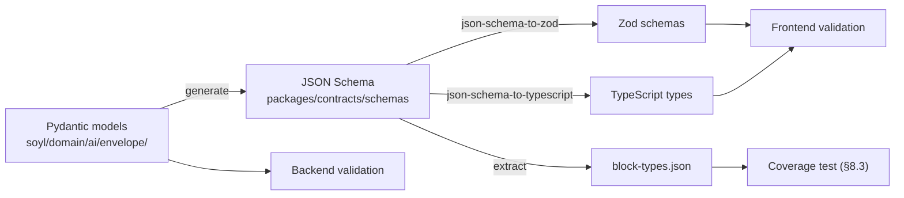

# Part XIII — Complete Folder Structures

## 65. The monorepo

```
soyl/
├── README.md
├── Makefile
├── package.json
├── pnpm-workspace.yaml
├── turbo.json
├── docker-compose.yml
├── .env.example
├── .gitleaks.toml
├── .importlinter
├── CODEOWNERS
│
├── apps/
│   ├── web/                          # Next.js — full tree in §7
│   └── admin/                        # internal tooling: traces, evals, tenants
│
├── services/
│   ├── api/                          # FastAPI monolith — full tree in §21
│   └── worker/                       # thin entrypoint; imports soyl.*
│
├── packages/
│   ├── contracts/                    # ── THE CROSS-LANGUAGE CONTRACT ──
│   │   ├── package.json
│   │   ├── schemas/
│   │   │   ├── envelope.v2.json      # generated from Pydantic
│   │   │   ├── blocks/
│   │   │   │   ├── metric.kpi.json
│   │   │   │   ├── chart.timeseries.json
│   │   │   │   └── ...
│   │   │   ├── events.json           # SSE event types
│   │   │   └── analytics.json        # analytics event catalog
│   │   ├── generated/
│   │   │   ├── types.ts
│   │   │   ├── zod.ts
│   │   │   └── block-types.json      # used by the coverage test (§8.3)
│   │   └── scripts/generate.ts
│   │
│   ├── ui/                           # shared design system
│   │   ├── src/
│   │   │   ├── components/
│   │   │   ├── tokens/
│   │   │   ├── hooks/
│   │   │   └── index.ts
│   │   └── tailwind-preset.js
│   │
│   ├── analytics/                    # typed event emitter (web + node)
│   ├── config/                       # shared eslint, ts, prettier configs
│   └── testing/                      # shared fixtures and helpers
│
├── infra/                            # § 53.4
│   ├── bicep/
│   ├── terraform/
│   └── scripts/
│
├── docs/                             # § 63
│
├── prompts/                          # symlinked into services/api/soyl/prompts
│   └── ...                           # kept top-level for visibility in review
│
├── evals/
│   ├── suites/
│   │   ├── revenue_diagnosis_v2.yaml
│   │   ├── knowledge_grounding_v1.yaml
│   │   ├── procurement_compare_v1.yaml
│   │   ├── adversarial_injection_v3.yaml
│   │   └── scope_boundary_v2.yaml
│   ├── fixtures/
│   │   └── fixture_hotel/            # deterministic synthetic tenant
│   ├── graders/
│   ├── reports/                      # committed baselines for regression diffing
│   └── runner.py
│
└── .github/
    ├── workflows/                    # § 53.2
    ├── ISSUE_TEMPLATE/
    └── pull_request_template.md
```

### 65.1 Why `packages/contracts` is the most important package

It is the only place where the frontend and backend agree on anything. The generation flow:



`make contracts` regenerates and the result is **committed**. A backend envelope change that is not accompanied by a regenerated contract fails CI. This turns a whole class of integration bug into a compile error.

## 66. AI subsystem tree (expanded)

```
services/api/soyl/domain/ai/
├── __init__.py                    # public API of the module
├── ports.py                       # interfaces this module depends on
│
├── orchestration/
│   ├── graph.py                   # LangGraph assembly, edges, conditions
│   ├── state.py                   # OrchestrationState
│   ├── budget.py                  # Budget, enforcement
│   ├── events.py                  # StreamEvent types
│   ├── checkpointer.py            # Postgres checkpoint saver
│   ├── runner.py                  # Orchestrator.run / run_sync
│   └── nodes/
│       ├── guard.py
│       ├── understand.py
│       ├── plan.py
│       ├── route.py
│       ├── execute.py
│       ├── reflect.py
│       ├── synthesise.py
│       ├── validate.py
│       ├── repair.py
│       └── persist.py
│
├── agents/
│   ├── base.py                    # Agent ABC, capability manifest
│   ├── registry.py                # @register_agent
│   ├── revenue.py
│   ├── market.py
│   ├── reputation.py
│   ├── operations.py
│   ├── procurement.py
│   ├── finance.py
│   ├── knowledge.py
│   └── general.py
│
├── tools/
│   ├── base.py                    # @tool, ToolContext, ToolRegistry, CachePolicy
│   ├── registry.py
│   ├── executor.py                # §31.4 pipeline
│   ├── metrics_tools.py
│   ├── pace_tools.py
│   ├── forecast_tools.py
│   ├── market_tools.py
│   ├── review_tools.py
│   ├── ops_tools.py
│   ├── finance_tools.py
│   ├── document_tools.py
│   ├── vendor_tools.py
│   ├── action_tools.py
│   └── meta_tools.py
│
├── envelope/
│   ├── schema.py                  # ResponseEnvelope, Block, Layout, Provenance
│   ├── blocks/
│   │   ├── __init__.py            # BLOCK_REGISTRY: type → payload model
│   │   ├── metric.py
│   │   ├── chart.py
│   │   ├── table.py
│   │   ├── card.py
│   │   ├── plan.py
│   │   ├── list.py
│   │   ├── forecast.py
│   │   ├── map.py
│   │   ├── doc.py
│   │   └── text.py
│   ├── materialise/               # ── DETERMINISTIC BINDING (§33.2) ──
│   │   ├── metric_kpi.py          # MetricResult → MetricKpiPayload
│   │   ├── chart_timeseries.py
│   │   ├── table_generic.py
│   │   └── ...
│   ├── builder.py
│   └── validator.py               # schema, provenance, policy, consistency
│
├── memory/
│   ├── working.py
│   ├── episodic.py
│   ├── semantic.py
│   ├── summariser.py
│   └── assertions.py
│
├── guardrails/
│   ├── input_guard.py
│   ├── output_guard.py
│   ├── injection.py
│   └── policy.py
│
└── eval/
    ├── datasets.py
    ├── graders/
    │   ├── deterministic.py
    │   └── judge.py
    ├── runner.py
    └── report.py
```

The `materialise/` directory is worth calling out: it is where the numeric-hallucination-elimination lives. One pure function per data-bound block type, each with a unit test. It is unglamorous code and it is the reason the product's figures are trustworthy.

## 66.1 Integrations tree (expanded)

Connectors get their own expanded tree because they are the part of the codebase that grows fastest and rots fastest — every one is a dependency on someone else's API decisions.

```
services/api/soyl/infrastructure/connectors/
├── base.py                        # Connector + VendorConnector protocols, Capability enum
├── registry.py                    # @register_connector, capability lookup
├── runtime/
│   ├── credentials.py             # envelope encryption, per-tenant data keys (§55.5)
│   ├── oauth.py                   # authorisation code flow, proactive refresh
│   ├── http.py                    # shared client: retries, backoff, rate limits, tracing
│   ├── ratelimit.py               # per-connector token buckets
│   ├── breaker.py                 # per-connector circuit breaker
│   ├── watermark.py               # incremental sync cursors
│   ├── quarantine.py              # malformed-record capture
│   └── webhook.py                 # signature verification, replay protection
│
├── canonical/                     # ── THE INTEGRATION CONTRACT ──
│   ├── reservation.py
│   ├── daily_metric.py
│   ├── rate_plan.py
│   ├── review.py
│   ├── ledger_entry.py
│   ├── vendor_offer.py
│   └── events.py                  # CanonicalEvent types emitted by webhooks
│
├── pms/
│   ├── cloudbeds/
│   │   ├── connector.py
│   │   ├── client.py              # raw API surface, generated where possible
│   │   ├── mapping.py             # raw → canonical
│   │   ├── capabilities.py
│   │   └── fixtures/              # recorded responses for contract tests
│   ├── ezee/
│   ├── hotelogix/
│   └── opera/
│
├── channel_manager/
│   ├── siteminder/
│   └── staah/
│
├── reviews/
│   ├── google_business/
│   └── aggregator/
│
├── maps/
│   └── google_places/
│
├── rateshop/
│   ├── lighthouse/
│   └── rategain/
│
├── accounting/
│   ├── tally/
│   ├── zoho_books/
│   └── quickbooks/
│
├── vendors/                       # §55.4.1
│   ├── tier_a/                    # per-supplier API connectors
│   ├── feed/                      # CSV/XLSX price-list ingestion
│   └── marketplace/
│
├── messaging/                     # §55.6
│   ├── email_acs.py
│   ├── email_sendgrid.py
│   ├── whatsapp.py
│   └── webpush.py
│
├── payments/                      # §55.7
│   ├── razorpay.py
│   └── stripe.py
│
└── signals/
    ├── weather.py
    ├── events_calendar.py
    └── holidays.py
```

Two conventions that make this tree maintainable:

- **`fixtures/` in every connector is mandatory.** Contract tests run against recorded real responses, so a connector can be refactored without hitting a partner's sandbox — which is usually rate-limited, frequently broken, and never available when you need it.
- **`mapping.py` is the only file allowed to know the partner's field names.** Everything else in the connector speaks canonical. When a partner renames a field, exactly one file changes.

---

# Part XIV — Engineering Roadmap

## 67. Roadmap principles

1. **Every phase ships something a customer can use.** No phase is purely infrastructural.
2. **Data collection precedes the feature that needs it.** OTB snapshots start in Phase 1 even though pace analysis ships in Phase 3 — the history cannot be back-filled.
3. **Evaluation precedes scaling.** We do not add capability packs faster than we can evaluate them.
4. **Technical debt is named and scheduled**, not accumulated silently. Every phase lists what it defers and when it is repaid.
5. **Estimates assume 2–5 engineers.** Effort is given in engineer-weeks so it can be re-mapped if staffing changes.

**Team assumptions:**

| Phase | Headcount | Composition |
|---|---|---|
| 1 | 2–3 | 1 full-stack lead, 1 AI/backend, (0.5 design) |
| 2 | 3 | +1 frontend |
| 3 | 4 | +1 backend/data |
| 4 | 4–5 | +1 AI/data |
| 5 | 5 | +0.5 platform, +0.5 QA/eval |
| 6 | 5–8 | +platform, +integrations |

---

## 68. Phase 1 — Foundation

**Goal:** a working AI conversation inside SOYL Cloud that answers real questions about real hotel data, with structured output rendering as real UI.

**Duration:** 10–12 weeks · **Effort:** ~26 engineer-weeks · **Team:** 2–3

### Deliverables

| # | Deliverable | Effort (ew) |
|---|---|---|
| 1.1 | Monorepo, CI, local dev in 30 min, Railway environments | 2.0 |
| 1.2 | Core schema: tenant, property, user, membership + **RLS from migration 1** | 1.5 |
| 1.3 | Auth integration with existing SOYL Cloud session; Principal, TenantContext | 1.5 |
| 1.4 | `fact.daily_metric` + **`fact.otb_snapshot` snapshotting job** | 1.5 |
| 1.5 | Metrics engine with normative definitions + golden tests | 2.0 |
| 1.6 | Model abstraction layer, OpenAI + Azure Foundry providers, routing config | 2.0 |
| 1.7 | LangGraph orchestrator: guard → understand → plan → execute → synthesise → validate | 4.0 |
| 1.8 | Tool layer: `@tool`, registry, executor, authz, caching + 8 metric tools | 2.5 |
| 1.9 | **Envelope schema v1 + deterministic materialisation** (v1 is internal-only and may break; it is stabilised as v2 in Phase 3 once external clients exist — §19.2) | 2.5 |
| 1.10 | SSE streaming, resumability, event log | 1.5 |
| 1.11 | Frontend: OS shell, composer, conversation, `⌘K` | 2.5 |
| 1.12 | **Block renderer + registry + 7 block types** (`text.markdown`, `metric.kpi`, `metric.group`, `chart.timeseries`, `chart.bar`, `table.generic`, `alert.callout`) | 3.0 |
| 1.13 | Contracts package + generation pipeline | 1.0 |
| 1.14 | Observability: OTel tracing, structured logging, usage ledger | 1.5 |
| 1.15 | `FixtureHotel` seed data | 1.0 |
| 1.16 | Manual data import (CSV) for pilot properties | 1.0 |

### Dependencies

- Access to the existing SOYL Cloud auth service and its session format.
- Agreement on the `core` schema shared with the existing platform.
- Two to three pilot properties with real historical data.
- Model provider accounts with zero-retention agreements in place **before** any customer data is used.

### Risks

| Risk | Likelihood | Impact | Mitigation |
|---|---|---|---|
| Envelope schema churns as blocks are added | High | Medium | Design v1 for extension; accept two breaking revisions in this phase only, before external clients exist |
| Existing platform auth is harder to integrate than expected | Medium | High | Spike in week 1. Fallback: a thin session-exchange service. |
| Pilot data quality is poor | High | Medium | Build the data-quality and quarantine layer in Phase 1, not Phase 3 |
| Underestimating the orchestrator | Medium | High | Timebox to 4 ew; ship a linear graph first, add conditional edges in Phase 2 |
| Metric definitions disputed by pilot customers | Medium | Medium | Make definitions configurable and *visible* from day one |

### Deliberately deferred (and when it is repaid)

| Deferred | Repaid |
|---|---|
| Azure infrastructure (running on Railway) | Phase 3 |
| Multi-agent routing (one general agent only) | Phase 2 |
| RAG (no documents) | Phase 2 |
| Semantic memory | Phase 3 |
| Spaces and pinning | Phase 3 |
| Reranking | Phase 2 |
| ClickHouse (events → Postgres) | Phase 4 |
| Read replica, PgBouncer | Phase 4 |

### Testing milestones

- Tenant isolation suite passes for every repository method.
- Metric golden tests exact-match against `FixtureHotel`.
- Contract test: every backend block type has a frontend renderer.
- Streaming integration test: ordering, resume from `from_seq`, heartbeats.
- First 30 eval cases authored and passing.
- E2E: ask a question, receive a rendered chart, click a KPI, see provenance.

### Exit criteria

A pilot hotel owner asks *"how did occupancy and ADR trend over the last 90 days?"* and receives, within 8 seconds, a KPI group, a timeseries chart, and a two-paragraph explanation with working provenance on every number.

---

## 69. Phase 2 — Core AI

**Goal:** the system knows things beyond the metrics database, routes to specialised reasoning, and is measurably good.

**Duration:** 10 weeks · **Effort:** ~28 engineer-weeks · **Team:** 3

### Deliverables

| # | Deliverable | Effort (ew) |
|---|---|---|
| 2.1 | RAG ingestion: upload, extract (native + Document Intelligence), sanitise, classify | 3.0 |
| 2.2 | Structure-aware chunking + contextual enrichment + hypothetical questions | 2.5 |
| 2.3 | Embedding pipeline, pgvector HNSW index, re-embedding strategy | 2.0 |
| 2.4 | Hybrid retrieval: vector + lexical + question index, RRF, pre-filtering | 2.5 |
| 2.5 | Cross-encoder reranking + neighbour expansion + context assembly | 1.5 |
| 2.6 | Agent registry + Revenue, Knowledge, General agents + routing | 3.0 |
| 2.7 | Prompt library, versioning, registry, caching-aware assembly | 2.0 |
| 2.8 | **Evaluation framework: datasets, graders, CI gate** | 3.0 |
| 2.9 | Guardrails: input guard, injection defence, output policy validation | 2.0 |
| 2.10 | 6 more block types: `doc.citation`, `plan.actions`, `table.comparison`, `chart.gauge`, `card.property`, `report.expandable` | 2.5 |
| 2.11 | Feedback capture → eval case creation | 1.0 |
| 2.12 | **Internal AI trace viewer** | 1.5 |
| 2.13 | Google Places + Google Reviews connectors | 1.5 |
| 2.14 | Reputation agent + review tools | 1.5 |

### Dependencies

- Real pilot documents (SOPs, contracts, menus) from at least two properties, in their actual messy form — not curated samples. Retrieval quality cannot be developed against clean data.
- Google Business Profile ownership verification completed for pilot properties, which is a manual, slow process outside our control. **Start it in Phase 1.**
- Phase 1's envelope schema stable enough that block additions are additive.
- A labelled retrieval evaluation set (~120 query/chunk pairs) built by hand in week 1. This is tedious and it is the only way to know whether retrieval is improving.

### Risks

| Risk | Likelihood | Impact | Mitigation |
|---|---|---|---|
| Retrieval quality is poor on real hotel documents | High | High | Build the retrieval eval set from real pilot documents in week 1; measure before optimising |
| Google Business Profile verification blocks review access | High | Medium | Design onboarding around verification; fall back to public Places data |
| Eval framework becomes a time sink | Medium | Medium | Start with 5 deterministic graders; add judges only where necessary |
| Agent routing degrades quality versus a single agent | Medium | Medium | A/B against the Phase 1 single-agent baseline using evals; do not assume decomposition helps |

### Testing milestones

- Retrieval eval: recall@10 ≥ 0.85, precision@5 ≥ 0.70 on the hand-labelled set.
- 80+ eval cases; CI gate active on AI paths.
- Adversarial injection suite passes.
- Groundedness ≥ 0.95 on the knowledge suite.

### Deliberately deferred

| Deferred | Repaid |
|---|---|
| Two-stage synthesis (single-call synthesis for now) | Phase 3 |
| Spaces and pinning | Phase 3 |
| Semantic memory (episodic only) | Phase 3 |
| Proactive surfaces (pull only) | Phase 3 |
| Azure migration | Phase 3 |
| LLM-judge calibration against human ratings (manual spot checks only) | Phase 5 |
| Prompt A/B infrastructure (manual rollout percentages) | Phase 4 |

### Exit criteria

*"What's our policy on group cancellations, and have we been applying it?"* returns a cited policy excerpt plus an analysis of actual cancellation patterns — combining RAG and metrics in one coherent answer.

---

## 70. Phase 3 — Visual AI and proactive intelligence

**Goal:** the generative UI becomes genuinely rich, and the system starts speaking first.

**Duration:** 12 weeks · **Effort:** ~34 engineer-weeks · **Team:** 4

### Deliverables

| # | Deliverable | Effort (ew) |
|---|---|---|
| 3.1 | **Azure migration**: Bicep, VNet, private endpoints, Container Apps, Front Door, Key Vault, CI/CD | 4.0 |
| 3.2 | Two-stage synthesis with parallel block materialisation | 2.5 |
| 3.3 | Shape-first streaming: early layout event, skeletons, staggered arrival | 2.0 |
| 3.4 | **Spaces**: pinning, `refresh_spec` execution, scheduled refresh | 3.0 |
| 3.5 | 8 more block types: `chart.heatmap`, `chart.waterfall`, `chart.scatter`, `chart.index`, `forecast.card`, `sentiment.breakdown`, `list.themes`, `compare.periods` | 4.0 |
| 3.6 | **Proactive engine**: anomaly detection, daily brief generation, Home surface | 3.5 |
| 3.7 | Notification delivery: email digests, in-app | 1.5 |
| 3.8 | Semantic memory: facts, extraction, governance UI | 2.5 |
| 3.9 | Market agent + rate shopping connector + comp set management | 3.0 |
| 3.10 | Forecasting tools (demand, revenue) with confidence intervals | 3.0 |
| 3.11 | Pace and pickup analysis (consuming Phase 1 snapshots) | 2.0 |
| 3.12 | `map.properties` block + MapLibre | 1.5 |
| 3.13 | Mobile-optimised surfaces | 1.5 |

### Dependencies

- Phase 1's OTB snapshots must have accumulated at least 90 days of history for 3.11 to be useful. **This is why 1.4 was non-negotiable.**
- A rate-shopping data licence.
- Comp set definitions confirmed by pilot customers.

### Risks

| Risk | Likelihood | Impact | Mitigation |
|---|---|---|---|
| Azure migration overruns | Medium | High | Timebox to 4 ew; keep Railway live in parallel until cutover succeeds; rehearse the cutover in staging |
| Forecast accuracy is poor and damages trust | High | High | Ship with explicit confidence intervals and backtest results visible; refuse to forecast where history is insufficient |
| Daily briefs become noise and are ignored | High | High | Anomaly threshold tuning; measure open and click rates; allow per-user configuration; ship "quiet" as a first-class option |
| Block type proliferation outpaces design capacity | Medium | Medium | Design system work runs one phase ahead; the block generator script keeps the marginal cost low |
| Cost per turn rises with richer responses | Medium | High | Two-stage synthesis (3.2) should *reduce* cost; verify with the cost regression gate |

### Testing milestones

- Time-to-layout p50 ≤ 1.2s in production.
- Forecast backtest: MAPE reported and within an agreed threshold on fixture and pilot data.
- Azure DR drill: full restore from geo-backup, timed and documented.
- 140+ eval cases.
- Accessibility: all 20 block types pass axe with zero violations.

### Exit criteria

A GM opens the app at 7am and, without asking anything, sees three KPI cards, a flagged anomaly with an explanation, and one recommended action with quantified expected impact.

---

## 71. Phase 4 — Analytics, operations and finance

**Goal:** depth across the remaining business domains, and a platform that can measure itself.

**Duration:** 12 weeks · **Effort:** ~36 engineer-weeks · **Team:** 4–5

### Deliverables

| # | Deliverable | Effort (ew) |
|---|---|---|
| 4.1 | ClickHouse: deployment, event pipeline, rollups, dashboards | 3.5 |
| 4.2 | Analytics event catalog fully instrumented across web and backend | 2.0 |
| 4.3 | Operations agent + labour, housekeeping, maintenance tools | 3.0 |
| 4.4 | Finance agent + P&L, variance, CPOR tools + `table.financial`, `chart.waterfall` | 3.5 |
| 4.5 | Accounting connectors (Tally, Zoho Books) | 3.0 |
| 4.6 | PMS connectors: Cloudbeds, then eZee | 4.0 |
| 4.7 | Channel manager connector | 2.0 |
| 4.8 | Export pipeline: PDF, XLSX, PPTX from envelopes | 2.5 |
| 4.9 | Read replica, PgBouncer, query optimisation pass | 2.0 |
| 4.10 | Entitlements and capability packs; billing integration | 2.5 |
| 4.11 | Per-tenant budgets, cost dashboards, margin reporting | 1.5 |
| 4.12 | `form.parameters`, `list.checklist`, `timeline` blocks | 2.0 |
| 4.13 | Customer-facing usage analytics (dogfooded through our own blocks) | 1.5 |
| 4.14 | Data quality framework: reconciliation, anomaly detection, freshness SLOs | 2.5 |

### Dependencies

- PMS vendor developer accounts, sandbox credentials and — for some vendors — a signed partner agreement. Procurement lead time here is measured in weeks and is outside our control; **start in Phase 3.**
- At least three pilot properties willing to connect a live PMS, since connector development against synthetic data proves nothing.
- Accounting chart-of-accounts mapping agreed per tenant. There is no universal mapping, and pretending there is produces a finance pack nobody trusts.
- Phase 3's Azure migration complete — ClickHouse and read replicas assume the Azure network topology.
- Entitlement model agreed with the commercial side before 4.10, since packs are the pricing unit.

### Risks

| Risk | Likelihood | Impact | Mitigation |
|---|---|---|---|
| PMS integrations take far longer than estimated | **High** | High | This is the most commonly underestimated work in hospitality software. Budget 2 ew per connector and expect to be wrong. Start with the best-documented API. |
| Accounting data does not reconcile with PMS revenue | High | Medium | Build reconciliation and variance surfacing as a *feature*, not a bug — owners genuinely want to know where the two disagree |
| ClickHouse becomes a second system to operate | Medium | Medium | Use ClickHouse Cloud rather than self-hosting; revisit only if cost demands it |
| Export rendering fidelity disappoints | Medium | Low | Build print density mode in Phase 3 (§11.4), not Phase 4 |

### Testing milestones

- PMS connector contract tests against recorded fixtures.
- Reconciliation test: PMS revenue vs accounting revenue within tolerance on pilot data.
- Load test: 100 concurrent turns, p95 within SLO.
- 200+ eval cases across six agents.
- Data quality: freshness SLO (§27.4) met for 95% of connected properties over a 14-day window.
- Export fidelity: PDF and XLSX renders of 10 golden envelopes reviewed and signed off.

### Deliberately deferred

| Deferred | Repaid |
|---|---|
| Enterprise SSO and SCIM | Phase 5 / 6 |
| Customer-managed encryption keys | Phase 5 |
| Warm standby / sub-hour regional RTO | Phase 5 |
| Vendor-side portal | Phase 5 |
| Voice input | Phase 5 |

### Exit criteria

A multi-property owner connects a live PMS and an accounting system, and within 24 hours receives a portfolio-level finance and operations analysis whose figures reconcile against both sources — with any discrepancies surfaced explicitly rather than silently averaged away.

---

## 72. Phase 5 — Procurement and marketplace

**Goal:** close the loop from insight to action, and open the supply side.

**Duration:** 14 weeks · **Effort:** ~40 engineer-weeks · **Team:** 5

### Deliverables

| # | Deliverable | Effort (ew) |
|---|---|---|
| 5.1 | Vendor data model, catalogue ingestion, normalisation | 4.0 |
| 5.2 | Procurement agent + vendor search, comparison, spend analysis tools | 3.5 |
| 5.3 | `card.supplier` block + comparison surfaces | 2.0 |
| 5.4 | Contract and invoice extraction into structured records | 3.5 |
| 5.5 | **Workflow actions with preview + confirmation contract** (RFQ, tasks) | 3.5 |
| 5.6 | Vendor-side portal (minimal): profile, respond to RFQ | 4.0 |
| 5.7 | WhatsApp Business integration for digests and alerts | 2.5 |
| 5.8 | Enterprise SSO (Entra External ID / SAML), SCIM groundwork | 3.0 |
| 5.9 | Customer-managed encryption keys; enterprise tenancy options | 2.5 |
| 5.10 | Voice input (speech-to-text on the composer) | 2.0 |
| 5.11 | Multi-property portfolio surfaces and cross-property benchmarking (k-anonymised) | 3.0 |
| 5.12 | SOC 2 Type I readiness: policies, evidence collection, controls | 3.0 |
| 5.13 | Multi-region DR improvement: warm standby, RTO ≤ 1 hour | 3.5 |

### Dependencies

- Phase 4's spend analysis in production, so vendor recommendations are grounded in what tenants actually buy rather than in a generic catalogue.
- A legal review of the vendor terms, the RFQ flow and any commission model **before** 5.6 is built, not after.
- SOC 2 evidence automation started in Phase 3; 5.12 assumes a year of controls operating, not a standing start.
- A second Azure region provisioned and the IaC parameterised by region (Phase 3 groundwork).
- WhatsApp Business verification and message-template approval, which has a multi-week Meta review cycle.

### Risks

| Risk | Likelihood | Impact | Mitigation |
|---|---|---|---|
| **Two-sided marketplace cold start** | **Very high** | **High** | Do not launch a marketplace. Launch *vendor discovery and comparison* using licensed and public data, which is valuable with zero vendor participation. Onboard vendors only where demand is already demonstrated. |
| Write actions cause a real-world error | Medium | **High** | The confirmation contract (§18.2) is non-negotiable; start with reversible actions only; ship a full action audit log |
| Benchmarking leaks competitive data | Low | **Very high** | k-anonymity ≥ 5, contribution caps, opt-in, and an internal review of every benchmark surface before release |
| SOC 2 work consumes an engineer for a quarter | High | Medium | Start evidence automation in Phase 3; use a compliance platform rather than manual collection |

### Testing milestones

- Action safety suite: every write action has a preview test, a confirmation-token expiry test, and a scope-denial test.
- Adversarial suite extended to cover action-triggering injection attempts; zero successful executions.
- Benchmark privacy test: synthetic cohorts prove no single property is inferable at k = 5.
- Regional failover drill executed and timed against the ≤ 1 hour RTO target.
- SSO integration tested against at least two real identity providers.
- 260+ eval cases; procurement suite added.

### Deliberately deferred

| Deferred | Repaid |
|---|---|
| Marketplace transactions and payments between tenants and vendors | Phase 6, only on demonstrated demand |
| Autonomous action execution | Phase 6, behind explicit per-action grants (§34.5) |
| Public partner API and API Management | Phase 6 (§22.4) |
| Fine-tuned proprietary models | Phase 6 |
| Active-active multi-region | Phase 6, contract-driven |
| Full conversational voice (input only in Phase 5) | Phase 6 |

### Exit criteria

An owner asks *"am I overpaying for laundry?"*, receives a comparison of their current spend against three verified alternatives with terms and distances, confirms an RFQ from inside the response, and the vendors receive it — with the whole chain auditable end to end.

---

## 73. Phase 6 — Enterprise scale

**Goal:** chains, autonomy, platform.

**Duration:** ongoing · **Effort:** 60+ engineer-weeks · **Team:** 5–8

### Themes

| Theme | Content |
|---|---|
| **Enterprise tenancy** | Schema- or database-per-tenant options, customer-managed keys, private deployment for the largest chains |
| **Chain hierarchy** | Brand → region → property rollups; corporate role model; consolidated reporting |
| **Autonomous agents** | Per-action-type autonomy grants with hard limits (§34.5); rate change execution, review responses, reorder triggers |
| **SOYL proprietary models** | Fine-tuned routers, intent classifiers, extractors, rankers. Distilled synthesis models for common intents. Requires the eval framework as a prerequisite, which is why it is here and not earlier. |
| **Public API and partner platform** | Documented API, webhooks, partner integrations, possibly GraphQL for partner query flexibility |
| **Marketplace** | Vendor participation, transactions, payments — only if Phase 5 demonstrated demand |
| **Multi-modal** | Image input (invoice photos, damage reports), voice output, document generation |
| **Multi-region active-active** | If enterprise SLAs demand it |
| **AKS migration** | Only if a specific Container Apps limit is hit |

---

## 74. Cumulative view

| Phase | Weeks | Cumulative | Effort (ew) | Team | Key risk |
|---|---|---|---|---|---|
| 1 Foundation | 12 | 12 | 26 | 2–3 | Orchestrator scope |
| 2 Core AI | 10 | 22 | 28 | 3 | Retrieval quality |
| 3 Visual AI | 12 | 34 | 34 | 4 | Azure migration + forecast trust |
| 4 Analytics | 12 | 46 | 36 | 4–5 | **PMS integration effort** |
| 5 Marketplace | 14 | 60 | 40 | 5 | **Marketplace cold start** |
| 6 Enterprise | ongoing | — | 60+ | 5–8 | Autonomy safety |

**Roughly 14 months to the end of Phase 4**, which is the point at which the product is a defensible business rather than a promising demo.

### 74.1 Technical debt ledger

Debt is tracked explicitly, with an owner and a repayment phase. Undocumented debt is how a two-year-old codebase becomes unmaintainable.

| Debt | Incurred | Repay | Cost if deferred |
|---|---|---|---|
| Railway rather than Azure | 1 | 3 | Blocks enterprise sales |
| Single agent, no routing | 1 | 2 | Prompt sprawl, quality ceiling |
| Events in Postgres | 1 | 4 | Primary DB bloat, slow analytics |
| No read replica | 1 | 4 | Analytics contends with transactions |
| Manual CSV data import | 1 | 4 | Onboarding cost per customer |
| Envelope v1 breaking changes | 1 | — | Acceptable only before external clients exist |
| No PgBouncer | 1 | 4 | Connection exhaustion at ~10 replicas |
| Single-region DR | 1 | 5 | 8-hour RTO; accepted risk |
| No SOC 2 | 1 | 5 | Blocks enterprise sales |
| LLM-judge calibration is manual | 2 | 5 | Eval drift |
| Prompt A/B is manual | 2 | 4 | Slow iteration |

### 74.2 The five things most likely to go wrong

Stated plainly, because an architecture document that only describes success is not useful:

1. **PMS integration takes twice as long as estimated.** It always does. The APIs are old, the documentation is wrong, the sandboxes do not work, and the data is inconsistent between properties on the same system. Budget accordingly and start earlier than the roadmap suggests.
2. **The envelope schema needs a breaking change after external clients exist.** Mitigated by capability negotiation and additive evolution, but the risk is real. Design v2 with more extension room than feels necessary.
3. **Forecast quality disappoints and damages trust in everything else.** A wrong forecast is more damaging than no forecast, because it makes users doubt the metrics too. Ship forecasting with visible backtests and refuse to forecast where history is thin.
4. **Daily briefs become ignored notifications.** The proactive surface is the highest-value feature and the easiest to get wrong. Measure engagement from day one and be willing to send *less*.
5. **Cost per turn creeps up feature by feature until margins are gone.** No single change causes it. Mitigated only by the cost regression gate (§39.5) and per-tenant cost visibility (§34.3) — both of which must exist before the creep starts, not after.
